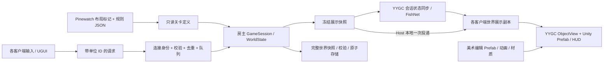

# Dark Nights Unity 技术架构

2026-09-11 增补：独立 [LAN Sample](LAN_SAMPLE.md) 已实现自己的四层程序集并验证 YYGC Object、可靠状态链及唯一权威写入。本页描述的正式玩法目录仍属设计；Sample 不反向依赖正式游戏。VitalRouter 仅保留框架命令链的显式适配，业务使用普通方法，R3 负责副本观察及订阅释放。

状态：设计基线，尚未实现。目标是在 YYGC 上建立一个可编辑、可验证的合作关卡，同时保留现有规则和单一权威模拟。联机实现路径已按[能力复评](YYGC_REASSESSMENT.md)调整：先修正并复用 YYGC 命令/状态链，再按测量补能力。

## 设计选择

| 方案 | 成本与适用性 | 结论 |
|---|---|---|
| 每个居民／建筑都改为 NetworkObject＋多组 StatefulBehaviour | 深入使用框架同步，但需要重组全部规则、时钟、ID、出生和保存；容易出现两套状态 | 首版不选 |
| 集中 GameSession＋YYGC 会话状态同步＋本地视图 | 可迁移现有规则；用会话 StatefulBehaviour/StateSynchronizer 承载冻结投影，集中处理冲突 | **优先验证并采用** |
| 确定性锁步或回滚 | 需要跨平台确定性、命令延迟和追帧等额外设施；当前为小规模合作营地 | 需求出现后另评估 |

关键对象为一个会话网络对象、每位玩家一个连接／命令入口对象，以及各客户端的本地实体视图。美术资源仍是原生 Prefab，联机并不要求每个 Sprite 都成为网络对象。

## 唯一状态归属

| 状态 | 唯一写入者 | 消费者 |
|---|---|---|
| 资源、人口、HP、任务、施工、训练、命中、波次、随机数 | 服务端 GameSession / WorldState | 投影器、快照、存档 |
| 已验证的请求序列、连接／玩家对应、epoch、房间权限 | Runtime/Session 与命令入口 | 命令处理与网络 |
| 世界展示副本 | 快照应用器；按版本／序号更新 | 视图、HUD、选择查询 |
| 相机、SelectedIds、悬停、建造预览、待确认指令 | 各客户端 LocalInteractionState | 本地输入与 UI |
| 动画帧、插值位置、选区、声音与一次性特效 | Presentation | Unity Renderer／UGUI／Audio |
| 成本、伤害、施工时间、职业属性 | 只读规则定义，源为 balance JSON | 模拟与 HUD 同一数据 |
| 外观、锚点、原点、绑定引用 | Unity Prefab／资源 | 本地视图与 Editor 预览 |

`StatefulBehaviour.State`、ScriptableObject 和客户端展示 DTO 都不能成为第二份可写的经济／战斗模型。Host 也通过展示副本驱动画面；只有一个服务端模拟实例。



箭头表示数据流，程序集依赖以下表为准。网络不会传递 ObjectInstance、Transform、Unity 资源或 GameSession 引用。

## 程序集与职责目录

以下为 M0–M3 将建立的结构，当前仓库尚无这些游戏文件。采用四个运行程序集，避免为每项规则建立额外框架层。

```text
Assets/DarkNights/
  Core/                           DarkNights.Core.asmdef
    Content/                      普通 C# 只读规则与关卡定义
    Simulation/                   会话、实体、经济、生产、战斗、波次
    Commands/                     明确的操作参数、校验结果
    ReadModels/                   展示 DTO、只读查询和操作接口
    Persistence/                  纯快照模型与关系校验，无文件访问
  Runtime/                        DarkNights.Runtime.asmdef
    Session/                      权威会话、玩家表、权限、恢复流程
    Networking/Commands/          YYGC 可信上下文到游戏权限、结果确认
    Networking/Snapshots/         会话投影、原子应用、版本检查；按需分块
    Networking/Connections/       加入、Ready、重连、断开
    Networking/Protocol/          版本化 wire DTO、序列化适配
    Framework/                    YYGC 启动、定义、容器与资源适配
    Content/                      JSON 读取、Unity 内容输入到 Core
    Persistence/                  文件／YYArchive 适配、旧档导入
    Time/                         唯一模拟调度与网络时钟
  Presentation/                   DarkNights.Presentation.asmdef
    World/                        按 EntityId 绑定本地视图、相机
    Actors/, Buildings/, Worksites/
    Effects/, Audio/              纯表现生命周期
    Input/, UI/                   本地交互、HUD、菜单
    Authoring/                    场景标记、无副作用预览组件
  Bootstrap/                      DarkNights.Bootstrap.asmdef；仅组合
  Editor/                         Editor-only 工具和验证
  Tests/                          按 EditMode/PlayMode 隔离的测试程序集
  Content/Rules/                  原 balance 与 waves JSON
  Content/Definitions/            YYGC ObjectDefinition 与映射配置
  Content/Visuals/                外观目录、动画、材质、字体
  Art/Original/, Art/Authored/    原始素材与新增／修改版本
  Prefabs/Entities/, Prefabs/Visuals/
  Prefabs/UI/, Prefabs/Environment/, Prefabs/Network/
  Scenes/                        Bootstrap、MainMenu、Pinewatch、ArtReview
```

| 程序集 | 允许项目依赖 | 限制 |
|---|---|---|
| Core | 无其他项目程序集 | noEngineReferences；不访问 Unity/Godot/YYGC/FishNet、资源、磁盘或 UI |
| Runtime | Core | 引擎、YYGC、网络、存档与调度适配；不依赖 Presentation |
| Presentation | Core | 可引用 Unity/YYGC 的视图和 UI；只读 ReadModels 与 Content，不访问可写 Simulation 或 Runtime 网络实现 |
| Bootstrap | Core、Runtime、Presentation | 提供具体实现，装配接口和场景；不包含玩法计算 |
| Editor | 按工具需要引用以上层 | includePlatforms=Editor；不能被运行程序集引用 |
| Tests | 被测程序集 | 不进入 Player；多进程驱动与日志作为独立验证工具 |

Core 中的只读接口让 Presentation 提交意图和读取副本，Bootstrap 注入 Runtime 实现。Presentation 虽引用 Core 程序集，仍需语义检查限制其访问 Simulation 的可写类型。程序集隔离、文件长度与 XML 注释检查在 M0/M1 建立；当前 AGENTS 是约束文档，尚不是已运行的自动守卫。

## YYGC 接入方式

- AppStartup 管理基础服务准备；游戏以 Ready 为开局条件，不在任意 Awake 中抢先生成世界。
- Root DI 保存跨局的不可变内容、资源和应用服务；会话容器保存本局服务；本地对象容器仅保存视图与绑定依赖。一次只运行一场权威对局。
- 场景、HUD、居民、建筑与工位使用 ObjectDefinition/PrefabRef 映射。普通游戏视图为 Local 对象，使用 ObjectView 和少量 PooledBehaviour；不挂依赖 Network 非空的 StatefulBehaviour。
- 规则 ID 如 `worker`、`tavern` 显式映射到 YYGC DefinitionId。SharedConfigs 保存映射、视图引用或展示参数；HP、成本与计时只从 Core 规则读取。
- 命令优先使用经修正验证的 YYGC Gateway/Sender/Processor、INetworkCommand 和统一类型注册；权威路由策略及可信上下文归框架，营地授权/去重归游戏。CampCommandEndpoint 仅可作为薄业务适配名称，不默认新建网络入口栈。
- 会话对象优先用一个普通 StatefulBehaviour 承载完整冻结投影，复用 StateSynchronizer 首次及后续发送；首个切片采用有界可靠完整投影。分块、差量与运动拆流在测量后决定，始终保留 GameSession 作为唯一业务写入者。
- 本地建造预览、目标选择和模态菜单的输入互斥复用 YYGC Interaction Sessions；它不保存共享营地或网络连接状态。
- 会话对象与玩家入口 Prefab 必须注册到 FishNet；世界的本地视图通过 EntityId 与展示副本关联，不需要每实体 NetworkTransform。
- Addressables 先使用本地打包内容。资源 await 不跨 SessionScope；必要时只扩展框架工厂的显式容器传递与同步装配点。
- UGUI 在场景中有可见根，面板在 Prefab Mode 可编辑；整个 HUD 使用同一 UI 体系。绑定键和类型有验证，不能靠运行时遍历名称掩盖 Prefab 缺引用。

## 时钟与模拟一致性

服务端调度为 60 Hz，未加速时调用 `Advance(1/60)`。原规则由 GameSession 内部乘一次 Speed，2×仍先保留原来的 `2/60` 步长语义，不擅自改成 120 次 `1/60` 或同时叠乘 Unity timeScale。

权威处理顺序保持经济→建筑→单位→工作点→箭矢→夜袭。服务器在每个调度点先处理已接受命令，再推进规则并产生投影。命令处理顺序由服务端排序确定；网络抵达时间不直接成为任意 delta。

暂停只停止模拟进度，命令队列、连接、快照、UI 仍工作。服务端单独维护递增 serverTick 与 simulationElapsed；它们在暂停／倍速时含义不同。若负载导致跟不上，记录积压和整体减速，不静默跳过经济／命中步骤。

表现动画采样模型的动作时间和阶段；客户端插值只改变显示位置。Unity Rigidbody、Animation Event、协程和 DOTween 不结算游戏伤害或生产。

## 身份与生命周期

| 标识 | 用途 | 生命周期 |
|---|---|---|
| ContentId | `worker` 等规则身份 | 随内容版本稳定 |
| YYGC DefinitionId | 规则身份到 Prefab/Behaviour 装配映射 | 锁定内容目录版本 |
| EntityId | 单位、建筑、工位身份及保存关系 | 世界内稳定；读取原存档保留 |
| FishNet ObjectId | 会话／连接网络对象 | 本次 spawn；不能保存为实体 ID |
| PlayerSlotId | 合作会话中的玩家身份 | 可跨一次断线重连 |
| ConnectionGeneration | 当前玩家的有效连接代次 | 重连增加，拒绝旧连接请求 |
| Epoch | 当前被装载的世界实例版本 | 开新局／加载世界增加 |

展示绑定键为 `(Epoch, EntityId)`。转职只替换外观，身份和人口不变；死亡／删除时释放视图、选择与绑定。加载先验证新世界，再切 epoch 并清除旧视图、旧请求和插值缓存。

池和事件的订阅归属必须明确：同一会话结束不留下活动 Update 或订阅。快照发送和插值缓冲拥有自己的数据，不持有已归池 State。初期优先正确性；游戏只有实际测得分配／帧时问题后才增加专用池。

## 美术与内容边界

Pinewatch 场景包含背景、地面、环境、布局标记与可见 Prefab 样本。布局标记有 ContentId 和 SpawnOrder，宿主从它们生成初始只读定义；客户端不会各自依据标记生成权威世界。

编辑器预览子树只展示同一份正式 Visual Prefab，运行时由视图绑定器统一接管显示，预览样本被隐藏／移除，避免两份居民同时出现。动画和外观资源可以独立打开编辑；预览不启动 DI 会话、网络或存档操作。

场景标记是 Unity 版本布局的唯一人工来源。若构建需要离线读取数据，可生成派生 LevelDefinition，但不能让 JSON 和场景坐标变成两份可编辑来源。规则配置、布局、外观分开计算版本摘要。

## 受控优化范围

本次有针对性的优化为：移除 Godot API 边界、拆分本地交互状态、建立有身份的服务端入口、统一世界同步生命周期、保留可编辑 Prefab，以及自动检查职责边界。

首版保持一场营地、单线程、全地图可见性；不提前加入分区兴趣管理、技能图、通用 ECS、插件式规则系统或自建网络传输。框架历史长文件只在触及必要修正时处理，不把游戏适配扩大为 YYGC 全面重构。
