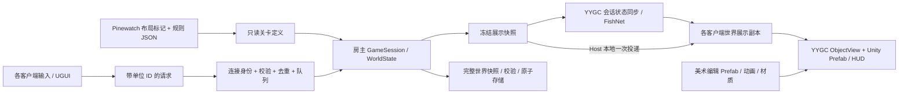

# Dark Nights Unity 技术架构

2026-09-11 增补：独立 [LAN Sample](LAN_SAMPLE.md) 已实现自己的四层程序集并验证 YYGC Object、可靠状态链及唯一权威写入。本页描述的正式玩法目录仍属设计；Sample 不反向依赖正式游戏。VitalRouter 仅保留框架命令链的显式适配，业务使用普通方法，R3 负责副本观察及订阅释放。

状态：正式玩法设计基线。已实现 Core/Config、Core/Logic、Core/Save、最小反馈 ViewData、Runtime 配置／旧档解析与 Entry 配置启动；规则及旧档已通过[核心回归](CORE_MIGRATION.md)，实际会话调度、View 与正式联机尚未实现。2026-09-11 的[移植方案](MIGRATION_PLAN.md)明确复用 YYGC `10b8f0e` 已由 Sample 验证的命令／状态链，补正式营地投影、可切换控制权限与原生资源。Core 继续保持单一权威模拟。

## 设计选择

| 方案 | 成本与适用性 | 结论 |
|---|---|---|
| 每个居民／建筑都改为 NetworkObject＋多组 StatefulBehaviour | 深入使用框架同步，但需要重组全部规则、时钟、ID、出生和保存；容易出现两套状态 | 首版不选 |
| 集中 GameSession＋YYGC 会话状态同步＋本地视图 | 可迁移现有规则；用会话 StatefulBehaviour/StateSynchronizer 承载冻结投影，集中处理冲突 | **采用；正式实体集合仍需验证** |
| 确定性锁步或回滚 | 需要跨平台确定性、命令延迟和追帧等额外设施；当前为小规模合作营地 | 需求出现后另评估 |

关键对象为一个会话网络对象、每位玩家一个连接／命令入口对象，以及各客户端的本地实体视图。美术资源仍是原生 Prefab，联机并不要求每个 Sprite 都成为网络对象。

## 唯一状态归属

| 状态 | 唯一写入者 | 消费者 |
|---|---|---|
| 资源、人口、HP、任务、施工、训练、命中、波次、随机数 | 服务端 GameSession / WorldState | 投影器、快照、存档 |
| 已验证的请求序列、连接／玩家对应、epoch、CampControlMode／PolicyRevision | Runtime/Session 与命令入口 | 命令处理、网络与只读权限展示 |
| 世界展示副本 | 快照应用器；按版本／序号更新 | 视图、HUD、选择查询 |
| 相机、SelectedIds、悬停、建造预览、待确认指令 | 各客户端 LocalInteractionState | 本地输入与 UI |
| 动画帧、插值位置、选区、声音与一次性特效 | View | Unity Renderer／UGUI／Audio |
| 成本、伤害、施工时间、职业属性 | 只读规则定义，源为 balance JSON | 模拟与 HUD 同一数据 |
| 外观、锚点、原点、绑定引用 | Unity Prefab／资源 | 本地视图与 Editor 预览 |

`StatefulBehaviour.State`、ScriptableObject 和客户端展示 DTO 都不能成为第二份可写的经济／战斗模型。Host 也通过展示副本驱动画面；只有一个服务端模拟实例。



箭头表示数据流，程序集依赖以下表为准。网络不会传递 ObjectInstance、Transform、Unity 资源或 GameSession 引用。

## 程序集与职责目录

2026-09-11 人工可读性复审后，采用 Scripts / Res 分离：代码按职责分层，资源按游戏对象归组。以下为 M0–M3 的目标结构；首批已建立 Core、Runtime、Entry、Editor/Tests 和 Res/Config，并保留 GUID 移动环境 Editor 工具；其他部分仍待实施。只在实现功能时建立所需目录，不预建空类。四个运行程序集为 Core、Runtime、View、Entry；View 和 Entry 分别替代原方案的 Presentation 和 Bootstrap 层名称，职责不变。

```text
Assets/
  DarkNights/
    Scripts/
      Core/                       DarkNights.Core.asmdef
        Config/                   只读规则与关卡配置类型
        Logic/                    权威状态、规则、显式业务命令
        ViewData/                 展示副本、只读查询和操作接口
        Save/                     存档模型与关系校验，无文件访问
      Runtime/                    DarkNights.Runtime.asmdef
        Session/                  对局、权限、恢复协调、唯一模拟调度
        Network/                  命令、投影、连接、wire DTO 与序列化
        Framework/                YYGC 定义、容器、资源及内容读取适配
        Save/                     文件／YYArchive 适配、旧档导入
      View/                       DarkNights.View.asmdef
                                  实体表现、UI、输入、场景标记与预览
      Entry/                      DarkNights.Entry.asmdef；仅启动装配
      Editor/                     Editor-only 工具和检查
      Tests/                      EditMode / PlayMode 隔离测试程序集
    Res/
      Objects/
        Worker/
          Worker.asset            ObjectDefinition
          Worker.prefab           对象容器与组件绑定
          WorkerVisual.prefab     可独立编辑的外观
          Animations/             工人专用动画
        House/                    其他角色、建筑、工位等按对象归组
      UI/
        HUD/                      同面板的定义、Prefab 与专用资源
        MainMenu/
      Scenes/                     Pinewatch、ArtReview、MainMenu 场景
      Config/                     规则 JSON、内容映射等实际配置资产
      Shared/                     多对象共用的材质、字体等
      Art/
        Original/                 原始素材，保留来源清单与 SHA-256
        Custom/                   新增／修改的源素材
  AddressableAssetsData/           现有 Addressables 配置，保留位置
  Samples/LanCoop/                 独立样板，不被正式游戏引用
```

图中省略现有框架启动资源和第三方目录。`Assets/Scenes/Bootstrap.unity`、AppStartup 资源和 NetworkManager Prefab 继续作为宿主入口；必要的目录迁移保留 `.meta` / GUID，并检查数据库、Addressable 条目和脚本硬编码路径。游戏不会再创建第二套 Bootstrap 或同时启用 Sample 的网络管理器。

Scripts 和 Res 仅用于物理组织，不加入命名空间，例如 `DarkNights.Core.Logic`。Runtime/Network 初期不再细分 Commands、Snapshots、Connections、Protocol；View 初期按文件命名定位，内容增多后才按 World、UI、Input、SceneSetup 拆目录，不增加程序集。代码不得放入 Res；原始素材只有一份，对象目录内的 Prefab／动画引用 Art 中的源素材。专用资源跟对象走，共用资源才进入 Shared。

`Res` 不是 Addressables 的特殊目录名；通过条目与分组注册资源，不能把物理目录当作 Address 或 Definition Key。`AddressableAssetsData` 是默认配置目录，不是游戏素材根。ObjectDefinition 与 Prefab 同目录维护，按 YYGC 绑定合同检查组件引用和生命周期。官方依据、分组与资源迁移要求见[移植方案的目录与装配要求](MIGRATION_PLAN.md#directory-and-assets)。

| 程序集 | 允许项目依赖 | 限制 |
|---|---|---|
| Core | 无其他项目程序集 | noEngineReferences；不访问 Unity/Godot/YYGC/FishNet、资源、磁盘或 UI |
| Runtime | Core | 引擎、YYGC、网络、存档与调度适配；不依赖 View |
| View | Core | 可引用 Unity/YYGC 的视图和 UI；只读 ViewData 与 Config，不访问 Logic 的可写状态或 Runtime 网络实现 |
| Entry | Core、Runtime、View | 提供具体实现，装配接口和场景；不包含玩法计算 |
| Editor | 按工具需要引用以上层 | includePlatforms=Editor；不能被运行程序集引用 |
| Tests | 被测程序集 | 不进入 Player；多进程驱动与日志作为独立验证工具 |

Core/ViewData 中的接口让 View 提交意图和读取副本，Entry 注入 Runtime 实现。View 虽引用 Core 程序集，仍需语义检查限制其访问 Logic 的可写类型；Core/Save 与 Runtime/Save 分别负责纯数据和文件读写。程序集隔离、文件长度与 XML 注释检查在 M0 建立，M1 随核心迁移启用完整规则；已建立 tools/ArchitectureGuard（源码、依赖与 asmdef）和 tools/CoreBuild（C#9 / .NET Standard 2.1 实际编译），见[执行状态](DEVELOPMENT.md#implementation-progress)。

## YYGC 接入方式

- AppStartup 管理基础服务准备；游戏以 Ready 为开局条件，不在任意 Awake 中抢先生成世界。
- Root DI 保存跨局的不可变内容、资源和应用服务；会话容器保存本局服务；本地对象容器仅保存视图与绑定依赖。一次只运行一场权威对局。
- 场景、HUD、居民、建筑与工位使用 ObjectDefinition/PrefabRef 映射。普通游戏视图为 Local 对象，使用 ObjectView 和少量 PooledBehaviour；不挂依赖 Network 非空的 StatefulBehaviour。
- 规则 ID 如 `worker`、`tavern` 显式映射到 `DefinitionReference`；新内容使用 YYGC Guid / Key。SharedConfigs 保存映射、视图引用或展示参数；HP、成本与计时只从 Core 规则读取。
- 命令使用 YYGC Gateway/Sender/Processor、INetworkCommand 和统一类型注册；设置 `NetworkCommandRoutingMode.ServerAuthoritative`，从 `NetworkCommandContext` 取得可信身份，营地授权／去重归游戏。CampCommandEndpoint 仅是薄业务适配，不另建网络入口栈。
- 会话对象优先用一个普通 StatefulBehaviour 承载完整冻结投影，复用 StateSynchronizer 首次及后续发送；首个切片采用有界可靠完整投影。分块、差量与运动拆流在测量后决定，始终保留 GameSession 作为唯一业务写入者。
- 本地建造预览、目标选择和模态菜单的输入互斥复用 YYGC Interaction Sessions；它不保存共享营地或网络连接状态。
- 会话对象与玩家入口 Prefab 必须注册到 FishNet；世界的本地视图通过 EntityId 与展示副本关联，不需要每实体 NetworkTransform。
- Addressables 先使用本地打包内容。资源 await 不跨 SessionScope；必要时只扩展框架工厂的显式容器传递与同步装配点。
- UGUI 在场景中有可见根，面板在 Prefab Mode 可编辑；整个 HUD 使用同一 UI 体系。绑定键和类型有验证，不能靠运行时遍历名称掩盖 Prefab 缺引用。

### 会话对象如何组合规则

下表类型名是拟议名称，用来限定职责，不表示当前已有实现。

| 组合位置 | 拟议对象／行为 | 拥有的状态与边界 |
|---|---|---|
| 营地 Network ObjectInstance | CampSessionBehaviour 与会话控制器 | 生命周期内拥有唯一 GameSession；协调命令队列和一个模拟时钟；Core 经济、战斗、生产仍是普通 C# 模块 |
| 同一营地 ObjectInstance | CampProjectionBehaviour : StatefulBehaviour | 从 Core 冻结投影并经 MutateState 发布；不在 StateData 再结算库存或 HP |
| 每位玩家的网络入口 | 既有 NetworkCommandSender＋薄业务结果适配 | FishNet 所有权只授予自己的发送入口；不据此将小人所有权交给玩家 |
| 各端实体 Local ObjectInstance | EntityPresentationBehaviour＋ObjectView | 按 `(Epoch, EntityId)` 订阅副本，驱动位置、姿态、选区、状态条；无写回模拟路径 |
| UI Local ObjectInstance | UGUIBehaviour／面板控制器 | 注入只读世界和命令接口；负责本地预览与待确认反馈 |

跨 Behaviour 协作使用 YYGC 注入接口；副本持续变化按需用 R3 观察，订阅随对象／会话结束释放。Core 不实现废弃的 `ILocalData`，也不通过共享黑板让视图修改规则。Behaviour 是营地规则的框架适配入口，普通 Core 类型无需为接入框架改成 MonoBehaviour 或另写一套 HP Behaviour。

四个正式程序集不引用 Sample。现有样板的注册表、IMGUI、文件控制和调试对象发现不直接进入正式流程；正式类型在 AppStartup 就绪前完成具体泛型注册和 Behaviour 工厂准备，按实际生成器入口验证 IL2CPP。

### 控制权限的位置

`CampControlMode = SharedCamp | HostOnly` 与递增 `PolicyRevision` 属于 Runtime/Session。每条修改世界的请求在执行点校验当前模式；HostOnly 限制来宾所有营地修改，包括建造自动派工和训练。房主修改模式也进入同一命令顺序，旧策略未执行请求被拒绝，已有订单继续。

View 读取权限投影来控制按钮、快捷键和预览；Core 接受经过授权的显式操作参数，不读取玩家连接或全局选择。加载保留房间控制模式，切世界只增加 epoch；控制模式本身不会重置世界。此设计允许后期关闭共享操作，而不调整模拟、DTO 主体或单位网络所有权。详见[联机权限合同](MULTIPLAYER.md)。

## 时钟与模拟一致性

服务端调度为 60 Hz，未加速时调用 `Advance(1/60)`。原规则由 GameSession 内部乘一次 Speed，2×仍先保留原来的 `2/60` 步长语义，不擅自改成 120 次 `1/60` 或同时叠乘 Unity timeScale。

权威处理顺序保持经济→建筑→单位→工作点→箭矢→夜袭。服务器在每个调度点先处理已接受命令，再推进规则并产生投影。命令处理顺序由服务端排序确定；网络抵达时间不直接成为任意 delta。

暂停只停止模拟进度，命令队列、连接、快照、UI 仍工作。服务端单独维护递增 serverTick 与 simulationElapsed；它们在暂停／倍速时含义不同。若负载导致跟不上，记录积压和整体减速，不静默跳过经济／命中步骤。

表现动画采样模型的动作时间和阶段；客户端插值只改变显示位置。Unity Rigidbody、Animation Event、协程和 DOTween 不结算游戏伤害或生产。

## 身份与生命周期

| 标识 | 用途 | 生命周期 |
|---|---|---|
| ContentId | `worker` 等规则身份 | 随内容版本稳定 |
| YYGC DefinitionGuid / Key | 定义资产身份与正式配置／查询入口；ContentId 经映射关联 | `.meta` / GUID 稳定；Key 改名保留别名；锁定内容目录版本 |
| YYGC 旧整数 DefinitionId | LegacyV1 网络定义与既有资产兼容 | 首个切片保留有效 ID，不作为游戏实体 ID |
| EntityId | 单位、建筑、工位身份及保存关系 | 世界内稳定；读取原存档保留 |
| FishNet ObjectId | 会话／连接网络对象 | 本次 spawn；不能保存为实体 ID |
| PlayerSlotId | 合作会话中的玩家身份 | 可跨一次断线重连 |
| ConnectionGeneration | 当前玩家的有效连接代次 | 重连增加，拒绝旧连接请求 |
| Epoch | 当前被装载的世界实例版本 | 开新局／加载世界增加 |
| PolicyRevision | 当前控制模式版本 | 房主切模式增加；命令执行时检查，和世界 epoch 分离 |

展示绑定键为 `(Epoch, EntityId)`。转职只替换外观，身份和人口不变；死亡／删除时释放视图、选择与绑定。加载先验证新世界，再切 epoch 并清除旧视图、旧请求和插值缓存。

首个正式联机切片保持当前 Sample 的 LegacyV1 wire；本地定义可使用 GUID / Key，网络会话定义仍保留有效旧 ID。新资源用 `DefinitionReference`，查找用 `GetDefinitionByKey`，不能把旧 `GetDefinition(string)` 的资产名语义当成正式 Key。GUID wire V2 是后续明确切换的构建合同，不能单边打开后继续认为与 V1 兼容。

池和事件的订阅归属必须明确：同一会话结束不留下活动 Update 或订阅。快照发送和插值缓冲拥有自己的数据，不持有已归池 State。初期优先正确性；游戏只有实际测得分配／帧时问题后才增加专用池。

## 美术与内容边界

Pinewatch 场景包含背景、地面、环境、布局标记与可见 Prefab 样本。布局标记有 ContentId 和 SpawnOrder，宿主从它们生成初始只读定义；客户端不会各自依据标记生成权威世界。

编辑器预览子树只展示同一份正式 Visual Prefab，运行时由视图绑定器统一接管显示，预览样本被隐藏／移除，避免两份居民同时出现。动画和外观资源可以独立打开编辑；预览不启动 DI 会话、网络或存档操作。

场景标记是 Unity 版本布局的唯一人工来源。若构建需要离线读取数据，可生成派生 LevelDefinition，但不能让 JSON 和场景坐标变成两份可编辑来源。规则配置、布局、外观分开计算版本摘要。

## 受控优化范围

本次有针对性的优化为：移除 Godot API 边界、拆分本地交互状态、建立有身份的服务端入口、统一世界同步生命周期、保留可编辑 Prefab，以及自动检查职责边界。

首版保持一场营地、单线程、全地图可见性；不提前加入分区兴趣管理、技能图、通用 ECS、插件式规则系统或自建网络传输。框架历史长文件只在触及必要修正时处理，不把游戏适配扩大为 YYGC 全面重构。
