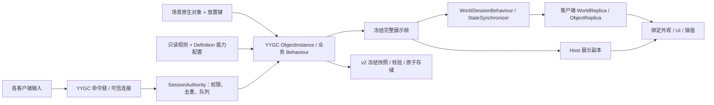

# Dark Nights Unity 技术架构

2026-09-14，采用 [YYGC 统一对象重构计划](YYGC_UNIFIED_REFACTOR_PLAN.md)。U0–U5 已完成，正式入口使用全部 YYGC 业务能力，旧运行模型已删除。U6 协议 7／YYGC `745f3d2` 通过 144 项 Editor／Play、Mono 完整矩阵 350 项及 240 秒容量检查 21 项；后续 [Linear 世界表现](M5_WORLD_PRESENTATION.md)在 `a4a5450` 完成 155 项 Editor／Play 和新 Mono 77 项检查。前台验收由用户暂缓，IL2CPP／双机器仍未验收；受限清理已完成[列账交接](STAGE_CLEANUP_INVENTORY.md)，目录未删除。实际状态与证据见[性能验收](YYGC_UNIFIED_PERFORMANCE.md)和[实施记录](YYGC_UNIFIED_IMPLEMENTATION.md)，不以类型或目录存在代替验收。

本页描述统一后的源码。原集中 Core 世界及按 Kind 借还视图的方案保留在 Git 历史和 [C 重构记录](C_REFACTOR_IMPLEMENTATION.md)，不再作为当前状态归属合同。游戏不兼容 Godot 旧档、Unity v1 或协议 6／5；独立 LAN Sample 的兼容边界单独保留。

## 唯一状态归属

正式游戏有一个会话网络对象、每位玩家一个网络入口，以及由 YYGC 管理的本地实体对象。个体不增加 NetworkObject／NetworkTransform；权威状态由其业务 Behaviour 拥有，以会话级可靠完整投影传输。

| 状态 | 唯一所有者 | 边界 |
|---|---|---|
| 时间、胜负、实体 ID 分配、RNG、营地统计 | CampSimulationBehaviour／CampSimulationState | 一场营地一个权威会话 |
| 库存、人口、容量、招募与食物结算 | EconomyBehaviour／EconomyState | 成本及规则来自只读 balance JSON |
| 波次和待出生敌人 | WaveBehaviour／WaveState | 只有会话调度推进 |
| 在飞箭矢及命中数据 | ProjectileBehaviour／ProjectileState | 视觉箭矢不结算伤害 |
| 单位位置、HP、任务、攻击与工作进度 | ActorBehaviour／ActorState | 移动和攻击能力操作所属单位状态 |
| 建筑 HP、施工与训练队列 | BuildingBehaviour／BuildingState | 训练和塔攻击能力由会话按固定顺序调用 |
| 工位库存、占用和生产进度 | WorksiteBehaviour／WorksiteState | 占用关系与单位任务在同一事务更新 |
| 请求队列、连接代次、Ready、epoch、共享策略 | SessionAuthority 与可信网络适配 | 不把连接／权限写入存档 |
| 冻结展示帧与客户端副本 | SessionProjector、WorldReplica、ObjectReplica | 无业务写权限，不自行计算资源或伤害 |
| 选择、镜头、悬停、预览、待确认反馈 | 各客户端交互状态 | Host 也只从展示副本驱动画面 |

ObjectSession 只组合能力、上下文、资源租约和对象索引，不保存第二套经济／实体状态。SessionEntityIndex 只引用 YYGC 对象。旧 GameSession、WorldState、Entity、Commands／Systems 运行链及过渡 SessionWorld 已删除。

所有可写 State 使用 YYGC 会话权限。网络 DTO、ScriptableObject、展示副本和客户端 Behaviour 不成为另一份权威模型。单对象 State 的变化不自行发送个体 RPC。

## 程序集与目录

正式代码位于 Assets/DarkNights/Scripts，资源位于 Assets/DarkNights/Res。Scripts／Res 不加入命名空间；文件名、主要类型与职责目录对应。四个运行程序集为 Core、Runtime、View、Entry。

| 程序集 | 职责 | 允许项目依赖 |
|---|---|---|
| Core | Config 只读规则；Logic 纯计算／随机数／枚举；Save 冻结合同与关系校验；ViewData 冻结展示合同 | 无引擎、框架、网络、磁盘依赖 |
| Runtime | Objects 的业务 Behaviour／State、对象生命周期；Session 的权限／队列／时钟；Network 的传输；Framework 的内容／绑定；Save 文件边界 | Core |
| View | 原生对象外观、动画采样、UGUI、输入与场景制作参数 | Core，以及 Unity／YYGC 的表现接口 |
| Entry | Bootstrap 启动装配、网络与表现接线、场景副本分发、显式验收入口 | Core、Runtime、View；不计算玩法 |
| Editor | 制作、初建、生成和只读合同检查 | 按工具需要引用，限 Editor |
| Tests | 真实装配、规则、文件、制作及 Play 回归 | 被测程序集，限 Editor；不进入 Player |

Core/Logic 不再包含可运行实体、命令服务或世界生命周期。View 不读 Runtime 的权威 State。Core/Save 仅保存冻结数据，恢复对象的装配在 Runtime/Objects，JSON 和文件访问在 Runtime/Save。

手写 C# 使用 C# 9／.NET Standard 2.1，单文件硬上限 300 行；生成代码单独维护输入与重建入口。源码和程序集边界由 tools/ArchitectureGuard 检查；纯计算工具与 Unity 测试的分工见[覆盖映射](YYGC_UNIFIED_TEST_COVERAGE.md)。

## 装配、能力和事务

AppStartup、YYGC DI、ObjectDefinition、PrefabRef、组件绑定和生成注册继续使用既有入口。定义的 SharedConfigs 提供显式 RuleKey 和能力参数，不重复维护 HP、成本、波次或实例进度。DefinitionRuleIndex 从配置读取 RuleKey，不按 Key 前后缀猜测职业。

完整内容包含 6 类单位、5 类建筑、4 类工位。单位按职业组合移动、战斗、近战或箭矢能力；建筑按类型组合训练或塔攻击。缺失能力／配置／绑定、重复配置和非法定义身份在激活前失败。

Addressables 预加载得到 PreparedObjectDefinition 租约；资源 await 在事务之外完成。对象以显式 ObjectSessionContext 同步准备，依赖和初始状态就绪后统一激活。不让 SessionScope 跨 await／线程，不使用全局临时容器寻找本局状态。

ObjectMutationBatch 为支付、工位占用、建造和转职提供短事务：先完成全部验证，保存可恢复状态和对象清理动作，提交完成后才通知订阅者。通知中禁止重入业务、退休同批对象或再次加载世界。失败释放本次准备资源，不留下半扣款／半占用。

## 调度、权限和网络

CampSessionBehaviour 在配置与服务端角色均就绪后创建 SessionServer；重复角色回调不再创建服务，退出先撤销外部引用，再关闭权威会话与对象上下文。真正服务推进来自 YYGC 生成的更新调度器。

SessionClock 累积未缩放时间，以 60 Hz 调用 SessionAuthority。命令先按接受顺序处理，再以经济→建筑→单位→工位→箭矢→波次的顺序推进业务。倍速只在 ObjectSession.Advance 乘一次：2× 保留原来的 2/60 步长语义，不改成另一套模拟算法。暂停停止业务时间，网络、请求、心跳、UI 和存储仍工作。

Host 与客户端使用同一验证入口；服务器从 NetworkCommandContext 取得连接身份。请求中的玩家 ID、资源和伤害不能构成授权。SharedCamp／HostOnly 与 PolicyRevision 在执行点检查，包含建造自动派工和训练；已生效任务继续。加载保持房间策略。

正式游戏为协议 7，YYGC 定义 wire 为 GuidV2，两者是不同版本概念。握手在业务载荷解析前拒绝旧协议 6／5，并校验规则、布局、定义和生成注册摘要。完整投影携带 EntityId、DefinitionGuid、放置关系、epoch／revision、实体与在飞箭矢；真实副本应用完成后才 Ready。投影使用有界原始／GZip 封套，解封后仍执行完整 MemoryPack 和规则校验，见[性能修正](YYGC_UNIFIED_PERFORMANCE.md)。继续复用 Gateway／Sender／Processor、StatefulBehaviour／StateSynchronizer，不新建并行传输栈。

## 场景对象与展示生命周期

LevelPlacementMarker 保存稳定放置键、顺序及实例参数；ObjectDefinitionLoader 保存定义并接入 YYGC 对象生命周期。二者职责分开。LevelLayoutAuthoring 导出只读布局供规则和摘要校验，不再从这些记录创建另一套 Core 实体。

Host 按放置键精确接管场景中的原 ObjectInstance。动态招募、建造和敌人创建使用同一工厂与上下文。客户端由 ObjectReplica 原子应用完整帧，构造无业务写权限的对象；它不根据场景标记自行模拟。

SessionEntityViews 只按当前 epoch／EntityId 分发展示：Host 查询权威对象索引，客户端查询副本对象，不再按 Kind 借一个视图。NativeVisualFactory 仅创建建造预览、残骸等被动外观。动画、碰撞和 UI 不结算玩法。

转职保留 EntityId、位置和原规则要求的状态，按新 Definition 重新装配并退休旧职业。重开／加载保留可复用的原场景对象，清除过期绑定与插值；退出后没有活动更新、残留会话订阅或幽灵对象。

## 身份与 v2 恢复

| 标识 | 用途 |
|---|---|
| RuleKey | 只读规则键，如 worker、tavern；来自 Definition 的配置 |
| DefinitionGuid／Key | YYGC 定义身份与可编辑查找键；不等于资源路径 |
| PlacementKey | 场景人工放置身份；动态对象为空；复制项必须重新分配唯一键 |
| EntityId | 世界内稳定实体和保存关系；转职保持 |
| FishNet ObjectId | 本次网络 spawn 的传输身份 |
| PlayerSlotId／ConnectionGeneration | 房间玩家与本次可信连接，重连增加代次 |
| Epoch／PolicyRevision | 当前世界版本／当前共享控制策略版本，分别验证 |

正式定义旧整数 Id 固定为 0，无旧别名；不恢复 Kind 后缀或整数兼容。独立 LAN Sample 的 LegacyV1 和 YYGC 面向其他使用者的兼容 API 不在游戏清理范围。

v2 保存全部权威状态、实体定义／放置身份、训练／施工／在飞箭矢与 RNG。捕获在模拟边界深度冻结，后台仅编码和写文件。恢复先验证完整 DTO，再准备未激活对象；提交时切换对象索引、增加 epoch、退休旧对象并重新 Ready。准备或提交失败保留当前世界；保存失败保留原文件。详细字段及原子文件边界见[存档合同](SAVE_FORMAT.md)。

## 资源与验证边界

保留 Bootstrap、Pinewatch、原 Prefab、动画、人工覆盖及资产 GUID。场景是初始布局唯一可编辑来源，派生数据不能反向覆盖制作内容。对象专用资源归组于 Res/Objects，共用资源进入 Res/Shared；原始 551 项素材在 Res/Art/Original 保留单份与 SHA-256。

Addressables 通过条目／分组管理，不要求资源目录叫 Addressables，不把 Res 当成 Resources。现有 AddressableAssetsData 配置位置保留。ObjectCapabilitySetup 只服务指定空目录的首版初始化；NativeObjectContracts 和普通构建执行只读校验，不自动升级人工资源。

U4 完成正式接线，U5 完成旧模型退出与回归迁移；U6 `4e3798f` 的同一 Mono 已通过多人、活跃恢复、九组弱网、三夜、容量时效及 240 秒后台观察。首轮无旧 Library 的构建和后续复用缓存的构建分别保留来源。`a4a5450` 已完成本机 Linear 固定世界画面对照，普通前台性能按用户选择暂缓；Mono、IL2CPP、双机器 LAN 分别记录，不把同型号 GPU 的本机结果写成最终全平台或跨物理 GPU 验收。

允许针对实证缺口更新 YYGC，先在隔离 checkout 验证，锁定可复现输入并维护[逐文件账本](YYGC_CHANGES.md)。框架历史长文件不在本次全面拆分范围。暂不增加锁步、回滚、ECS、房主迁移、专服集群或未经测量的拆流。
