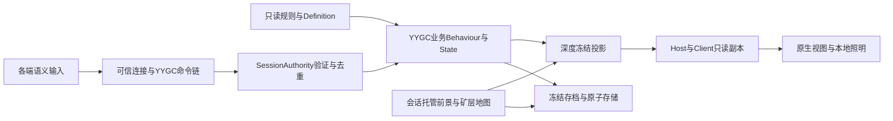

# Dark Nights Unity 技术架构

本页维护现行结构与不变量。当前开放范围见[地面基础玩法](GROUND_GAMEPLAY_BASELINE.md)，运行版本和验收见[执行状态](DEVELOPMENT.md)。联机、文件、地图、工具和照明分别由专项合同承接；历史决定及原文见[迁移摘要](archive/MIGRATION_HISTORY.md)。

## 唯一状态归属

正式游戏使用一个会话网络对象、每位玩家一个网络入口和YYGC管理的本地业务对象；个体不增加NetworkObject／NetworkTransform。Host唯一结算业务与RNG，各端表现只读冻结副本。

| 状态 | 唯一所有者 | 当前边界 |
| --- | --- | --- |
| 会话时间、ID、RNG、统计 | CampSimulationBehaviour／State | 仅推进当前允许的基础会话 |
| 信用点及角色库存、运动、装备动作／货袋 | 所属Economy／Actor／Hero Behaviour及State | 购买、手持使用、采集按现有短事务更新 |
| 飞船、驾驶、舱门和乘员关系 | 所属ExpeditionShip及能力 | 地面本地飞行；旧航程／结算暂停 |
| 前景与矿层格、耐久、储量 | SessionTerrain托管ARDMap／GridBusinessStateStore | Host唯一写入；初始矿床信息是静态元数据，不创建逐床对象 |
| 请求、可信连接、Ready、epoch、策略 | SessionAuthority及网络适配 | 不将连接、租约、请求队列写入存档 |
| 展示帧与客户端副本 | SessionProjector、WorldReplica、ObjectReplica | 深度冻结，无业务写权限 |
| 相机、选择、悬停、预览、照明缓存 | 各端表现上下文 | 不结算支付、HP、伤害或采矿 |
| 旧波次、建筑、工位、自动工作能力 | 原所属Behaviour／State | 实现保留，自动推进及旧命令按玩法范围暂停 |

ObjectSession只组合能力、上下文、资源租约和索引，SessionEntityIndex只引用YYGC对象。旧GameSession／WorldState／Core实体运行世界不恢复；DTO、ScriptableObject及ViewData不成为第二份权威状态。

```mermaid
flowchart LR
    Config[只读规则与Definition] --> Objects[YYGC业务Behaviour与State]
    Input[各端语义输入] --> Gate[可信连接与YYGC命令链]
    Gate --> Authority[SessionAuthority验证与去重]
    Authority --> Objects
    Terrain[会话托管前景与矿层地图] --> Projection[深度冻结投影]
    Objects --> Projection
    Projection --> Replica[Host与Client只读副本]
    Replica --> View[原生视图与本地照明]
    Objects --> Save[冻结存档与原子存储]
    Terrain --> Save
```

## 程序集与目录

正式源码为 `Game/Assets/DarkNights/Scripts`，资源为 `Res`；两者不加入namespace。文件名、主要类型、职责目录和 `DarkNights` namespace对应。

| 程序集 | 职责 | 项目依赖 |
| --- | --- | --- |
| Core | 只读Config、纯计算／可恢复RNG、Save及ViewData冻结合同 | 无Unity、YYGC、网络、表现、文件系统依赖 |
| Runtime | Objects业务与State、Session权限／时钟、Network、Framework装配及Save文件边界 | Core |
| View | 主视图、动画、UGUI／UITK、输入、制作参数及本地受光 | Core及引擎／YYGC表现接口；不读Runtime权威State |
| Entry | Bootstrap、网络／表现接线、明确委托注入及验收入口 | Core、Runtime、View；不结算玩法 |
| Editor／Tests | 制作、生成、只读检查与真实装配回归 | 按工具需要引用，仅Editor，不进入Player |

View需要Core照明算法时由Entry装配有限委托，避免直接依赖Core.Logic.Lighting。手写代码语言、summary、单主体和300行边界由[AGENTS](../AGENTS.md#代码与程序集)与ArchitectureGuard约束；历史覆盖映射见[回归迁移](archive/YYGC_UNIFIED_TEST_COVERAGE.md)。

## 装配、能力和事务

沿用AppStartup、YYGC DI、ObjectDefinition／PrefabRef、组件绑定及生成注册。SharedConfigs声明稳定RuleKey和能力参数，规则JSON不重复存入Definition。缺失配置、必要绑定、重复配置和非法身份在激活前失败，不以GetComponent、名称或子索引兜底。

EntityView的Actor／Building／Worksite主视图各拥有类别特有动画、锚点及阶段引用，直接继承YYGC ObjectView；Bindings用于真实外部依赖。当前装备继续通过Definition、ObjectInstance和Behaviour装配，视觉枚举仅为展示派生值。完整内容保留不表示全部进入正式调度。

Addressables预加载提供PreparedObjectDefinition租约；await位于事务外，ObjectSessionContext同步准备对象，依赖／初始状态就绪后统一激活。SessionScope和可写池状态不跨await／线程。

StartupResourceBatch有限并发准备独立对象／UI资源，全部成功后按原输入顺序移交；失败／取消等待所有请求收尾并释放晚成功租约。六个UGUI面板仍按原顺序创建、绑定和激活。普通导入和构建不执行资源初始化来覆盖人工内容。

ObjectMutationBatch先完成验证，保存可恢复状态和清理动作；支付、库存、占用及相关对象／地图变化安装后才通知。通知中不重入业务、退休同批对象或加载新世界。失败释放本次资源，不留下半扣款或半装配。采集细节见[地图合同](TERRAIN_GENERATION.md#采集事务)。

## 调度、权限和网络

SessionClock用未缩放时间以60 Hz调用SessionAuthority，先处理接受顺序的合法请求，再推进当前允许的能力。倍速只在ObjectSession.Advance生效一次；暂停停止业务时间，网络、心跳、请求、UI和存储继续。旧经济生产、波次、工作与营地命令不因能力仍装配而恢复。

Host和Client使用相同验证入口；可信连接、控制租约、策略版本、epoch、序号及参数在执行点验证。运行协议与YYGC定义GuidV2属于不同版本概念，实际当前值由执行状态和源码常量确认。对象可靠完整投影及双层AMP1局部流的职责见[联机合同](MULTIPLAYER.md)。

## 场景对象与展示生命周期

场景是初始布局唯一可编辑来源。ScenePlacement提供稳定放置身份和实例初值，ObjectDefinitionLoader装配原生对象；分组直接子对象的sibling顺序是创建顺序。派生布局只读，不反向覆盖场景或另建Core实体。

Host接管原ObjectInstance；动态业务走同一工厂。Client原子应用完整帧后创建无业务写权限的对象。SessionEntityViews按epoch／EntityId分发，换职业保持身份并退休旧实例。动画、物理回调、碰撞和UI不结算伤害。退出、加载及重开撤除旧绑定、订阅和插值；残骸、预览通过定义创建被动表现。

## 主角与输入

HeroControl／Motion／Inventory及采集／手电能力共用ActorState；每步只选择一种合法决策入口。GameInputActions是正式本地玩家唯一InputAction入口，通过YYGC Interaction Sessions许可提供语义值。HeroInputSampler保存边沿、30 Hz限速和10 Hz保活；Entry发送冻结意图，服务端验证租约和输入超时。跳跃按下绕过发送等待，持续值仍节流。

每位玩家首次Ready创建专属worker，重复Ready不增员；真正重连与加载的接管区别见联机合同。主角、相机、菜单和改键各有明确生命周期，不共享客户端选择状态。Host本地主角在权威模拟后冻结即时展示，验证epoch／槽位／租约；远端仍消费正式副本和插值，不用本地展示替代网络诊断。

## 身份与当前存档恢复

RuleKey表示规则；DefinitionGuid／Key表示定义身份／查找键；PlacementKey表示作者放置；EntityId表示世界关系；FishNet ObjectId表示传输实例；槽位／连接代次、epoch／PolicyRevision表示会话身份。正式旧整数ID为0，不恢复Kind／整数兼容；独立LAN Sample的LegacyV1保留隔离边界。

保存从所属State及最终两层地图捕获冻结数据，文件后台只编码／写入；恢复先完整校验，在未激活上下文准备对象和候选地图，同步提交后增加epoch、退休旧世界并重新Ready。失败保留旧世界／原文件。连接和控制所有权不从文件恢复，详细字段及零值约束见[存档合同](SAVE_FORMAT.md)。

## 本地照明与有界日志

照明身份、持有和开关归角色State；LightEffect组合环境光源及指定精灵补光，不拥有第二份装备状态。相机共享有界环境光场，View后端仅消费冻结光源和已加载地形；挂载、材质、URP回退及退休见[照明合同](LIGHTING.md)。

YYLogger沿用General／Runner／Network／Gameplay通道。业务消息和横幅经SessionEventJournal投影，CampHudBehaviour写入Gameplay／Info，普通信息青蓝色、玩家危险提醒橙色；真正运行Warning／Error维持原等级。HUD消息容器保持隐藏，F10承担有界查看。

正式装配关闭Smart Console的ShowApplicationLogs，由SmartConsoleLogBridge转入日志：待处理最多200条、每帧12条、单条2048字符，显示达到400条后轮换清空。只拦控制台自身TMP缺字反馈，其他警告不吞掉；运行时中文回退使用独立字体副本和单张1024²图集。退出释放队列／订阅／运行字体，断开作者图集和材质引用，不改作者资产。原根因和失败见[内存事故](archive/UNITY_MEMORY_INCIDENT_20261007.md)。

## 作者资源与变更边界

保留Bootstrap、原Prefab、动画、场景布局、人工覆盖、GUID、规则来源和原始素材。专用资源归Res/Objects，共用归Res/Shared，Original与Custom分开。Addressables的条目／分组和物理目录分离；Debug Hub开发模板的既有Resources加载例外见其专项规范。

仅指定空目录可执行首次初始化。框架修改、升级和补丁接入按AGENTS取得具体范围授权，逐文件记录[YYGC账本](YYGC_CHANGES.md)；不默认增加锁步、回滚、ECS、房主迁移或未经测量的拆流。
