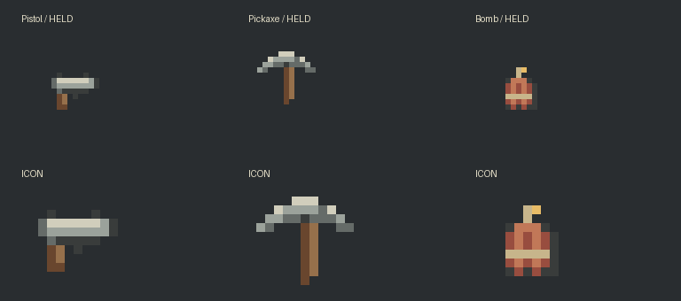

# 主角手持装备：开发成果与交接

2026-09-20。基于本次拉取的 `origin/main` **b96d8dccaefc4d36da56f688dd73927be2914aac**，开发分支 `codex/hero-handheld-equipment`。实现和 Unity 6000.4.9f1 编译已完成；依用户要求，玩法、Prefab 保存重开、Player、独立进程联机和性能验收均留待执行，不能引用历史批次的通过计数。执行清单见[冒烟／回归计划](HERO_HANDHELD_TEST_PLAN.md)，机器记录见[本批证据](evidence/hero-handheld-2026-09-20.json)。

## 可操作功能

| 输入 | 行为 |
|---|---|
| 1／底部手枪图标 | 装备手枪；鼠标瞄准，左键短按发射、按住连续射击；后坐及枪口闪光 |
| 2／底部矿镐图标 | 装备矿镐；左键挥舞，按住重复；仅动作，不派工、不采矿、不伤害物体 |
| 3／底部炸药图标 | 装备炸药；按住左键蓄力，松开按鼠标方向抛出，带额外向上初速度和重力；撞墙、地面或顶面后黏附 |
| 4／底部背包按钮 | 保留原喷气背包开关及燃料机制；由原槽 3 移至槽 4 |
| 滚轮 | 在四槽间切换 |

炸药从**抛出时**计引信，蓄力不会提前消耗引信。爆炸只伤害范围内且地形射线无遮挡的敌军，不伤友军、不修改地图。手枪同样只命中敌军，实体碰撞由权威逻辑计算。切换道具、暂停、UI／失焦阻塞、控制失效和超时会取消蓄力，不自动补扔；恢复输入后需松开再按。以上为已实现的行为合同，实际操作效果待验收。

## 素材与编辑工作流

参考原 worker 12×12 身体、独立衣服叠层及 16×16 采矿动作：小尺寸轮廓，灰绿金属、暖棕木材和米色高光，低饱和像素风。直接逐像素绘制；未调用 gpt-image，也没有修改 `Res/Art/Original` 素材。24×24 透明画布用于统一挂点，并非将人物放大。

源文件集中在 `Game/Assets/DarkNights/Res/Art/Custom/Handheld`：

| 源文件 | 可编辑图层 | 标签／帧（从 0 计） | 运行导出 |
|---|---|---|---|
| Pistol.aseprite | 木柄、枪管、金属高光 | held 0、recoil 1、icon 2 | Pistol.png、PistolIcon.png |
| Pickaxe.aseprite | 木柄、镐头、金属高光 | held 0、swing 1、icon 2 | Pickaxe.png、PickaxeIcon.png |
| Bomb.aseprite | 炸药棒、绳／引线、高光 | held 0、charge 1、icon 2 | Bomb.png、BombIcon.png |
| Explosion.aseprite | 烟尘轮廓、火焰核心 | explode 0–3，每帧 75 ms | Explosion0.png–Explosion3.png |

另有独立 `Hand.png`、`Bullet.png`、`Muzzle.png`，图案保存在绘制脚本中，可分别替换。`manifest.json` 记录调色板、握点、帧映射和尺寸。四个 Aseprite 文件是真正的分层 RGBA 文件，按 [Aseprite 文件规范](https://github.com/aseprite/aseprite/blob/main/docs/ase-file-specs.md) 写出，已通过当前 Unity Aseprite 导入；本机没有 Aseprite 可执行程序，原生软件打开／编辑／重导出检查待执行。

日常以 `.aseprite` 为编辑源，在 Aseprite 中选对应标签导出透明 PNG；保持画布和握点，覆盖已有 PNG 内容但保留 `.meta`／GUID。手持帧使用 24×24 画布、Unity pivot `(8/24, 0.5)`；图标居中。Unity 使用 100 PPU、Point、无压缩、无 mipmap、sRGB，项目仍为 Linear。运行时后坐、蓄力和挥镐由挂点变换驱动，源文件第二帧提供动作编辑参考；爆炸使用四帧序列。

`tools/create-handheld-art.py --output <空目录>`（Python＋Pillow）只负责首版可重现绘制，遇非空目录拒绝覆盖。人工修改后不重新生成正式目录。`Dark Nights/Content/Install Handheld Equipment` 同样只用于首版安装，已安装项目无需再次运行。

## 原生资源装配

`Res/Objects/Handheld/Handheld.prefab` 是共享手持挂点；Worker、Spearman、Archer 的原生 Prefab 各嵌入一份，并序列化到 ActorView。手动控制时使用原 worker 身体与衣服帧，隐藏职业动作中自带的武器／弓臂，避免重复手持；退出手动控制恢复原职业表现。原角色 Prefab GUID、原动画帧和场景布局保留。

`Ballistic.prefab` 及 `Ballistic.asset` 注册 `effect.ballistic`，经 YYGC ObjectDefinition／Addressables／ObjectInstanceFactory 装配，通过显式 `ballistic` 绑定取得 BallisticView。`Hero.prefab` 增加三张图标与第四槽，默认主角模式显示底部工具栏；营地开发入口继续由 camp mode 控制。

## 状态、池化和联机

- ActorState 持有选装、瞄准、冷却、动作及临时蓄力输入；ProjectileBehaviour／ProjectileState 是所有新投射物的唯一权威写入者。Core 只扩展冻结投影和存档合同。
- 权威使用固定 **128** 个 BallisticFlight 槽，空槽复用；客户端通过 YYGC 工厂预热 **128** 个原生表现实例，之后租还，退出显式释放。子弹／炸药／爆炸余帧共享上限，池满拒绝新发射；箭矢仍走原机制，总投射物上限仍为 1024。没有声明零 GC：冻结投影和既有同步仍有分配。
- 碰撞在服务器按不超过 2 像素的线段步进查询权威地图；手枪出生点从手部扫到枪口，避免贴墙穿射。炸药碰撞后速度清零，按引信转爆炸，伤害仅结算一次。
- 沿用 YYGC 输入 Gateway／Sender／Processor、会话权限及已有 R3 展示生命周期。只扩展现有 HeroInputCommand 的瞄准、选择版本、按下／释放／取消字段；没有新增业务 Command 类型、VitalRouter 路由器或并行状态系统。
- Host 与客户端使用相同入口；校验连接、epoch、policy、租约、序号、选择版本和有限瞄准角。客户端不提交伤害、速度或已蓄力时间。短按边沿跨发送间隔保留，蓄力按服务器模拟秒累计；500 ms 输入超时清空输入。
- 冻结投影包含飞行速度、黏附及动作状态；晚加入读取当前飞行物，epoch／连接变化归还旧表现。表现最多外推 100 ms，不结算碰撞或伤害。

## IConfigData 与版本

`HandheldConfig : IConfigData` 放在 `Res/Objects/WorldSession/WorldSession.asset` 的 SharedConfigs，由 ProjectileBehaviour 的 RequireConfig／Inject 取得。所有新参数从此读取，不把伤害写在动画或客户端输入内。

| 参数组 | 默认值（像素／秒） |
|---|---|
| 子弹 | 速度 360、半径 1、寿命 1.5 s、伤害 12、射击间隔 0.22 s |
| 挂点 | 手高 9、枪口距离 8 |
| 矿镐 | 挥舞／冷却 0.48 s |
| 炸药发射 | 速度 65–180、额外上抛 65、重力 220、满蓄力 1.2 s、冷却 0.65 s |
| 炸药爆炸 | 半径 2、引信 3 s、爆炸范围 36、伤害 32、余帧 0.3 s |

配置带有限值／范围校验；配置 SHA-256 加入握手和存档一致性校验。正式协议升为 **10**，存档升为 **v5**，写入独立 `Saves/v5` 目录。旧 v4 文件保留，不自动迁移或删除。保存飞行物的位置、速度、年龄、黏附状态及角色动作冷却；恢复时重建投射物身份，清空临时蓄力／按键。不同装备配置或旧协议不能混用。

## 编译、依赖与验证边界

最终批处理编译退出码 **0**，没有 C# 编译错误；新增 Editor／Tests 代码也已编译。首轮失败是旧 `.deps/AnyRules` 两个文件偏离原锁导致 TerrainEditCommand.ExpectedRevision 缺失，不是本批功能代码失败。保留旧缓存，改用 `.deps/AnyRules-locked-aa450a7`，从原提交与原三份补丁重建后 **442 个文件哈希一致**。manifest、lock 和准备脚本同步新路径；YYGC 仍锁 `12b253c`，AnyRules 仍锁 `aa450a7`，没有新增框架源码补丁，详见[账本](YYGC_CHANGES.md)。

已完成：代码编译、整批 PNG／Aseprite 导入、首版 Prefab／配置／Addressable 装配、静态差异与资源引用检查、PNG 预览检查。

待执行：新增 7 个手枪／炸药用例及更新后的主角用例；Prefab 编辑保存重开；真实输入、像素挂点和动作观感；Editor／Play、Mono、2–4 进程联机、弱网、恢复与性能。未运行任何本批玩法测试、未构建 Player，未验证 IL2CPP、双机器 LAN 或 M5 前台性能。
