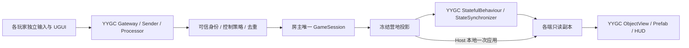

# Dark Nights Godot → Unity 移植方案

2026-09-14 当前入口：[YYGC 统一对象架构分阶段执行计划](YYGC_UNIFIED_REFACTOR_PLAN.md)。运行实体与状态所有权已迁入 YYGC，Core 只保留纯算法／数据合同；可针对框架能力限制和 BUG 升级适配。此次无需 Godot 旧档、Unity v1 存档或旧协议兼容；仍保留冻结玩法、人工资源及新格式完整恢复。**U0–U5 已完成，框架锁定 `745f3d2`；协议 7 基础完成 144 项 Editor／Play、同一 Mono 的 350 项完整矩阵及 240 秒容量 21 项。后续 UI／结果页及 [Linear 固定世界表现](M5_WORLD_PRESENTATION.md)已分别验收，最新 `a4a5450` 完成 155 项 Editor／Play 和新 Mono 77 项检查。前台验收由用户暂缓，IL2CPP／双机器 LAN 仍待条件；受限清理按用户要求完成[清单交接](STAGE_CLEANUP_INVENTORY.md)。** 下文保留原移植方案的历史设计，旧档兼容和 Core 世界长期保留要求不再适用；当前合同以[技术架构](ARCHITECTURE.md)和[存档格式](SAVE_FORMAT.md)为准。

2026-09-13 Definition 场景入口修复已实施，具体职责与替代关系见[当前合同](SCENE_DEFINITIONS.md)。场景身份和分类由 Loader 的 Definition 提供，Marker 仅保留实例参数；静态视图沿用 YYGC 初始化并绑定权威副本。编译完成，回归按用户要求待确认；下文早期手工 ContentId 映射表和预览替换描述保留历史时点。

2026-09-12 C 重构已实施并完成最终 Ready 修复后的 Mono 复验。Core 1361、最终 Editor 95、Play 生命周期 20、Mono 启动 6 和双进程 13 项通过；同一最终产物的并发、活跃加载、九组四进程弱网、战斗晚加入、三夜及容量上限也已通过。性能 A/C 对比仍待后续；M5 既有待验收项保持。实际合同与证据见[C 实施记录](C_REFACTOR_IMPLEMENTATION.md)。下文历史批次的当时边界保留。

设计更新：2026-09-11。**建议保留普通 C# 规则核心，由 YYGC 会话对象管理权威运行与状态发布，Unity 原生 Prefab / UGUI 负责表现；单人和联机使用同一条命令链。** 首版默认共享营地控制，同时提供仅房主操作模式，后期关闭共享控制只改变权限。

方案已开始执行：配置已接通 AppStartup / Addressables，权威模拟、显式命令、旧档核心和可编辑布局来源已通过冻结夹具对照；首批 WorldSession／Worker Definition、Prefab 与生成 wire 合同也已通过双后端启动检查，实际状态和证据见[开发执行计划](DEVELOPMENT.md#implementation-progress)。可玩会话、完整对象表现和正式联机尚未完成。目标保持灰松谷的素材、布局、数值、操作意图、三夜玩法和旧档语义。多人输入的权限、顺序与反馈作为明确的会话差异单独验收。

## 已有基础与实施范围

| 输入 | 本次核对结果 | 方案含义 |
|---|---|---|
| Godot `projects` | HEAD `91cb09ff0894f26134f07fd544f1273d9fe7ffaa`，工作区干净 | 冻结规则、素材、场景和测试夹具，Unity 运行独立于原目录 |
| Unity `unity-projects` | 设计开始时 HEAD `4432d75`；`Game/` 已有 Bootstrap、Addressables、网络管理器与独立 LAN Sample | 在现有宿主上增量建立正式 `Assets/DarkNights`，不重新建一个 Unity 工程 |
| Editor / 语言 | `6000.4.9f1`；项目代码目标 C# 9 / .NET Standard 2.1 | 使用现有版本，不为迁移回退 Editor 或直接加载 net8.0 程序集 |
| YYGC | `10b8f0e` / `0.3.0-preview.1`，通过 `.deps/YYGC` 隔离引用 | 复用已验证提交；补丁、DLL 和生成注册仍需纳入可重现输入 |
| 联机证据 | LAN Sample 的 Mono / Windows IL2CPP 均有 Host＋3 客户端及真实 UDP 弱网通过记录 | 可复用命令与状态路径；正式实体集合、AppStartup 集成、双机器与完整游戏仍待验证 |

首版沿用仓库的 2–4 人共享营地范围，以 Windows、房主主持、局域网 IP 直连为实施假设。单人使用一人本地主持会话；镜头、框选、悬停、建造预览和菜单各自独立。公网邀请、Steam 与中继可随后接入连接层；首版不包含这些入口、私人营地或房主迁移。

原始检查记录见 [LAN Sample](LAN_SAMPLE.md) 和[冻结依赖证据](evidence/lan-sample-dependencies.json)。本次读取证据并核对代码，没有重新运行这些 Player 测试。早期框架复评中的故障属于旧提交，不再按未修复问题从头安排。

## 实施效率要求

实施必须遵循 [AGENTS 的批量执行约束](../AGENTS.md#execution-efficiency)及[每批执行方式](DEVELOPMENT.md#每批实施的执行方式)。同批文件、`.meta` 生成、资源配置和验证尽量集中准备、一次触发、汇总取回结果；避免逐文件刷新、重复编译／构建、密集轮询和逐步请求用户继续。按真实编译／导入依赖分批，保留既有 GUID、人工资源和全部必要验收。此项为后续实施约束，不代表自动化批量流程已经实现。

## 架构与 YYGC 的对应关系

以营地会话作为 YYGC 的业务聚合入口，Core 内部继续组合经济、生产、战斗、波次等小模块。YYGC Behaviour 管理生命周期和适配，ObjectView 保存表现引用，SharedConfigs 只保存只读内容映射。这既遵循框架的对象组合设计，也保留现有跨单位规则的单一写入者。



| YYGC 能力 | 正式游戏接法 |
|---|---|
| AppStartup、Root / Session / Local DI | 启动加载规则和定义；每局建立独立生命周期；通过接口注入命令入口与只读副本 |
| ObjectDefinition、ObjectInstance、Behaviour | 一个网络会话对象组合模拟适配和投影 Behaviour；每位玩家一个有所有权的命令入口；单位、建筑、工位为本地对象视图 |
| SharedConfigs、ObjectView、绑定生成器 | 保存 ContentId、外观、锚点和引用；HP、资源、训练进度来自副本，规则数值仍只来自 JSON |
| Gateway / Sender / Processor | 使用 `ServerAuthoritative` 和 `NetworkCommandContext`；Host 和远端都进入相同业务处理方法 |
| StatefulBehaviour / StateSynchronizer / MemoryPack | 先发布 10 Hz 的有界可靠完整投影；游戏补 epoch、revision、Ready、集合冻结和大小限制 |
| R3 / VitalRouter | R3 观察副本并管理订阅释放；VitalRouter 只做现有命令链的显式适配，规则使用普通 C# 调用 |
| UGUI / Interaction Sessions / Addressables | 正式 HUD 和菜单使用 UGUI；建造、框选、模态输入由本地交互会话仲裁；内容本地打包 |

新定义遵循当前 YYGC 的 GUID / Key 设计：ContentId 映射到 `DefinitionReference`，运行时使用 `GetDefinitionByKey` / `CreateByKeyAsync` 等正式入口。核心 EntityId、资产 GUID / Key、旧整数定义 ID 和 FishNet ObjectId 分开。正式 Dark Nights 已整体采用 GuidFirst／GuidV2：数据库关闭在线 ID 服务，所有正式 Definition 的旧整数 ID 和别名均为空，Windows 构建启用 `YYGC_GUID_DEFINITION_WIRE_V2`，网络定义不再依赖旧 ID。YYGC 框架仍保留废弃字段以支持其他旧项目，但正式 Editor／Runtime 守卫会拒绝旧身份。独立 LAN Sample 继续使用已验证的 LegacyV1；旧 v1 存档导入属于玩法迁移，不与定义身份兼容混用。详见[身份指南](<D:/Developer/YYGC/Documentation~/DEFINITION_IDENTITY.md>)及[架构](ARCHITECTURE.md)。

正式代码不引用 `Assets/Samples/LanCoop`；将其中已验证的接法落实到正式的四个程序集，业务 DTO、注册表、Prefab 与会话服务均由正式工程拥有。Sample 保留为独立回归对照。

<a id="directory-and-assets"></a>

## 目录、Addressables 与对象装配要求

2026-09-11 经人工可读性复审，正式目录采用 **Scripts / Res 分离，代码按职责分层，资源按游戏对象归组**。本节为实施要求；已创建正式配置、启动、View、Res/Scenes/Pinewatch，并按首批对象建立 Res/Objects/Worker 与 WorldSession。完整对象、UI 和美术仍待按实际功能实施；完整目录及程序集依赖以[技术架构](ARCHITECTURE.md)为准，不预建空目录、占位类或通用 Manager。

| 入口，相对于 `Assets/DarkNights` | 归属与维护方式 |
|---|---|
| `Scripts/Core` | Config、Logic、ViewData、Save；纯 C#，可写世界仅归 Logic，ViewData 是展示副本 |
| `Scripts/Runtime` | Session、Network、Framework、Save；框架、加载、网络与文件系统适配 |
| `Scripts/View`、`Scripts/Entry` | 表现与本地输入；启动装配；对应 View、Entry 两个运行程序集 |
| `Scripts/Editor`、`Scripts/Tests` | 编辑器工具与隔离测试，不进入 Player |
| `Res/Objects/Worker` 等对象目录 | 同对象的 ObjectDefinition、对象 Prefab、Visual Prefab、专用动画及材质放在一起 |
| `Res/UI/HUD` 等面板目录 | 同面板的定义、Prefab 与专用资源放在一起 |
| `Res/Scenes`、`Res/Config` | 关卡／预览场景；规则 JSON、内容映射等实际配置资产 |
| `Res/Shared` | 多个对象共用的材质、字体等资源；专用资源留在所属对象目录 |
| `Res/Art/Original`、`Res/Art/Custom` | 原始素材与新增／修改素材；原始素材只保存一份，按来源清单保留相对路径和 SHA-256，由 Prefab／动画引用 |

命名采用 Core、Runtime、View、Entry 四个运行程序集；原方案的 Presentation、Bootstrap 层分别改称 View、Entry，既有 Bootstrap 场景和 Sample 类型名不随之改名。代码目录使用 Config、Logic、ViewData、Save、Network 等直观名称。`Scripts` 与 `Res` 不加入代码命名空间，例如 `DarkNights.Core.Logic`。配置类型在 `Scripts/Core/Config`，配置文件在 `Res/Config`；Res 中不放 `.cs` 代码文件，Prefab 仍正常引用 Scripts 中定义的组件。

### Addressables 不要求游戏资源目录采用特殊名称

已核对本工程锁定的 Addressables **2.10.1** 包内文档、设置加载源码，以及 Unity 官方 2.10 文档：

- 游戏资源无需放在名为 `Addressable`、`Addressables` 或 `AddressableAssets` 的目录。`Res` 是本项目的人类可读性约定；命名不会自动注册资源。通过 Inspector、Groups 或 AssetReference 建立 Addressable 条目与组归属。Addressable 资源不能放在特殊的 `Resources` 目录中。[官方资源组织说明](https://docs.unity3d.com/Packages/com.unity.addressables@2.10/manual/organize-addressable-assets.html)
- `Assets/AddressableAssetsData` 是工具默认创建的**配置目录**，存放设置、分组等管理资产，并非游戏素材必须存放的位置。其受版本控制的配置需提交；构建产物按既有忽略规则处理。本项目保留现有配置位置，不因资源整理改名。[官方安装与配置说明](https://docs.unity3d.com/Packages/com.unity.addressables@2.10/manual/installation-guide.html)
- 包内 `AddressableAssetSettingsDefaultObject` 以 `kDefaultConfigFolder` 定义默认配置位置，并通过已记录的 GUID 加载 Settings；不能由此推导出任意移动整个配置目录和构建路径都会自动兼容。游戏资源目录自由与工具配置迁移是两个问题。
- 物理目录用于找文件，Groups 用于打包和加载，Address／Label 用于寻址或分类，DefinitionGuid／Key 用于 YYGC 定义身份。这些概念不互相替代；不从文件夹名推导定义 Key，不要求每个 Worker 目录对应一个组。按共同加载／释放需求组织分组，并检查共享依赖重复打包。

在线 2.10 文档可能展示后续补丁版本，本次同时核对了本机 2.10.1 的 `Documentation~/organize-addressable-assets.md`、`installation-guide.md` 和 `Editor/AddressableAssetSettingsDefaultObject.cs`；不据此升级包版本。此次仅为文档／源码核对，没有运行 Unity 构建或移动资源实验。

### ObjectDefinition 驱动与绑定合同

正式对象遵循 `ContentId → DefinitionReference → YYGC 定义查询／创建 → ObjectDefinition.PrefabRef → Addressables 加载 Prefab 及依赖 → ObjectInstance / ObjectView 装配`。BehaviourTypes 和 SharedConfigs 参与框架装配；业务代码不另造资源管理器、DI 容器或对象创建路径。图片、动画和材质可作为资源依赖，无需为每个素材单建 ObjectDefinition；规则数值仍以 JSON 为唯一来源。

ObjectDefinition 与所属 Prefab 放在同一对象目录，方便一起核对装配配置与视图。YYGC 通过序列化组件引用、绑定表／缓存以及生成绑定与注入减少运行时组件查找；不能将此机制简化成“加载后随意 GetComponent”。正式接入必须：

1. 核对所锁定框架的绑定、Behaviour 注册、初始化与销毁顺序；组件就绪后才能订阅和驱动画面，资源 await 不跨 SessionScope。
2. 编辑器检查绑定键、目标类型、缺失／失效引用和重复键；Prefab 改层级、替换组件、Visual 替换或池化复用后仍正确。缺失绑定应明确报错，不靠 GetComponent、节点名或子节点索引兜底。
3. 沿用框架的组件访问和生成入口，不手改生成结果、不新增一套组件查找缓存。磁盘生成文件放所属程序集的 Generated 目录并记录输入／重建方式；编译器内生成源码按生成器机制管理。
4. 验证定义加载、Prefab 实例化、Behaviour 装配、组件绑定、复用／销毁与资源释放的完整生命周期，并在正式 Mono / IL2CPP Player 中验证生成注册。
5. 首次导入仅向指定空目录输出样板，随后由人工维护。M0 先拆开初始化与日常构建；移动现有资源时保留 `.meta`／GUID，并核对定义引用、Addressable 条目、框架数据库、场景引用及脚本中的硬编码路径。日常构建不得重新生成或覆盖正式美术资源。

## 共享控制如何保留开关

`CampControlMode` 与 SessionStatusState 字段已建立；正式 Runtime/Session 的 SessionAuthority 已实现房主权限、策略切换和执行点复查，并通过单元回归，见[会话业务合同](SESSION_AUTHORITY.md)。它不是角色所有权或静态全局开关；正式网络／UI 与策略投影尚未接线。

| 模式 | 房主 | 普通已 Ready 玩家 |
|---|---|---|
| `SharedCamp`，首版默认 | 操作全部友军与营地，管理时间和存档 | 操作全部友军、采集、建造、训练、招募、修缮 |
| `HostOnly`，可随时关闭共享控制 | 保持完整操作能力 | 观看同步世界、移动镜头、选择查看信息；不能修改营地 |

仅房主操作模式同时限制移动、攻击、采集、施工派工、训练、招募和修缮，避免通过建造的自动选工人路径间接控制居民。暂停、倍速、提前入夜、加载、重开和修改控制模式在两种模式下始终属于房主。

切换在服务端命令顺序中生效，并增加 `PolicyRevision`。尚未执行的旧策略请求被拒绝；已执行的订单、施工和训练继续，不取消任务或退款。客户端据投影更新按钮和预览；即使绕过 UI 发包，服务端仍按当前策略拒绝。单人也走同一入口。完整权限表和切换验收见[联机设计](MULTIPLAYER.md)。

如果首个切片希望先只让房主操作，可把默认值设为 `HostOnly`，保持相同的同步与命令结构；无需为暂缓共同操作重做网络模型。

## 当前内容与代码量

| 模块 | 文件／物理行 | 迁移方式 | 难度 |
|---|---:|---|---|
| Simulation | 26 / 1,379 | 保留规则和处理顺序，替换少量 Godot 数学／随机 API，拆出客户端选择 | 中 |
| Content | 14 / 333 | 复用数据与定义语义，将 JSON／素材加载移到 Unity 适配层 | 低至中 |
| Persistence | 16 / 692 | 保留 DTO／校验／关系恢复思路，替换 IO、JSON 兼容和 RNG 边界 | 中 |
| Presentation | 54 / 2,814 | 在 Unity 中建立 Prefab、AnimationClip、UGUI、镜头和效果绑定 | 中高，工作量主体 |
| Bootstrap | 5 / 229 | 接入 YYGC 启动与单一会话装配 | 中 |
| 总计 | 115 / 5,447 | 不能把行数直接折算为可复制代码比例 | — |

现有 44 个 `.tscn`，包括 6 类角色、5 类建筑、4 类工位外观，以及 UI、效果、环境、关卡与预览场景。原始素材清单有 551 个文件、75 个 sprite 组、9 个 sound 条目；字节总量约 1.92 MiB，历史来源哈希核验见冻结证据。

既有 Godot 记录包含 133 项游戏检查和 27 项架构工具自测。这些是迁移的验收输入，本轮没有重新运行，更不是 Unity 测试结果。

## 内容冻结边界

| 内容 | 原始唯一来源 | Unity 人工来源／派生关系 |
|---|---|---|
| 经济、单位、建筑、工位数值 | `projects/data/balance.json` | 保留 JSON；Unity 只读加载成 Core 定义 |
| 关卡 ID、seed、waves | `projects/data/levels/pinewatch.json` | 保留 JSON；仍为 `pinewatch`、seed 90127 |
| 初始摆放与边界 | `projects/scenes/levels/Pinewatch.tscn` 的 Layout | 一次迁移为 Pinewatch.unity 布局标记；派生定义不另作手填来源 |
| 外观、动作、偏移、锚点 | 原生 `.tscn/.tres` | 对应 Prefab、AnimationClip、外观目录资源 |
| 原图／音频／帧序／来源 | `projects/assets/manifest.json` | 原字节复制到 Res/Art/Original，保留来源和导入映射 |
| 初始布局／旧档回归 | `projects/tests/Fixtures` | 只读测试夹具；不可成为正式运行时依赖 |

冻结输入的精确哈希见[证据](evidence/assessment-2026-09-10.json)。新仓库运行不能依赖原游戏目录的绝对路径或 Godot 导入缓存。

需保持的代表性内容：初始食物60、木100、石80、铁40、金0；5工人、1长矛兵、1弓箭手，人口7/9；酒馆等4座初始建筑；5个显式自然工作点和由农田生成的食物工位。世界宽1100像素，地面Y=320，建设X=30–850，出生X=1020。

三夜敌人数量7/11/16，准备90/70/70秒，生成间隔3.8/3/2.7秒。费用、伤害、攻击前摇、训练和施工不因玩家人数调整。完整数值以 JSON 为准，本文件不维护第二套数值表。

## C# 核心迁移

1. 将 Content 规则定义、Simulation 和纯快照／校验迁到 Core，使用 Unity 支持的 C# 9 语法。移除主构造、required、文件级 namespace、集合表达式；显式构造／字段验证不能丢失不可变和必填语义。
2. 替换 Godot.Vector2 等基础类型为实际需要的小型值类型，例如 WorldPoint；移动、吸附与舍入保留原 double/float 边界，不引入完整数学框架。
3. 原 GameCatalog.Read 的 FileAccess、SaveRepository 的 user:// 和文件操作留在 Runtime 适配层；Core 接收已经验证的定义／快照。
4. 将 InteractionState、SelectGroup、Construction.Begin 等客户端意图移到本地交互层。Issue、Place、StartSelected 改收显式单位列表、职业、建筑种类和位置，返回业务结果而不是修改全局选择。
5. 保持有序 ActorIds 和 SpawnOrder。原 AI 时钟按 ID 派生、编队偏移、候选工人和训练顺序都不能被无意排序改变。
6. 保留 Economy.Pay、独占关系释放、施工受伤不回满、训练退款、箭矢延迟命中和波次结算的业务语义。

需要优先拆出的实际调用如下；表中目标接口是拟议参数合同，实施时可按职责命名：

| Godot 当前入口 | Unity 目标边界 |
|---|---|
| `GameSession.Interaction`、`SelectedActors`、`UnitOrders.SelectGroup` | 客户端本地选择与副本查询；Core 会话不持有玩家的选区和镜头 |
| `UnitOrders.Issue(target, x)` | `IssueOrders(orderedActorIds, targetEntityId, x)`；服务器解析实体并校验权限 |
| `Construction.Begin` / `Place(x)` | Begin 只启动本地预览；`PlaceBuilding(kind, x, candidateActorIds)` 在权威端吸附、选工人、支付和创建 |
| `Training.StartSelected(kind)` | `TrainActors(orderedActorIds, kind)`；保留逐单位支付和部分成功，不改为全批事务 |
| `Camp.Recruit` / `RepairSelected` | 招募由服务端继续按原规则选取酒馆；修缮显式传建筑 ID；回执返回新实体，只有发起者自动选中 |
| `EntityLifecycle.Remove` 中清除选择 | Core 只维护实体与工作关系；客户端收到移除后各自清理选区、悬停和视图 |
| `SessionFeedback` 混合文本、音效与指令圈 | 无效操作只回发起者；昼夜、死亡等世界反馈按事件 ID 派生；显示反馈不影响结算 |

命令回执可先于下一份投影到达；发起者用回执中的 revision 等待相应副本再读取新对象。客户端可立即显示指令圈和等待提示，不能预扣资源或先改 HP。

原数学行为需要特例检查：建造 `Mathf.Snapped(x, 4)` 的半格舍入、双精度 MoveToward、伤害的 AwayFromZero 舍入。不能仅把 API 名称替换成 Unity Mathf 后假定边界相同。

### 随机数与旧档

原会话用 Godot.RandomNumberGenerator，存档保留其 seed/state 的64位位表示。System.Random 或 UnityEngine.Random 使用同一个 seed 不会自然得到同样的序列。

M1 需要实现并验证该 Godot 版本的算法、播种、整数／浮点范围映射和状态恢复；首版冻结原调用顺序。用固定 seed 以及旧档继续20秒的夹具逐字段对照。不能只检查“能读出 JSON”就宣称兼容。显示效果不能消耗会话随机数。

如果无法达到旧序列兼容，应记录为未完成的兼容目标，并明确需要单独决定的存档／玩法变化；不能更换随机算法后继续声称内容结果一致。

## 场景与 Prefab 对应

| 现有职责 | Unity 对应 | 维护人可直接编辑 |
|---|---|---|
| ActorView / BuildingView / WorksiteView | YYGC ObjectView 实体容器 Prefab | 绑定引用、选区、状态条锚点 |
| 六角色 Visual 场景 | Worker、Spearman、Archer、Zombie、Ghoul、Armored 等 Visual Prefab | 身体／手臂分层、帧、颜色、ArtOffset |
| 五建筑 Visual 场景 | Tavern、House、Barracks、Farm、Watchtower Prefab | 成品图、施工阶段、锚点 |
| 四工位 Visual 场景 | Wood、Stone、Iron、Food Prefab | 变体与枯竭表现；农田工位避免重复绘制 |
| Arrow、尸体／废墟、飘字、指令圈 | 纯效果 Prefab | 显示与寿命；不结算命中 |
| Torch、CampLight、Backdrop | 环境 Prefab／SpriteRenderer／适量 URP 2D 灯光 | 布局、颜色、视差 |
| HUD、菜单、组件、Theme | UGUI Prefab、RectTransform、TMP 与主题资源 | 原静态布局、间距、字体、按钮状态 |
| Pinewatch/Layout | LevelAuthoring＋Placement 标记 | X、ContentId、SpawnOrder、边界 |
| ArtReview | ArtReview.unity | 一屏检查15类外观与 HUD 样本，无正式会话 |

建议的实体层次：

```text
ActorView                       脚底世界根；EntityId 绑定
  VisualSlot
    WorkerVisual                可独立编辑与替换的 Visual Prefab
      ArtOffset
        Facing
          Origin
            BackArm / Body / FrontArm
      StatusAnchor
      SelectionAnchor
  SelectionOverlay
  StatusDisplay
```

具体类和资源名在实施时可按职责调整；脚底、视觉偏移、朝向、状态锚点与玩法占地分离的合同必须保持。ObjectDefinitionLoader 遵循 YYGC 的场景／Prefab 保存规则，不把场景加载辅助器随意 Apply 到实体 Prefab。

### 坐标、像素和排序

模拟继续以原世界像素单位工作。建议展示尺度 PPU=100，统一在适配边界转换：

```text
UnityWorldX = GodotWorldX / 100
UnityWorldY = (320 - GodotWorldY) / 100
局部视觉偏移 = (GodotLocalX / 100, -GodotLocalY / 100)
```

因此1100像素地图显示为11 Unity单位，30像素/秒显示为0.3单位/秒；JSON 的速度和射程不改。地面基线320应来自关卡定义，实际代码不能散落这一常数。鼠标／镜头坐标需逆变换回模拟单位后再发请求。

迁移已校准的 Sprite2D 时，首版可统一使用左上角 pivot `(0,1)`，将已有 offset 转成局部坐标。manifest 原点用于核验，不再重复叠加。若改用原点 pivot，公式为 `(originX/width, 1-originY/height)`，同时消除旧偏移的重复量；先用工人和分层弓箭手验证，再批量转换。

像素图采用 Point 过滤，检查压缩、mipmap、图集边缘和Pixel Perfect设置。角色使用 SortingGroup，组内明确后臂／身体／前臂层级；脚底朝向翻转不能带动状态条或让占地漂移。

### 动画、UI 与预览

采用原生 AnimationClip/Animator，帧图切换使用离散键。PosePresenter 根据模型动作阶段和时间采样，不通过 Animation Event 施加伤害或启动生产；关闭 root motion。身体11帧与静态手臂等不同轨道必须保留各自帧序。

施工阶段、受击闪烁、转职换装和死亡残骸按现有规则映射；AnimationClip 可以由美术编辑，但行为时机仍归模拟。帧时钟和网络插值分开，暂停时战斗动作不能继续推进到新的命中。

HUD 使用1280×800作为对照尺寸，同时验1600×900；建立独立的菜单、选择、命令、资源和小地图面板，不把布局堆进一个生成脚本。Godot 主题里的字体、回退与系统字体选择需单独核实，Unity/TMP 必须具备实际中文字符资源。

编辑器中的布局标记显示正式 Visual Prefab 样本，Play 时统一由本地视图绑定器管理，预览不额外产生游戏实体。拖动标记、修改动画帧、替换原点和主题后，保存重开仍生效。普通构建和导入不能重新生成正式 Prefab 覆盖美术修改。

## 数值与关卡验证

将现有测试的业务意图迁为 Core/NUnit 与 Unity 场景检查，重新建立覆盖关系；不为了沿用“133项”这个数字而制造空测试。

需要保留的基线：

- 初始 Layout 与世界实体快照；农田派生工位与ID顺序一致。
- 固定正常资源策略三夜胜利：原记录约377.67模拟秒、34击杀、酒馆320HP；无人照料约452.10秒失败。时间和完整状态按既有浮点容限检查，不只比较胜负。
- 旧 v1 恢复与继续20秒的逐字段结果，允许原基线定义的浮点容差，不覆盖旧夹具。
- 暂停、2×、支付原子性、工位独占、训练部分成功、死亡清理和在飞箭矢的保存／恢复。
- 正常控制所触发的规则一致；多人并发的次序由服务端明确定义，不能要求不同网络抵达顺序产生同一策略轨迹。

跨引擎画面采用固定场景、镜头、动作时间和窗口尺寸对照。纹理字节相同不代表渲染逐像素相同；记录颜色空间、灯光、后处理与文字排版差异，逐项检查角色脚底、分层、UI与昼夜观感。Godot 的旧 GPU 对照结果不自动适用于 Unity。

## 存档接入

Unity 新档已在 M1 第六批实现独立格式 `dark-nights.world` v1，记录规则／布局摘要并引用 Core 随机算法标识；字段、原子文件流程与实际验证见[存档合同](SAVE_FORMAT.md)。旧 v1 用独立导入入口，保留严格字段和关系校验。第七批会话层已实现房主 BeginLoad 票据及加载 epoch；产品 UI、实际文件任务与网络通知仍待装配。

世界快照与玩家显示设置分离。旧档的相机／选择可供房主本地恢复，其余客户端使用各自设置。epoch、连接ID和网络对象ID是本次会话状态，不把它们当作持久实体身份。

默认先保留 JSON 与原子文件写入边界；接 YYArchive 时将整个世界作为一个模块。任何恢复路径都先建立临时世界，完成全部校验后再替换正在运行的世界。

## 迁移执行方式

按以下阶段推进，每一步都形成可独立检查的产物。详细退出条件、剩余工作量与验收矩阵见[执行计划](DEVELOPMENT.md)。

| 阶段 | 交付物 | 通过后再扩展 |
|---|---|---|
| M0 接入收口 | 正式四程序集、架构守卫、依赖与生成注册、独立的构建入口 | 正式 AppStartup 与新程序集的 Mono / IL2CPP 小探针可运行 |
| M1 核心迁移 | Content / Simulation / 纯快照、显式命令、Godot 数学与 RNG 兼容 | 初始布局、规则、完整三夜和旧档继续 20 秒对照通过 |
| M2 正式联机切片 | 少量工人、工位、建筑 Prefab；单人、Host＋客户端；控制策略与投影 | 两端采集／建造一致、选择独立、切换 HostOnly 后无越权或重复支付 |
| M3 完整表现 | 15 类外观、环境、完整 HUD／菜单、音效、动画、ArtReview | 正式 Player 可玩完整三夜；资源可编辑、保存重开 |
| M4 会话完整性 | 四人、晚加入、断线重连、暂停／倍速、保存／加载、epoch | 第二夜加入、加载中的旧包和控制策略切换均正确 |
| M5 交付验收 | 双机器 LAN、完整关卡弱网／性能、干净构建及操作文档 | 可独立运行的 Windows Player 和可复现报告 |

M0 已完成两个源码确认的接入项：[SampleAssemblyAccess.cs](../tools/lan-framework-patch/SampleAssemblyAccess.cs) 同时向样板 Runtime 与正式 DarkNights.Runtime 授予生成调度器所需的窄范围友元访问；[DarkNightsEnvironmentSetup](../Game/Assets/DarkNights/Scripts/Editor/DarkNightsEnvironmentSetup.cs) 已拆开 `BuildAddressablesContent()` 与 `Initialize()` 并保护初始化输出。Worker／WorldSession 定义、Prefab、Addressables、FishNet spawn、ContentId 映射和 GuidV2／MemoryPack 生成注册已在 Mono 与 IL2CPP Player 启动验证；旧的 LegacyCompatible／LegacyV1 记录保留为历史基线，当前切换证据见[开发执行计划](DEVELOPMENT.md#implementation-progress)及[正式身份切换记录](evidence/formal-object-contracts-guid-v2-2026-09-11.json)。M2 已实现独立的权威会话业务层；仍需接入网络命令处理器、实际会话装配和真实实体集合投影。

M2 先迁移真实规则下的工人采集与住宅施工，不再做另一个十金币测试营地。使用冻结开局布局和数值；可暂只接必要视图，其余表现由 M3 补齐。实体集合的复制、序列化、在飞箭矢及事件池生命周期是相对标量 Sample 新增的验证重点。

一次性资产迁移工具可以读取原 manifest 和场景数据，输出到明确的空目录，并生成路径／GUID／原点／帧序对照；此后正式 Unity 场景归人工维护。原目录和原始素材不清理、不移动。
