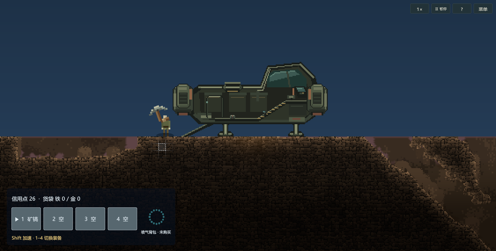

# 矿镐网格选择与权威采集（2026-09-30）

## 当前状态与范围

- 首轮按用户要求仅实施源码；随后用户报告“拿起矿镐还是看不到网格”，明确授权跟进验证。
- **DISPLAY_VERIFIED / GAMEPLAY_PARTIAL**：同一 Local Unity `6000.4.9f1` 已导入、生成新增 `.meta` 并完成编译。正式 Bootstrap 购镐、航行、自动着陆、出舱后的显示生命周期 **14/14** 通过，专项 Editor **13/13**；按影响合并 **28/30**，保留两项旧手枪测试失败。本批没有 Player 构建，不能沿用历史 Mono／IL2CPP 验收。
- 正式协议由 **17 → 18**，因为主角输入合同新增采矿目标。存档仍为 **v13**，不新增保存字段；旧协议客户端不得混连。旧 Player 不包含本批功能。
- 不修改 YYGC 框架、依赖配置、现有资源 GUID、人工 Prefab／场景、材料数值、矿镐冷却或采矿奖励。
- 这里的“墙壁格”是已有权威地形／矿床玩法格，不是三层装饰背景。网格覆盖邻格只作视觉辅助，每次成功采集仍只作用中心一格。
- 保留现有 HandMine 规则：允许软岩和铜／铁／金格，拒绝基岩、保护格及其他硬岩；空格只有存在同格且未枯竭的既有矿床时才可采集。不新增全墙可挖规则。

## 可调外观与使用

配置归当前地图的 `CaveTerrainStyle.MiningSelector`，经 `RandomLevelEntry` 交给 `PinewatchStage`；未提供样式时使用同样的紧凑默认值。它只控制本地 UI，不参与地图视觉身份或权威采集范围。

| 参数 | 默认 | 含义 |
| --- | --- | --- |
| `Radius` | 1 | 1 为紧凑 3×3，2 为扩展 5×5；外围线尾继续渐隐 |
| `LinePixels` | 2 | 屏幕像素线宽，不随相机缩放变粗 |
| `CenterOpacity` | 1 | 中心格白色边框不透明度 |
| `SurroundOpacity` | 0.4 | 周围白色格线透明度上限 |
| `FillOpacity` | 0.055 | 中心格极淡白色填充 |
| `FadePower` | 2 | 从中心向外围衰减的曲线指数 |
| `InvalidOpacity` | 0.3 | 无效格整体变淡，并以虚线中心框区分 |

持有矿镐并将鼠标移到地图格子，显示上述选择器；左键短按或按住沿既有装备节奏采集。选中格不可采、超距、被坡形阻挡或货袋已满时，只显示无效反馈，不发送有效采矿目标。换装备、UI 输入阻塞、暂停、角色失效、登船、断连以及非地面远征阶段隐藏选择器。选择器是原生主角 HUD 下的单个 UGUI 几何组件，禁用射线，随面板释放；不制作位图、不调用 AI 生图、不创建逐格游戏对象或新的网络实体。

## YYGC 状态与执行链

1. **本地读取**：`HeroMiningPointer` 只读取冻结角色、矿床和 AMP1 地图副本。格中心、距离换算来自 Core 纯函数；遮挡查询复用真实坡形。手部高度读取当前会话 Definition 的 `HandheldConfig`，不是另一份玩法配置。
2. **冻结目标**：`HeroInputSampler` 在原 30 Hz 节流与保活中携带 `HeroMiningTarget`（地图 WorldId／Epoch、U／V、TileId／Flags）。短按在客户端缓冲首次点击目标；同一服务端模拟步内已缓冲的按下目标不被后续持有包改写。无效点击不能被后续移动“补成”另一格有效点击。
3. **现有命令**：扩展 `HeroInputCommand`，仍走 YYGC Gateway／Sender／Processor。服务器继续验证可信连接、ActorId、控制租约、序号、协议、会话 epoch、策略版本、观察 tick 和装备选择版本；目标内容只用于拒绝过期请求，不用于授权奖励。
4. **唯一执行入口**：`HeroEquipment.Tick → HeroMining.TryMine`。服务器重新核验 worker、矿镐、地面阶段、存活、冷却、容量、地图身份、目标内容、范围、坡形遮挡及材料保护规则；Host 不另走本地采矿捷径。旧离散矿床 Use 和玩家 Tag 3 地形请求不再执行采矿。
5. **唯一状态所有者**：格子仍由 `TerrainMapAuthority`／ARDMap 持有；装备冷却和货袋仍归 ActorState；余额、风险和矿床剩余量分别归原 Behaviour。Core 无 Unity／YYGC 引用，展示不预测结算库存或地图，不引入平行世界／全局事件系统。
6. **同步短事务**：`TerrainMiningBatch` 只保存当前 `ObjectMutationBatch` 内的稀疏清除候选。同格先到先登记，事务内读取已登记格视为 Empty；多个采矿与同 tick 爆破合成一批地图清除，不复制全图。
7. **提交次序**：先准备全部 YYGC 状态候选并检查重复所有者，再进行地图清除安装，再由 `SessionStateChange.CommitAll` 安装对象状态，最后发布地图变更通知。准备失败不安装地图；过程同步、无 await，地图安装期间禁止通知重入。该组合依赖现有 YYGC 准备／提交生命周期合同；尚未做故障注入，不宣称异常条件原子性已验收。
8. **已有同步／恢复**：对象冻结投影和 AMP1 增量分别沿现有链发布，Ready 仍由完整对象／地图／表现共同门控。SoftRock 信息编码在运行格 Flags 的 bit 5（32），bit 0 保护位、bit 1–4 坡形不变；保存仍使用既有 `soft_rock` 数据，恢复装载时重建 bit 5。输入目标和临时地图草稿不进入存档。

## 待验证清单（全部未执行）

### 导入与代码合同

- [ ] Unity 一次批量导入新增脚本，生成 `.meta`；检查既有 GUID 和场景／Prefab 引用未变，不人为分配新 GUID。
- [ ] C# 9／四程序集编译；YYGC StateData、MemoryPack 和命令注册生成恢复，检查 ActorState 复制／池归还、新输入字段及协议 18 指纹。
- [ ] 既有测试和输入回放工具改用显式采矿目标；不沿用无目标射线采矿或旧 Tag 3 成功断言。
- [ ] bit 5 在完整快照、AMP1 增量、局部刷新、坡形渲染、工作台填挖和保存恢复中均保留正确含义。

### 原生画面与操作

- [ ] 正式 Bootstrap／星球地面实际持有矿镐，网格为白色、中心亮、周围渐淡；实际 Linear 色彩空间、不同分辨率与镜头缩放下对齐一格且线宽保持 2px。
- [ ] Inspector 3×3／5×5、线宽、透明度和曲线实时调节；Native HUD 重开、显示／隐藏、释放及无射线遮挡。
- [ ] 软岩、铜／铁／金、保护格、基岩、硬岩、空格矿床和枯竭矿床；真实斜坡遮挡、格边界、距离边界、未知地图块、货袋满等有效性与服务端结果一致。
- [ ] 快速点击后移动鼠标、30 Hz 发送间隔内按下／释放、持续采矿跨格、换装未确认、UI 打开／关闭、暂停、失焦、死亡、登船／下船；取消不会补发采集，冷却数值不变。
- [ ] 装饰背景不可采，不把邻格光线误解为范围伤害；一格清除对应碰撞／岩层局部更新，资源与风险奖励仅结算一次。

### 权威、事务与恢复

- [ ] 独立 Host＋Client：相同目标、同格争抢、重发／乱序、假 ActorId／租约／地图身份／坐标／内容、超距和隔墙请求；Host 单次执行。
- [ ] SharedCamp／HostOnly 策略切换、旧 PolicyRevision、旧选择版本、旧世界／地图 epoch；关闭权限后持有输入不能继续采矿。
- [ ] 正常网络及 200 ms RTT＋5% loss＋25 ms jitter；初始 Ready、晚加入、断线重连及暂停中的地图／库存一致。
- [ ] 准备状态失败、地图候选冲突、同 tick 多矿工／爆破、提交通知异常和对象退休故障注入；检查地图、货袋／余额、矿床、冷却不会部分生效或重复奖励。
- [ ] v13 实际写盘、进程重启恢复最终格子／软岩／坡形／矿床剩余量／库存；不恢复按住输入或上次悬停目标，拒绝旧 epoch 请求。
- [ ] 同一 Mono 产物完成上述独立进程回归；协议 17 客户端拒绝混连。尚未构建本批 Player。
- [ ] 前台性能、全路线、双机器未验收；IL2CPP 只在用户另外明确授权后安排，不将 Mono 结果替代它。

## 本轮未做的工作

未改自动采矿／自动寻路、矿物平衡、破坏强度、多格采集、背景墙新数据层或额外特效资产；没有提交 Git、构建 Player 或清理历史产物。现有工作区其他未提交成果保留。本次只收口网格不可见与 Local 显示验收，不宣称权威采矿、联网、故障原子性或恢复已全部交付。

## 2026-09-30 持镐网格不可见跟进

### 根因与修复

`SessionUiController` 在远征存在 `ShipTradeHud` 时禁用整个 `Hero` 根；新增的 `MiningSelector` 挂在该根下，因此虽然目标采样继续执行，图形始终不活动。现在根只受世界／菜单生命周期控制，旧常驻工具栏则由 `showToolbar` 单独隐藏，不与 UI Toolkit 装备栏重复显示。

`HeroHudBehaviour.InitializeMiningSelector` 同时明确根 RectTransform 的全视口锚点和零偏移，避免继承 Prefab 零尺寸布局；不修改人工 Prefab、GUID、场景或 YYGC。暂停、UI 模态、装备与船内门控仍由原目标采样器处理，不为显示网格放宽采矿授权。

### 本批证据与边界

- 正式 [汇总证据](evidence/mining-grid-20260930.json)记录源文件哈希、两次 Editor 结果、所有 Play 尝试与最终回执。
- Editor 首次 **23/30**。四项几何测试反射匹配歧义已修正；旧“无目标矿镐仅挥动”断言改为显式目标合同“无目标不执行”。受影响组重跑 **13/13**；合并后 **28/30**，不是 36 个独立通过用例。
- `HeroCombatTests.ShortClickHitsOnceAndDuplicateInputCannotFireAgain` 与 `RepeatedFireReusesBoundedSlotsAndRetiresExpiredShots` 未给当前默认空背包夹具配置手枪，仍失败；本轮不改初始装备或扩修手枪。
- 实际 Play **14/14**：协议 18 新开局、正式客户端购镐、航行着陆出舱、Hero 根活动、旧工具栏保持隐藏、网格视口非零、真实鼠标悬停产生几何、亮度匹配有效性、不阻挡射线、暂停隐藏、切空槽隐藏、重装备恢复、菜单隐藏和返回恢复。
- 下图来自实际 Game 视口 `1689×855`，不是 H5 示意。鼠标选中落地保护格，因此是淡色虚线无效中心；有效中心亮度、3×3／5×5 与 Canvas 1×／2× 比例由隔离几何测试覆盖，其他实际分辨率／镜头缩放仍待验。

- **实际合法格采矿仍未验证**：本次落地区未找到合法且可达的采矿格，最终回执明确 `miningVerified:false`。没有注入地图、角色坐标或奖励，也没有把网格出现当作采集成功；清除单格、掉落／入袋、多人竞争、弱网、事务异常和真实写盘恢复继续保留待验证。
- 首两次 Play 驱动未完成开局，第三次已完成购镐／着陆／出舱，但寻找可采格时移动超时；修正驱动的按钮中心、PlayerInput 鼠标配对及限定显示检查后，最终批次通过。失败回执保留，不以重跑抹除失败历史。
- 验证仅使用现有 Local Editor，结束后退出测试会话并恢复临时鼠标和输入设置；无第二套 Library、Mono／IL2CPP Player、用户存档修改或框架修改。
- 本批回执与截图约 **438 KiB**，全部为正式成功／失败证据，保留在 `artifacts/mining-grid-20260930`；无专属可移出的过期构建副本。共享且正在复用的 `Library` 不归档，未删除缓存；最终磁盘余量见汇总证据。

### 待验证清单的状态解释

上方综合清单保留为未勾选，避免部分通过冒充整项完成：导入／编译已完成；显示／菜单／暂停／换装在上述单一实际视口完成；合法采矿、材料／距离／坡形全矩阵、失焦／死亡／登船全矩阵、联机和恢复未完成。

## 2026-09-30 左键采集无反馈跟进

### 现场诊断与修正

- 读取用户当时的 Local Play，而不是将上一批网格截图当作采矿成功。最后悬停格为 `(54, -55)`，TileId 7、Flags 0、材料 2（普通硬板岩），本地有效性为 false；`Player/Attack` 实际绑定仍为 `<Mouse>/leftButton`。诊断时远征已经结算为 Phase 4、人物已登船；该状态也不允许采矿。现场世界另存为验证前备份，未覆盖用户存档。
- 该地图的前景可手采格数为 0；独立矿床仍有 12 个。普通硬岩、保护区域和基岩本来不属于合法手采目标，不能因看见网格就视为可采。保持现有材料、奖励、默认地图、存档和协议不变。
- 同时复现距离回归：配置 `work_reach` 为 16 逻辑像素，但新网格输入按格中心量距。角色碰撞阻止身体进入墙格，侧面手部到中心约 `(16, 1)`，脚下约 17 像素，导致贴墙／踩在格上仍可能被判超距。现在量手部到目标格边缘的最短距离；配置仍为 16，原有真实坡形遮挡检查保留，没有允许隔墙采矿。
- 原来无效格仅显示淡色虚线，点击后没有任何文字解释。现在正式装备栏和开发者工具栏显示硬岩／保护区／基岩／空格／超距／遮挡／满袋的具体原因；有效目标显示左键及按住连续采集提示。继续不发送有效目标给被拒绝的格子，不作本地奖励或地图预测。

### 本批验证与边界

- 专项 Editor 最终 **21/21**：新增 7 个独立 YYGC 会话用例，覆盖软岩单格清除、矿石奖励一次、独立矿床减量一次、重复输入拒绝，以及硬岩／保护矿石／基岩／空格拒绝；新增贴墙和脚下触及距离回归，既有网格与无目标输入断言继续通过。测试夹具使用明确的可达位置和已购买装备，不是正式地图路线或真实鼠标成功证明。
- 最终 Editor 回执为 `artifacts/mining-grid-20260930/editor-194543.json`。早期夹具缺失基岩边界、地图布局类型不匹配、目标超出 16 像素中心距离的失败回执均保留；最终通过不抹除失败历史。
- 本轮继续用同一个 Local Editor 检查真实购镐、航行、着陆、出舱、悬停及无效格点击提示；原生 Play 结果另行记入汇总证据，不把隔离权威用例写成全流程采矿通过。
- 不修改 YYGC、人工 Prefab、GUID、场景、数值或资源字节；不新建 worktree、不提交 Git、不构建 Mono／IL2CPP Player。正式地图合法目标的自然到达和真实鼠标采集、独立进程联机、弱网、故障注入、保存重启及全路线仍待验收。
