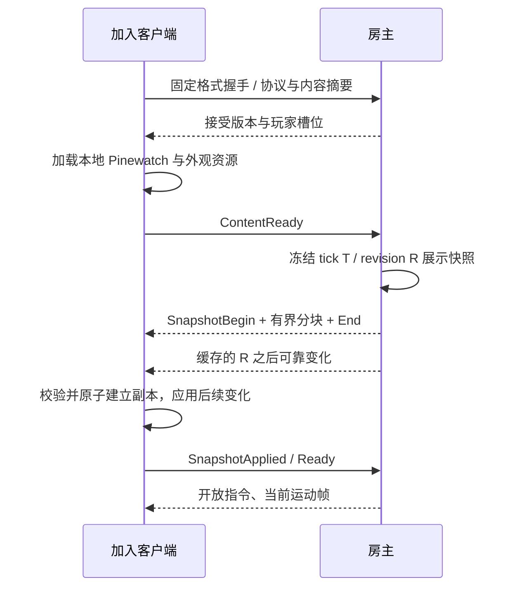

# Dark Nights 合作联机设计

状态：设计，尚未实现或运行验证。已确认 2–4 人合作、共享一个营地；按 Windows、房主主持、局域网／直连估算。公网房间、邀请、中继与平台身份尚未确认，见[范围与工期](DEVELOPMENT.md)。

## 玩法权限

| 操作／状态 | 首版建议 |
|---|---|
| 库存、人口、营地、建筑和胜负 | 全队共享，不按玩家人数增加初始资源或改变三夜数值 |
| 居民控制 | 所有已 Ready 的玩家都可操作友军；不分配永久私人单位 |
| 镜头、选择、悬停、放置预览、帮助页 | 客户端独立；打开自己的菜单不会自动暂停大家 |
| 同一单位收到不同玩家命令 | 按服务器接受顺序串行处理，最后一个合法命令生效；UI 显示最近操作来源 |
| 同时建造／招募／训练 | 服务器重新验证并逐项支付，不信任客户端显示的余额 |
| 同一工位／工地 | 继续保持现有独占和释放规则；冲突返回明确结果 |
| 暂停／恢复、1×／2×、提前入夜 | 仅房主可执行；状态向所有人显示 |
| 暂停时下命令 | 保留既有语义：允许合法指令和即时支付／分配，生产、移动和战斗时间停止 |
| 保存、加载、重开 | 房主负责；加载和重开进入受控切世界流程 |
| 普通玩家断开 | 营地继续，单位保留已有任务／AI，其他玩家可接管 |
| 房主离开 | 会话结束，客户端返回菜单；恢复依赖房主已有成功存档，不做自动房主迁移 |

共享控制、房主权限是针对已确认玩法给出的设计建议，不是已经实现或逐项确认的产品行为。相对单人的变化集中于权限、本地菜单、请求延迟与冲突反馈；不隐式改变战斗和经济规则。

## 请求与服务端处理

请求包含 `ProtocolVersion`、`Epoch`、`CommandSequence` 和具体参数。身份由接收端的有效连接得到，映射为 `PlayerSlotId + ConnectionGeneration`，不使用客户端传来的 PlayerId 作为授权。

拟议请求包括：

| 请求 | 明确参数 | 服务端处理 |
|---|---|---|
| IssueOrders | 有序 ActorIds、可选 TargetEntityId、目标 X | 验证友军／状态、目标、边界；保留编队偏移和采集分配顺序 |
| PlaceBuilding | BuildingKind、X、候选 ActorIds | 使用相同网格吸附、占地、选工人和 Pay 规则；返回新 EntityId |
| TrainActors | 有序 ActorIds、目标职业 | 保留原先逐单位入队／支付的部分成功语义；返回成功和失败列表 |
| Recruit／Repair | 对应建筑 EntityId | 验证存在、类型、营地权限、资源和冷却 |
| SetPaused／SetSpeed／StartNight | 目标值／操作 | 验证房主身份、状态与允许值 |
| Save／Load／Restart | 受支持的槽位或操作 | 验证房主权限；不接收任意客户端文件路径 |

客户端不能发送“直接增加资源”“应用伤害”或“设置 HP”之类权威写入。原来读取全局 SelectedIds／BuildKind 的方法改成显式参数；建造完成后的选中、退出预览等由发起客户端依据结果执行。

处理流水线：

1. 校验握手、场景 Ready、有效连接代次、epoch 与支持的请求类型。
2. 限制消息大小、列表长度、字符串长度、发送频率和积压队列；拒绝 NaN/Infinity、非法 ID、越界位置和超出定义的参数。
3. 按 `(epoch, playerSlot, connectionGeneration, commandSequence)` 去重；保存有界的结果窗口。可靠传输不等于游戏扣款天然不会重复。
4. 将输入复制为普通不可变操作参数，进入主线程服务端队列，赋予服务器接受顺序。
5. 在同一处理片段验证最新世界、成本和占用，再执行业务；不存在“先支付后 await 再创建”的窗口。
6. 产生带 RequestId、接受 tick、结果码、相关 EntityId 和状态 revision 的 CommandResult。客户端据此结束待确认反馈，世界变化仍来自状态同步。

超过缓存窗口的旧序号返回明确过期结果，不重新执行。重复实体 ID 不得重复扣款；标准化 ActorIds 时保留第一个出现的顺序，不能排序后改变原编队和批量训练顺序。多人同时购买时只允许实际库存支持的操作成功。

Host 的输入也调用同一个处理入口，使用服务端构造的可信身份上下文；不同时调用本地规则和 ServerRpc。初始单人模式也采用一个本地主持的会话，避免长期维护第二条未经权限校验的业务路径。

## 同步粒度与通道

首版采用会话级同步，完整模拟只在房主。世界视图使用少量 YYGC/FishNet 入口桥接，不按每个精灵层或单位创建网络同步组件。

| 数据 | 建议通道／频率 | 规则 |
|---|---|---|
| 业务请求、CommandResult | 可靠、按事件 | 有序／去重、明确失败；不广播未验证请求当作事实 |
| 加入／加载的完整展示快照 | 可靠、分块 | 冻结于同一个 tick/revision；验证所有块后一次应用 |
| 实体创建／删除、职业变化、资源、HP、工作与训练、波次、暂停、胜负 | 可靠、合并同一模拟步的变化 | 保持结构和业务事实一致；小关卡先发送变更记录的完整值 |
| 位置、朝向、可采样动作时间 | 不可靠、10–20 Hz 初始调参范围 | 带 epoch/tick/sequence；过时包丢弃；周期发送完整运动帧 |
| 声音／飘字等一次性表现 | 按事件重要性选择可靠或不可靠 | 带 EventId/tick 去重；晚加入不重播历史一次性效果 |
| 镜头、选择、放置预览 | 本地 | 首版不做共享光标协议 |

网络发送频率不改变 60 Hz 模拟的规则步长。10–20 Hz 和约 50–100 ms 插值缓冲只是待测起点，最终以当前关卡和实际延迟为准，不能据此宣称带宽或体验已达标。

运动帧只更新已存在的实体，不能创建／复活实体。其头部标记所需的结构 revision；结构消息尚未应用时只做有界暂存或丢弃，等后续完整运动帧恢复。停止移动后仍定期发送当前状态，避免最后一个不可靠更新丢失后永久停在旧位置。暂停时网络继续发送必要的当前值。

业务关键状态使用可靠通道；周期运动帧不是把丢失的经济增量靠插值补回来。首版不做复杂字段级 delta 压缩，先测单帧 DTO 大小、消息量和分配，再决定是否优化。

箭矢命中完全由模拟负责。客户端只显示轨迹；晚加入快照包含仍在飞行的箭矢展示数据，不重新发射或补算伤害。可以在 epoch 内分配独立的 ProjectileViewId；旧档无该字段时在恢复后重新建立展示 ID，不改变原来的伤害、目标和剩余飞行时间。

## 加入、晚加入与重连

握手摘要覆盖协议、数值规则、规范化布局、YYGC 定义映射和使用的生成类型注册表。外观包另带版本；同一发行包优先要求完全一致。固定握手通过后才生成／开放业务入口，避免拿未匹配的类型表解码游戏请求。客户端不根据自身场景布局擅自生成开局单位。

对象 `OnSpawnServer` 的首次快照不能替代上述世界流程。经济、实体关系、波次必须来自同一个切点；分块保存 snapshotId、epoch、tick、revision、总字节数和摘要，限制块数、总量与缓存时间。大快照不能塞成单个无界 UDP RPC；具体块大小由已锁定 transport 的限制与实测决定。

传输期间其他玩家继续游戏，服务器为加入者暂存 R 之后的可靠变化；到达上限／超时则放弃这份基线并重新取快照，不无限积压。客户端只在初始快照与后续变更连续可用后 Ready；运动帧在这一阶段可以丢弃，Ready 后用当前帧恢复。

普通断线重连使用服务器签发的会话恢复凭据绑定原玩家槽位，并增加 ConnectionGeneration。槽位和凭据保留时间设置上限；客户端遗失凭据时作为新玩家加入，不冒认原连接 ID。每个槽位同时只接受一个有效连接。

重连一律重新获取当前展示快照；不要求建立完整事件回放系统。客户端丢弃原连接的待确认预览，不自动重发可能已支付的操作。连接 ID 变化不改变营地 EntityId。联网入口升级到公网时，鉴权与中继按所选平台另行设计，不能把局域网恢复凭据当作平台账号体系。

## Host 与展示副本

Host 运行服务端模拟和一个本地展示副本。冻结投影通过同一副本应用逻辑在本地送达一次；网络回环的重复 revision/event 被过滤。UI 不直接持有可写 WorldState，避免 Host 看似正常而客户端才暴露错误。

所有世界视图按 `(epoch, EntityId)` 绑定；切职业重用身份、更换外观，删除清理绑定。显示位置经插值和坐标适配得到，不写回服务端。

## 保存与加载

权威存档保留完整模拟状态和随机数，网络展示快照仅包含客户端需要的读模型，两者不能混用。旧 v1 中 camera/selected 字段视为单人历史显示状态，导入时只用于房主本地恢复或忽略；不能覆盖每个客户端的镜头。

保存流程在服务端 tick 边界捕获冻结的完整世界，随后执行严格校验和原子文件写入；成功与失败向房主确认。客户端不自行持久化一份“可继续结算”的营地。

加载／重开流程：

1. 进入 Loading，停止推进与接受新业务命令，继续心跳和通知。
2. 在临时世界中解析、校验所有字段、ID 和关系，恢复随机数、在飞箭矢及计时；失败保留旧世界与原暂停／倍速设置。
3. 成功后切换世界并增加 epoch，重置请求、结构 revision、快照及插值缓存，客户端清理旧世界绑定。
4. 向活动玩家发送同一份新基线，设置 Ready 超时；超时者退出 Ready 集合，不能无限阻塞其余玩家。
5. 按存档中的暂停和倍速状态恢复会话；拒绝此前 epoch 的所有消息。

首版支持游戏自身的新档与明确的旧 v1 导入，不承诺让旧 Godot 客户端与 Unity 客户端混联。兼容方式见[适配方案](MIGRATION_PLAN.md)。

## 联机验收重点

- Host 一次建造只扣一次资源；远端同样如此；重复请求不再支付。
- 2–4 人分别选中／训练／建造，镜头与选择互不覆盖；同时争抢不足资源、同一工位和同一单位的结果确定。
- 非房主修改倍速／加载被拒绝；非法 ID、敌方单位、无效数值、超大请求和过期连接不修改世界。
- 第二夜晚加入可见一致的资源、HP、训练、在飞箭矢和波次；既有客户端不回到旧 tick。
- 不可靠包丢失／乱序后最终位置收敛；可靠结构尚未到达时不产生幽灵实体。
- 普通玩家断线、重连和新连接代次正常；房主退出给出明确结束原因。
- 暂停期间仍可连接／接收同步，加载期间旧 epoch 请求不污染新世界。
- 测试使用独立进程和模拟网络条件，具体矩阵见[开发执行计划](DEVELOPMENT.md)。
