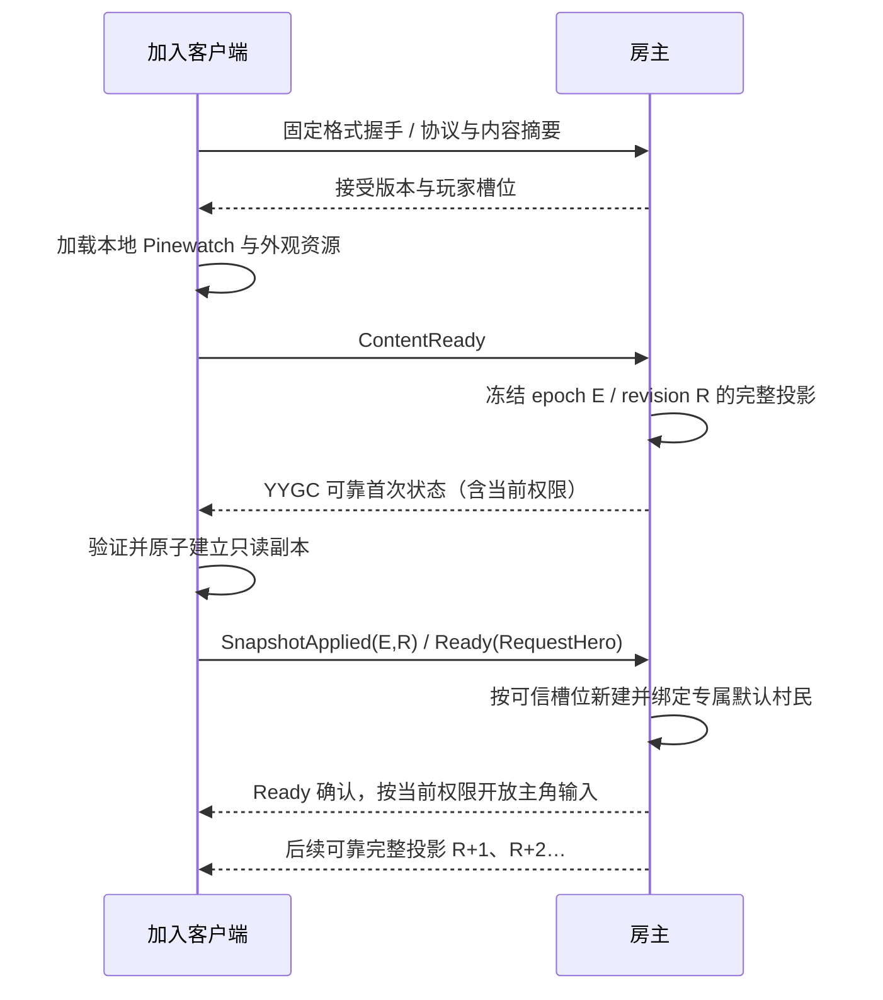

# Dark Nights 合作联机设计

2026-09-17 [随机灰松谷](RANDOM_PINEWATCH.md)接入正式游戏，当前协议 **9**／存档 **v4**。AMP1 可靠同步 61,440 格最终地图，完整副本、正确世界代次和初始可见页共同门控实体 Ready；服务端核验 Ready 中的地图身份。Host 与客户端均从只读副本渲染。主角逻辑格碰撞及实体／地图共同恢复已接入；暂停保持网络工作，晚加入、重连、加载和重开重新取得当前地图。采矿输入、工具耐久与奖励仍未接入。后续带日期的协议 8 说明为历史批次。

2026-09-16 当前实现采用协议 **8**／存档 **v3**，YYGC 锁定输入分支 `0c7cec0`。主角独占控制和有界输入流复用 Gateway、可信连接、完整投影及同一权威 ActorState；Ready 携带默认主角偏好，服务端为每个首次上线且有权限的玩家新建不同的专属村民，不从场景现有闲置村民中选择。重复 Ready 不重复生成；断线释放旧人物，重连生成新人；HostOnly 回到 SharedCamp 恢复同一专属人物。默认 UI 隐藏顶部主角工具栏与旧营地操作入口。实现与本批实际验证见[联合执行文档](HERO_INPUT_EXECUTION.md)。下方带旧日期与提交的统计是历史证据。

2026-09-13 当前实现见 [YYGC 统一对象执行计划](YYGC_UNIFIED_REFACTOR_PLAN.md)：权威状态已从 Core 实体迁入 YYGC 业务 Behaviour，继续复用可信命令链、会话完整投影、Ready、epoch、恢复凭据和共享控制语义。使用游戏协议 7／新档 v2，拒绝协议 6／5 及旧档；不强制逐实体 NetworkObject。**U0–U5 已完成；U6 最新 `4e3798f`／YYGC `745f3d2` 通过 144 项 Editor／Play 和同一 Mono 的 350 项完整矩阵**，含活跃恢复 14/14、四人恢复 24/24、九组弱网各 24/24、战斗晚加入 9/9、三夜 22/22、容量及新增时效 21/21。另用同产物完成 240 秒摘要容量 21/21，48 组抽样最大落后 0.3 秒，见[性能修正与证据](YYGC_UNIFIED_PERFORMANCE.md)。前台验收按用户选择暂缓，性能仍未签署；IL2CPP／双机器 LAN 未验收。下文旧协议的记录保留历史时点，不作为当前版本通过证据。

2026-09-11 增补：独立 [LAN Sample](LAN_SAMPLE.md) 已通过 Windows Host＋3 客户端的共享交易、工位、权限、Ready、epoch、暂停、晚加入／重连和真实 UDP 弱网验证。本页完整游戏协议仍为设计，Steam、双机器和正式玩法未验收。

2026-09-12 当前状态：正式玩法经 YYGC 命令／状态链接通，协议 5 已接入主机授权存档、同房间重开、120 秒恢复凭据及真实新快照 Ready。C 重构最终 Ready 修复后的同一 Mono 产物已通过并发 13/13、活跃施工／训练／箭矢组合恢复 13/13、九组四进程弱网各 22/22、战斗晚加入 9/9、三夜 17/17 及容量上限 13/13；M5 的画面和普通 Player 性能仍待收口。实现见[正式网络](FORMAL_NETWORK.md)、[恢复接入](NETWORK_RECOVERY.md)和[C 重构实施记录](C_REFACTOR_IMPLEMENTATION.md)。沿用 2–4 人共享营地和 Windows 房主 LAN／直连；公网房间、邀请、中继、平台身份及房主迁移不在首版范围。下文的拆流等内容保留为测量超限后才启用的设计。

实现沿用 YYGC `10b8f0e` 的 Gateway/Sender/Processor 和 StatefulBehaviour/StateSynchronizer；同一 WorldSessionBehaviour 已承载有界、可靠的完整营地投影，并接入首次状态和在线替换。后文的分块、结构/运动拆流、增量暂存流程是在测量超限后启用的设计。权限、epoch、原子应用、Ready 与恢复合同保持有效。

## 玩法权限

| 操作／状态 | 首版建议 |
|---|---|
| 库存、人口、营地、建筑和胜负 | 全队共享，不按玩家人数增加初始资源或改变三夜数值 |
| 居民控制 | 默认 `SharedCamp`；每位请求主角的玩家首次 Ready 时由服务端直接生成一名专属 `worker`，不扣招募资源、不占用现有闲置村民。产品 UI 暂时隐藏顶部主角工具栏和营地命令；`HostOnly` 会撤销来宾接管并拒绝其修改，恢复 SharedCamp 后接回原专属人物而不重复增员 |
| 镜头、选择、悬停、放置预览、帮助页、右键指令圈 | 客户端独立；打开自己的菜单不会自动暂停大家，指令圈不进入网络投影 |
| 同一单位收到不同玩家命令 | 自动单位按原营地顺序处理合法命令；已接管单位拒绝营地订单，仅接受持有有效租约的控制者输入 |
| 同时建造／招募／训练 | 先验证控制模式，再重新验证并逐项支付；建造自动派工也受限制 |
| 同一工位／工地 | 继续保持现有独占和释放规则；冲突返回明确结果 |
| 暂停／恢复、1×／2×、提前入夜 | 仅房主可执行；状态向所有人显示 |
| 暂停时下命令 | 原营地合法指令和即时支付／分配继续保留，生产、移动和战斗时间停止；主角移动／使用拒绝，接管／释放可执行 |
| 保存、加载、重开、修改控制模式 | 房主负责；加载和重开进入受控切世界流程 |
| 普通玩家断开 | 营地继续，原自动任务保留；其主角释放占用，空中先落地再恢复自动控制，有权限者可重新接管 |
| 房主离开 | 会话结束，客户端返回菜单；恢复依赖房主已有成功存档，不做自动房主迁移 |

CampControlMode 枚举和状态字段已经冻结；SessionAuthority 已实现默认 SharedCamp、房主权限、策略切换及拒绝结果，并接入网络与 UI。用户允许暂缓全员操作，也允许先开启后关闭；两种模式使用相同模拟与网络结构。相对单人的变化集中于权限、本地菜单、请求延迟与冲突反馈；不隐式改变战斗和经济规则。

2026-09-15 [右键指令圈](LOCAL_COMMAND_RINGS.md)已改为各端预热复用的本地输入反馈。服务端仍验证和执行单位指令，但不发布圆圈事件；本地圈不代表指令已获服务端确认。已知无操作权限、未 Ready 或输入被模态会话阻塞时不显示。独立 Host＋客户端基础和真实 UDP 弱网分别通过 22 项隔离及生命周期检查。

### 控制模式与切换合同

`CampControlMode` 与 `PolicyRevision` 由 Runtime/Session 的 SessionAuthority 唯一写入，执行时统一检查权限；已进入房间展示副本，不放进单位的 FishNet Ownership。UI 读取同一策略用于按钮、快捷键、右键和建造预览。

| 操作 | SharedCamp 普通玩家 | HostOnly 普通玩家 | 房主，两种模式 |
|---|---|---|---|
| 观察、相机、选择查看、帮助 | 允许 | 允许 | 允许 |
| 移动、指定攻击、采集、施工派工 | 允许 | 拒绝 | 允许 |
| 放置建筑、自动选工人、训练、招募、修缮 | 允许 | 拒绝 | 允许 |
| 暂停、倍速、提前入夜、存档、加载、重开、切模式 | 拒绝 | 拒绝 | 允许 |

这里 `HostOnly` 明确表示非房主仅观看营地：建造会改变工人订单，训练会转移单位，不能只禁用移动按钮。将来若需要普通玩家仅建设等细分角色，再增加权限规则，不提前设计私人单位系统。

1. 开房时写入模式，默认 `SharedCamp`；也可仅通过配置设为 `HostOnly`。加入者完成 Ready 前先取得当前模式和策略版本，并在 Ready 中声明是否请求默认主角；身份仍只取可信连接。
2. 房主的 `SetControlMode` 与其他命令在同一队列串行处理；切换增加 `PolicyRevision` 并发布新投影。每条修改世界的请求携带提交时的策略版本，在执行点再次校验。
3. 排在切换前且已经执行的操作保持生效；切换后尚未执行的旧策略请求返回 `PolicyChanged`，不扣款、不分配工人。当前版本下无权限请求返回 `PermissionDenied`。客户端不会自动重发失去权限的请求。
4. 已有移动、AI、生产、施工和训练继续，无需重置世界、销毁单位或退款。切换不增加 epoch，也不改变 EntityId。
5. 客户端收到策略变化后取消失效的本地预览，刷新操作入口，保留镜头和信息选择。服务端仍校验绕过 UI 的请求。
6. 世界加载保留当前房间模式，不能让旧存档扩大来宾权限；加载增加 epoch 并重新 Ready，只恢复仍带手动主角标记的保存对象。连接记录的专属 ID 必须指向这样的对象，若碰巧指向普通闲置村民则不能接管；没有可恢复主角时新建村民。新建房间使用所选模式，网络待确认请求和分配偏好不写入存档。

因此，后期关闭共同操作只需要切模式或修改默认值。自动采集、AI 战斗和世界同步无需变更。

## 请求与服务端处理

请求包含 `ProtocolVersion`、`Epoch`、`PolicyRevision`、`CommandSequence` 和具体参数。身份由接收端的有效连接得到，映射为 `PlayerSlotId + ConnectionGeneration`，不使用客户端传来的 PlayerId 作为授权。策略版本只用于拒绝过期意图，不能由客户端指定权限。

拟议请求包括：

| 请求 | 明确参数 | 服务端处理 |
|---|---|---|
| IssueOrders | 有序 ActorIds、可选 TargetEntityId、目标 X | 验证友军／状态、目标、边界；保留编队偏移和采集分配顺序 |
| PlaceBuilding | BuildingKind、X、候选 ActorIds | 使用相同网格吸附、占地、选工人和 Pay 规则；返回新 EntityId |
| TrainActors | 有序 ActorIds、目标职业 | 保留原先逐单位入队／支付的部分成功语义；返回成功和失败列表 |
| Recruit／Repair | Recruit 为操作；Repair 带建筑 EntityId | 招募保留原服务端选酒馆规则；修缮验证明确目标；均验证权限、资源和冷却 |
| SetPaused／SetSpeed／StartNight | 目标值／操作 | 验证房主身份、状态与允许值 |
| SetControlMode | 枚举目标值、当前 PolicyRevision | 验证房主身份，在队列中切策略并发布新版本 |
| Save／Load／Restart | 受支持的槽位或操作 | 验证房主权限；不接收任意客户端文件路径 |

客户端不能发送“直接增加资源”“应用伤害”或“设置 HP”之类权威写入。原来读取全局 SelectedIds／BuildKind 的方法改成显式参数；建造完成后的选中、退出预览等由发起客户端依据结果执行。

处理流水线：

1. 校验握手、场景 Ready、有效连接代次、epoch 与支持的请求类型。
2. 限制消息大小、列表长度、字符串长度、发送频率和积压队列；拒绝 NaN/Infinity、非法 ID、越界位置和超出定义的参数。
3. 按 `(epoch, playerSlot, connectionGeneration, commandSequence)` 去重；保存有界的结果窗口。可靠传输不等于游戏扣款天然不会重复。
4. 将输入复制为普通不可变操作参数，进入主线程服务端队列，赋予服务器接受顺序。
5. 在同一处理片段再次验证当前控制模式、策略版本、最新世界、成本和占用，再执行业务；不存在“先支付后 await 再创建”的窗口。控制模式改变也遵循该顺序。
6. 产生带 RequestId、接受 tick、结果码、相关 EntityId、PolicyRevision 和状态 revision 的 CommandResult。客户端据此结束待确认反馈，世界变化仍来自状态同步；回执先到时等待对应 revision 后再选择新建对象。

超过缓存窗口的旧序号返回明确过期结果，不重新执行。缓存内相同请求返回原结果；相同序号却修改参数的请求拒绝。重复实体 ID 不得重复扣款；标准化 ActorIds 时保留第一个出现的顺序，不能排序后改变原编队和批量训练顺序。多人同时购买时只允许实际库存支持的操作成功。

Host 的输入也调用同一个处理入口，使用服务端构造的可信身份上下文；不同时调用本地规则和 ServerRpc。单人模式采用只接受本地玩家的一人主持会话，使用同一命令和展示入口。

## 同步粒度与通道

首版采用会话级同步，完整模拟只在房主。复用 YYGC 会话状态组件，单位视图为本地对象。可靠完整投影以 10 Hz 为待测起点，直接整体替换副本，不先实现增量合并协议。模拟仍为 60 Hz，1×/2×只在模拟入口应用一次。

完整投影至少包含 epoch、revision、服务端 tick、模拟时间、暂停／速度、控制模式／策略版本、库存／人口／波次／胜负，以及全部单位、建筑、工位和仍在飞行的箭矢展示数据。随机数和完整恢复用的内部状态仅属于权威存档，不随展示快照暴露或在客户端继续结算。

Sample 只有标量，正式投影存在列表和嵌套数据：发布前冻结集合；检查 MemoryPack 注册与生成的 CopyFrom / Equals / Reset 语义，不能把 record 的浅复制当作冻结。R3 订阅内立即复制成客户端拥有的不可变副本，之后再交给异步资源加载和插值缓冲。

M2 测量序列化字节数、分配、四连接带宽和可靠队列积压，同时覆盖正常关卡及有效旧档上限（256 实体、1024 箭矢）。按锁定 transport 限额设置单帧、接收总量和超时；超限时引入有界分块，不能截掉实体或损坏兼容档。以下表格仅描述需要拆流时的通道合同。

| 数据 | 建议通道／频率 | 规则 |
|---|---|---|
| 业务请求、CommandResult | 可靠、按事件 | 有序／去重、明确失败；不广播未验证请求当作事实 |
| 加入／加载的完整展示快照 | 可靠、分块 | 冻结于同一个 tick/revision；验证所有块后一次应用 |
| 实体创建／删除、职业变化、资源、HP、工作与训练、波次、暂停、胜负 | 可靠、合并同一模拟步的变化 | 保持结构和业务事实一致；小关卡先发送变更记录的完整值 |
| 位置、朝向、可采样动作时间 | 不可靠、10–20 Hz 初始调参范围 | 带 epoch/tick/sequence；过时包丢弃；周期发送完整运动帧 |
| 声音／飘字等一次性表现 | 按事件重要性选择可靠或不可靠 | 带 EventId/tick 去重；晚加入不重播历史一次性效果 |
| 镜头、选择、放置预览 | 本地 | 首版不做共享光标协议 |

网络发送频率不改变 60 Hz 模拟的规则步长。10–20 Hz 和约 50–100 ms 插值缓冲只是待测起点，最终以当前关卡和实际延迟为准，不能据此宣称带宽或体验已达标。

运动帧只更新已存在的实体，不能创建／复活实体。其头部标记所需的结构 revision；结构消息尚未应用时只做有界暂存或丢弃，等后续完整运动帧恢复。停止移动后仍定期发送当前状态，避免最后一个不可靠更新丢失后永久停在旧位置。暂停时网络继续发送必要的当前值。

业务关键状态使用可靠通道；周期运动帧不是把丢失的经济增量靠插值补回来。首版不做复杂字段级 delta 压缩，先测单帧 DTO 大小、消息量和分配，再决定是否优化。

箭矢命中完全由模拟负责。客户端只显示轨迹；晚加入快照包含仍在飞行的箭矢展示数据，不重新发射或补算伤害。可以在 epoch 内分配独立的 ProjectileViewId；旧档无该字段时在恢复后重新建立展示 ID，不改变原来的伤害、目标和剩余飞行时间。

## 加入、晚加入与重连

握手摘要覆盖协议、数值规则、规范化布局、YYGC 定义映射和使用的生成类型注册表。外观包另带版本；同一发行包优先要求完全一致。固定握手通过后才生成／开放业务入口，避免拿未匹配的类型表解码游戏请求。客户端不根据自身场景布局擅自生成开局单位。

逐实体 `OnSpawnServer` 快照不能独自保证世界一致性；但把营地冻结为单个会话状态时，可以复用它传送完整基线，并由游戏控制 Ready 与原子应用。完整投影方案无须同时维护 R 之后的增量日志，后续直接应用更新的完整 revision。测量要求分块/拆流后，再启用上述 SnapshotBegin/End 与增量暂存流程；所有块来自同一切点且受总量/时间限制。具体大小由锁定 transport 的限制与实测决定。

完整投影传输期间其他玩家继续游戏；客户端只应用同 epoch 的较新 revision，不因随后到达的旧首次快照回退。在资源尚未就绪时只保留有界的最新完整投影，不能排队保留无限历史。若以后切换到分块＋增量方案，才为加入者暂存 R 之后的可靠变化；到达上限／超时重新取基线，连续可用后再 Ready。

普通断线重连使用服务器签发的会话恢复凭据绑定原玩家槽位，并增加 ConnectionGeneration。槽位和凭据保留时间设置上限；客户端遗失凭据时作为新玩家加入，不冒认原连接 ID。每个槽位同时只接受一个有效连接。

重连一律重新获取当前展示快照；不要求建立完整事件回放系统。客户端丢弃原连接的待确认预览，不自动重发可能已支付的操作。连接 ID 变化不改变营地 EntityId。联网入口升级到公网时，鉴权与中继按所选平台另行设计，不能把局域网恢复凭据当作平台账号体系。

## Host 与展示副本

Host 运行服务端模拟和一个本地展示副本。冻结投影通过同一副本应用逻辑在本地送达一次；网络回环的重复 revision/event 被过滤。UI 不直接持有可写 WorldState，避免 Host 看似正常而客户端才暴露错误。

所有世界视图按 `(epoch, EntityId)` 绑定；切职业重用身份、更换外观，删除清理绑定。显示位置经插值和坐标适配得到，不写回服务端。

## 保存与加载

权威存档保留完整模拟状态和随机数，网络展示快照仅包含客户端需要的读模型，两者不能混用。旧 v1 中 camera/selected 字段视为单人历史显示状态，导入时只用于房主本地恢复或忽略；不能覆盖每个客户端的镜头。

保存流程在服务端 tick 边界从 YYGC 业务 State 捕获冻结的完整世界，随后执行严格校验和原子文件写入；成功与失败向房主确认。客户端不自行持久化一份“可继续结算”的营地。

加载／重开流程：

1. 进入 Loading，停止推进与接受新业务命令，继续心跳和通知。
2. 在临时世界中解析、校验所有字段、ID 和关系，恢复随机数、在飞箭矢及计时；失败保留旧世界与原暂停／倍速设置。
3. 成功后切换世界并增加 epoch，重置请求、结构 revision、快照及插值缓存，客户端清理旧世界绑定。
4. 向活动玩家发送同一份新基线，设置 Ready 超时；每个成功 Ready 的连接按当前策略和请求偏好恢复已保存主角，缺少可恢复对象时才新建默认村民，超时者退出 Ready 集合，不能无限阻塞其余玩家。
5. 按存档中的暂停和倍速状态恢复会话；拒绝此前 epoch 的所有消息。

当前[主角切片](HERO_INPUT_EXECUTION.md)使用协议 8／v3 新档；旧 Godot／Unity v1／v2 与协议 7／6／5 明确拒绝，不导入、不自动迁移。主角由可信连接独占接管；输入使用独立序号、控制租约与过期归零，共享营地权限继续由同一服务端入口验证。当前数据边界见[存档合同](SAVE_FORMAT.md)。

## 联机验收重点

- Host 一次建造只扣一次资源；远端同样如此；重复请求不再支付。
- SharedCamp 下远端能下令；HostOnly 下伪造移动、训练和自动派工请求均被拒绝，观看正常；两种模式都可完整完成一局。
- 在队列中切模式、暂停时切模式、晚加入／重连取得新策略；旧策略未执行请求不支付，已生效订单继续；加载不恢复旧房间权限。
- 2–4 人分别选中／训练／建造，镜头与选择互不覆盖；同时争抢不足资源、同一工位和同一单位的结果确定。
- 非房主修改倍速／加载被拒绝；非法 ID、敌方单位、无效数值、超大请求和过期连接不修改世界。
- 第二夜晚加入可见一致的资源、HP、训练、在飞箭矢和波次；既有客户端不回到旧 tick。
- 首版可靠完整投影在延迟／丢包后收敛且不会旧 revision 回退；启用不可靠拆流后额外验收最终位置与结构次序。
- 普通玩家断线、重连和新连接代次正常；房主退出给出明确结束原因。
- 暂停期间仍可连接／接收同步，加载期间旧 epoch 请求不污染新世界。
- 测试使用独立进程和模拟网络条件，具体矩阵见[开发执行计划](DEVELOPMENT.md)。
