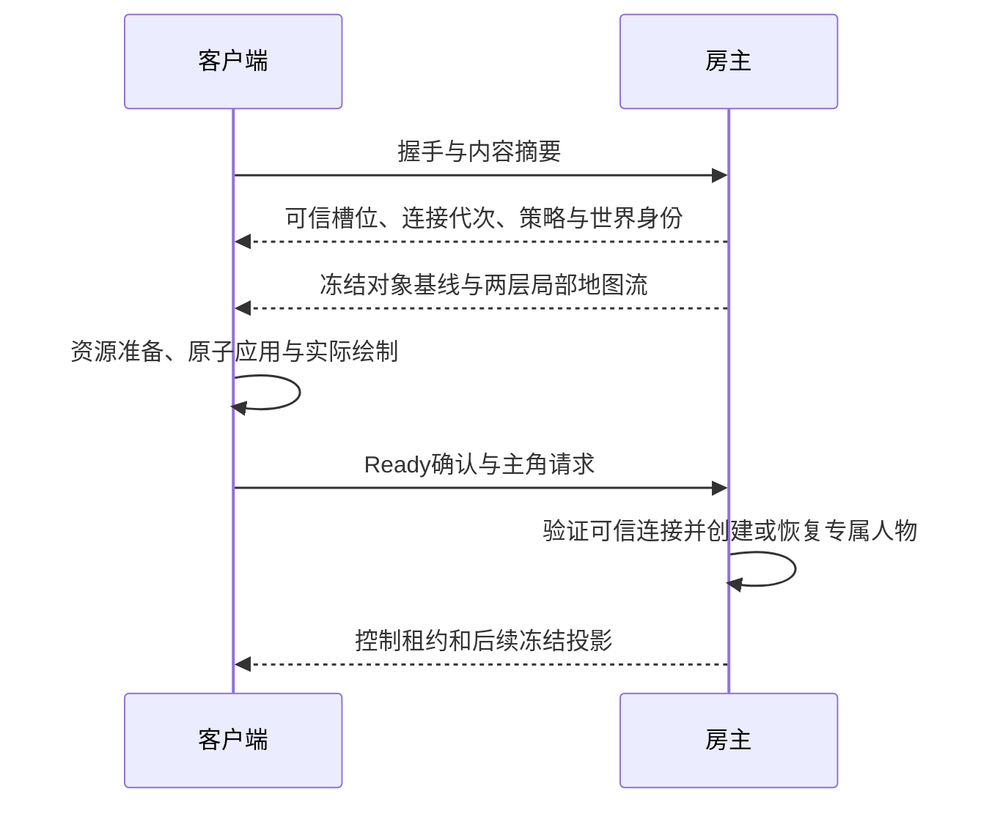

# Dark Nights 合作联机合同

本页维护当前会话的可信身份、权限、请求、同步、Ready、重连与epoch。当前开放操作见[玩法范围](GROUND_GAMEPLAY_BASELINE.md)，状态所有者见[架构](ARCHITECTURE.md)，文件合法性见[存档](SAVE_FORMAT.md)。版本、构建和验收状态统一查[DEVELOPMENT](DEVELOPMENT.md)。历史营地／太空方案不是当前请求授权表。

## 玩法权限

默认SharedCamp，2–4人共享营地及信用点；每位玩家控制服务端分配的专属主角。首次完整Ready直接创建worker，不扣招募资源或占用闲置角色；重复Ready不增员。当前购买、采集、装备、手电和飞船请求均走所属业务入口，不由客户端直接写资源或伤害。

| 操作 | SharedCamp普通玩家 | HostOnly普通玩家 | 房主 |
| --- | --- | --- | --- |
| 观察、镜头、帮助与信息查看 | 允许 | 允许 | 允许 |
| 合法主角输入、采集、装备／手电及购买 | 按角色控制租约和当前状态验证 | 拒绝修改 | 同一验证入口 |
| 飞船驾驶、起飞、降落、取消收舱 | 按唯一驾驶席、位置及阶段验证 | 拒绝修改 | 同一业务验证 |
| 暂停、倍速、保存、加载、重开、切控制模式 | 拒绝 | 拒绝 | 验证后允许 |
| Debug Hub免付费添加／移除和上帝模式 | 拒绝 | 拒绝 | 仅有效开发会话及明确调试请求 |
| 旧建造／训练／招募／修缮、目的地、出售、NPC／物流／结算 | 当前暂停 | 当前暂停 | 当前暂停，房主身份不解除范围限制 |

CampControlMode和PolicyRevision由SessionAuthority唯一写入，投影给各端，不通过转移FishNet所有权实现。暂停停止业务时间，网络、心跳、UI、合法会话控制及存储继续；不使用Time.timeScale=0停掉整个服务进程。菜单只锁本地输入，不自动暂停全房间。

### 控制模式与切换合同

1. 开房默认SharedCamp；Ready前取得当前模式和策略版本。连接身份取可信网络上下文，客户端PlayerId／SenderObjectId不授予权限。
2. SetControlMode与请求在同一队列串行；切换增加PolicyRevision，在执行点拒绝尚未执行的旧策略意图，不支付、不分配、不自动重发。
3. 已生效操作保持，已生效任务按其原生命周期继续；暂停玩法不因模式改变恢复。切策略不改变epoch或EntityId。
4. HostOnly撤销来宾控制租约；恢复SharedCamp接回本连接仍有效的专属人物，不重复增员。UI取消失效预览，但服务端仍检查绕过UI的请求。
5. 加载保持当前房间策略，存档不能扩大来宾权限；新房间使用开房选择。权限／连接／租约和待确认请求不写入文件。

## 请求与服务端处理

业务参数明确携带协议、epoch、PolicyRevision、序号、目标EntityId／定义GUID、位置或操作值；库存调试还校验角色、明确实例、数量和版本。选择、BuildKind或本地UI下标不能代替请求参数。身份映射为可信PlayerSlotId＋ConnectionGeneration，角色输入另验控制租约及过期归零。

Host、远端和单人Host复用YYGC Gateway／Sender／Processor以及SessionAuthority处理链，Host一次输入只提交一次。客户端只显示待确认反馈，不先支付、结算伤害或修改权威矿格。

1. 业务解析前校验协议及规则／布局／定义／生成注册内容摘要，核验有效连接、epoch、Ready与操作范围。
2. 验证消息／列表／字符串上限、频率与积压；拒绝非法ID、敌方／不存在目标、越界位置、NaN／Infinity和不合法数量。
3. 以epoch、玩家槽、连接代次、请求序号去重，使用有界结果窗口；相同序号改参数拒绝，过期序号不重新执行。重复ActorIds按首次出现保序去重，不排序改变原语义。
4. 从传输回调复制不可变参数到主线程队列，不保存池化命令；处理时再次验证策略、最新目标、距离、版本、成本、库存及独占关系。
5. 同步短事务执行。资源准备await在事务外完成，不先扣款再等待；候选全部校验后安装，提交完成再通知。
6. 返回请求身份／结果及状态版本；客户端据回执结束待确认，实际世界来自冻结投影，旧页面／连接／epoch回执不能更新新会话。

可靠传输不能代替去重与原子支付。SharedCamp不授予开发者权限；普通商店仍验证距离、价格及余额，调试操作不经过经济扣款，也不直接Instantiate表现Prefab。

## 同步粒度与通道

模拟60 Hz、业务倍速只有一个入口；对象可靠完整投影由YYGC StatefulBehaviour／StateSynchronizer分发。当前世界位置、身份、库存、动作与飞船从深度冻结读模型展示，不在客户端继续模拟RNG、经济或伤害。网络发送率不改变模拟规则步长，最终频率／插值效果按测量验收，不将待测参数视作达标结果。

| 数据 | 当前责任与边界 |
| --- | --- |
| 对象展示 | 会话可靠完整投影，携带epoch／revision／tick及当前对象身份、状态和只读权限；集合冻结后才发送／异步使用 |
| 前景／矿层 | 游戏侧NativeMapTransport沿独立MapWireMessage／MineralMapWireMessage广播复用原生AMP1；各自局部流，非逐矿床对象投影 |
| 请求和回执 | 现有业务／主角／调试入口，可信验证及去重；不广播未验证请求作为事实 |
| 一次表现事件 | 既有SessionEventJournal，按事件身份消费，不让晚加入重播历史伤害或经济结算 |
| 相机、选择、预览、光场和阴影 | 本地，不成为权威业务或新网络协议 |

投影发布前深度冻结列表／嵌套数据；R3订阅即复制客户端拥有的不可变副本，池状态不跨await／线程。资源未就绪时只保留有界最新投影，旧revision不回退世界；Host本地应用一次，回环重复帧／事件过滤。

### 双层局部地图

可信世界信号限定可接受地图WorldIdentity，前景／矿层共用世界代次，各自有流会话、代次和提交。兴趣区域来自服务端可信角色或船体，最多160×160格、按32格区块移动，含原生邻格及完整渲染页缓冲；不能用客户端自报位置扩张权限。

初次Ready合取对象、前景、矿层及实际本端绘制确认。无可信槽位时使用船体；不把ControllerSlot=-1的闲置角色当作本地玩家。Hello早于可信世界信号不安装，矿层按现有500 ms有界机制请求已冻结Hello；该空业务信封只用于重发请求，不创建新流或授予区域。

新区域完整区块到达后才能加载，旧提交不确认新区域。Unknown不是空格；未加载缓冲变化不装入表现。普通同世界换区等待新基线，保留背景／重叠页，RefreshingReplica期间Ready为假。断线、换世界、加载及撤权退休旧流、源、任务和页面。几何／缓存细节见[地形合同](TERRAIN_GENERATION.md#局部装载与换区)。

先验可靠完整对象投影及现有双层局部流，测量后才决定新的分块／拆流。历史运动不可靠通道、结构增量和SnapshotBegin／End建议不代表当前额外通道已接入。

## 加入、晚加入与重连

```mermaid
sequenceDiagram
    participant C as 客户端
    participant H as 房主
    C->>H: 握手与内容摘要
    H-->>C: 可信槽位、连接代次、策略与世界身份
    H-->>C: 冻结对象基线与两层局部地图流
    C->>C: 资源准备、原子应用与实际绘制
    C->>H: Ready确认与主角请求
    H->>H: 验证可信连接并创建或恢复专属人物
    H-->>C: 控制租约和后续冻结投影
```

客户端不根据本地场景自行生成开局单位，逐实体spawn也不独自证明全世界就绪。首次基线传输期间其他玩家继续；只接受同epoch较新revision，过期首次快照不能回退。加载后各端重新Ready，超时连接不无限阻塞其余人。

普通重连通过服务端会话恢复凭据绑定原槽位，增加ConnectionGeneration，成功后轮换凭据；同槽位同一时刻只接受一个有效连接。当前保留窗口120秒、失联检测15秒，凭据仅内存保存；同进程同地址／端口重连可恢复身份，关闭程序后重新加入使用新身份。房主退出结束房间，没有房主迁移。

重连获取当前全新基线，丢弃旧连接待确认意图，不自动重放可能已支付请求。角色断开撤除控制占用，真正重连上线按现有主角创建流程处理；加载则优先接回仍有manual_control标记的合法保存主角，普通闲置角色或碰撞ID不能冒充可恢复人物。

## Host与展示副本

Host也读取冻结展示。HostHeroProjection在权威模拟后只冻结本地主角值，核验epoch、槽位和控制租约，改善本地显示；远端走正式网络副本与插值。诊断记录器保留实际Replica身份，不能把即时展示当作远端同步证据。UI不持有可写State。

所有视图按epoch／EntityId绑定；对象删除／换职业／加载撤除旧绑定及插值。照明只消费持有、开关和方向副本，光场与后台缓存各端重建。

## 保存与加载

权威存档与网络读模型分开，文件只由房主处理。保存从模拟边界冻结State和最终两层地图；后台编码与原子提交见[存档合同](SAVE_FORMAT.md)，旧Godot／Unity格式拒绝且保留原文件，不从旧显示字段恢复各端相机或选择。

加载取得票据，停止业务推进／新业务请求，网络心跳继续。候选对象／地图完整校验并在未激活上下文准备，失败保留当前世界及暂停／倍速。同步提交后增加epoch、撤除旧Ready／去重窗口／副本缓存，发布同一新基线；当前控制策略保持。旧epoch命令、输入、地图及回执不能污染新世界。

## 联机验收重点

- 独立进程Host＋Client，按当前范围覆盖2人／4人、正常／弱网，同一配置构建一次复用。
- 购买竞争、非法距离／目标／数量、Host单次执行、重复序号不重复支付；普通Client不能取得调试权限。
- SharedCamp／HostOnly切换、队列旧策略、权限撤销和动作取消；加载不恢复旧房间策略。
- 对象及双层Ready、分散区域、晚加入／重连、流换代和乱序；旧revision／epoch不回退或写回。
- 采最后一份、工具切换／移除、个人货袋、手电持有／开关及投射物副本一致，保存／加载／重启恢复。
- 暂停时心跳、UI、连接和受支持会话操作继续；房主退出结束原因明确。
- 非法／旧档保留当前世界，恢复后真实控制租约重建；冻结读模型不持有归池状态。

当前结果和未完成组只在执行状态核销。暂停玩法的建造、训练、NPC、三夜、旧航程及结算矩阵不默认加入当前验收；IL2CPP和双机器条件分别保留。
