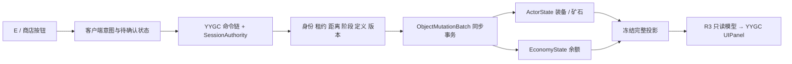

# 飞船交易、冲刺与背包改版设计

日期：2026-09-29。状态：**实施前方案**；现行源码与验收状态见[飞船交易、装备与冲刺验收](SHIP_TRADE_EQUIPMENT_ACCEPTANCE.md)。需求来源：本轮用户提出的五项要求。

源码核对基线：游戏 `c306c12`（来自 `ft-20260929-unified-terrain-assembly`），协议 16／存档 v11。文档分支为 `docs-20260929-ship-trade-equipment-plan`。本文所有新类型名、字段和交互均为拟议设计，不代表代码已经存在。

## 1. 本轮结论与范围

把正式远征的玩家循环补为：**空装备登船 → E 打开商店购买矿镐 → 下船采矿 → 携带矿石回船 → 靠近出售点按 E 换取收入 → 购买手枪或喷气背包继续探索**。步行途中按住 Shift 加速。出售不再依赖另一个星球；本轮不实现贸易星球、跨星球市场或返程航线。

| 用户要求 | 方案 |
|---|---|
| 飞船内主动出售、未来可关闭或替换 | 独立出售终端子物体，独立 Definition／Prefab／能力配置；按 E 提交一次出售请求 |
| Shift 加速、暂无体力 | 现有输入链增加 SprintHeld；服务端统一计算地面／船内速度，保留体力判定扩展位置 |
| 船内商店、默认无装备 | 独立商店终端；装备需购买后写入角色唯一状态；移除默认手枪可用、炸药赠送和喷气背包赠送 |
| 四个半透明方格 | UI Toolkit 四个通用手持装备槽，槽位内容不再由索引硬编码 |
| 喷气背包独立显示和圆形能量 | 四格外增加能力格，不占装备容量；显示购买状态和权威剩余能量 |
| 简单商店 | 标题、余额、少量商品行、购买按钮、结果文本与右上角 X；E 打开，X／Esc 关闭 |
| 符合 YYGC | ObjectDefinition＋IConfigData、现有业务 Behaviour／State、框架 UI 生命周期与绑定、R3 展示订阅、既有可信命令链 |

本轮不扩展装备耐久、随机词条、拖拽整理、装备交易／回购、地面掉落拾取、弹药经济、体力消耗、私人账户、跨房间角色档案或全项目 UI 迁移。炸药保留既有玩法能力，但不默认赠送；是否作为第四种商品列为后续内容选择。

### 尚未由用户确认的产品选项

以下采用建议值完成方案；它们不是已经批准的玩法决策。实施前集中确认，其他结构设计不依赖具体价格。

1. **四格含义**：建议只装手持装备，矿石继续使用现有独立货袋；喷气背包在四格之外。本文“携带矿石”指角色货袋有矿石，不要求选择一块矿石成为手持物。若用户希望装备与矿石共用四格或必须手持矿石，需要改为统一物品堆叠与选中物出售，不能只换 UI。
2. **经济归属**：建议销售所得为全队共享的独立交易币，装备归购买者的角色。铁／金原料库存不冒充货币。若选择沿用原料付款，删除新增 Credits 字段，购买成本改用现有 ResourceAmounts，其他授权／事务不变。
3. **起步资金及价格**：建议新世界发一次共享初始资金，按支持四人购买基础矿镐预算；Ready、晚加入、重连和新建人物不再发钱。所有具体金额待定。推荐先买矿镐，但“允许把钱花光后如何自救”仍是经济规则待定项，不能把初始资金描述成对任意消费顺序的防卡死保证。
4. **出售粒度**：建议每次 E 出售本人货袋内所有可售矿石，提示显示种类、数量与预计收入；不隐式出售他人或船仓货物。若需逐种选择，另加简短出售面板，不混进首版商店。
5. **冲刺手感**：建议先以现有步速的 1.8 倍做实机候选；未经过画面与路线测试，不冻结为最终数值。

## 2. 当前实现与需要改动的真实位置

以下路径相对于 `Game/Assets/DarkNights/Scripts/`，是本次源码检查结果，不沿用旧文档的已验收数字。

| 当前证据 | 实施影响 |
|---|---|
| `Runtime/Objects/HeroInventoryBehaviour.cs` 的 ItemKey 固定 0–3 为 pistol／pickaxe／bomb／jetpack | 改成读取实际槽内容与 Definition；选择空格允许空手，使用空格必须无效果 |
| `HeroEquipment.cs` 按 SelectedItem 数字决定开枪、挖矿和炸弹，没有购买所有权门槛 | 所有使用入口校验选中槽实际物品、数量和能力类型；不能只禁用 UI |
| `ActorBehaviour.cs` 初始化炸药 3 发；`ObjectCampCommands.SpawnDefaultResident` 给远征主角启用喷气背包 | 新人物四格为空、炸药为零、无喷气背包／零能量；恢复已有本格式角色不能再次走赠送逻辑 |
| `View/HandheldView.cs` 用 SelectedItem 直接索引图片并以 `<3` 判可见 | 同步改为物品定义映射与空手姿态，防止引入 -1 后负索引／旧武器残留 |
| `HeroControlBehaviour.PlayerMoveSpeed` 为职业速度 × 1.35 × 调试倍率；船内也调用此函数 | 冲刺倍率必须在这里统一生效，避免船内外两套速度 |
| worker 速度 30；逻辑格为 `PlayableTerrain.CellPixels = 16` | 普通步速约 40.5 逻辑像素／秒，即 2.53 格／秒（调试倍率 1）。1.8 倍候选约 72.9／秒、4.56 格／秒；8px／格的美术密度不能直接当逻辑单位 |
| `Res/Input/Gameplay.inputactions` 已有 Player/Sprint（左 Shift）；Player/Interact 当前绑定 W | 接入已有动作，Interact 调整为 E，保留动作／绑定身份以兼容改键；`GameInputActions` 当前尚未采样这两者 |
| `ExpeditionCargo` 持有转移／装载算法，角色货袋与船仓分别在 ActorState／BuildingState | 矿石与四格装备目前是两种容量模型；不能将货袋数值当成已有通用背包 |
| `ExpeditionOperations.Command(unload/board)` 可把货袋转入船仓；Settle 把船仓变成铁／金库存 | 必须明确新即时销售与原料结算的边界；出售扣掉的矿石不能再入仓或结算 |
| `ExpeditionOperations.Prepare` 会清空经济库存 | 交易币初始化必须在新世界初始化流程明确执行一次，不能靠旧 starting_resources 假定有钱 |
| `View/HeroHudBehaviour.cs` 为旧 UGUI 四按钮；`Entry/ExpeditionHud.cs` 接远征全局按钮 | 正式新背包替换旧装备栏；不因本轮重做所有航程、营地与调参面板 |
| `SessionExpeditionControl` 的非 personal 操作只允许房主 | 不能把新装备购买直接塞进旧舱段升级分支；SharedCamp 的普通玩家也应能为自己买装备 |
| 远征 `SessionHeroControl.FindDefaultCandidate` 会按 OwnerSlot 找可接管角色 | 重连优先恢复现有角色和装备；不能仅按历史文档中的“重连新建”处理。死亡／新角色保持空装备且不补发资金，具体死亡损失策略待产品确认 |

**依赖现场与旧说明存在差异**：本次 `Game/Packages/manifest.json` 实际指向 `file:D:/Developer/YYGC`，AnyRuleD 也指向该目录；框架 HEAD 为 `fee1864`，读取时工作区干净。本文以此实际源码核对 UI 能力，未改动框架、manifest 或锁文件。下一轮实现前需记录输入哈希并恢复／确认可重现依赖落点，不能以 `.deps/YYGC-unified` 中的旧副本冒充当前依赖，也不擅自切换用户框架工作区。

## 3. 出售点与商店：飞船子物体合同

建议飞船 Prefab 中保留两个可编辑子模块：

```text
ExpeditionShip（既有 Building ObjectInstance / State）
  Services（组织节点）
    OreSaleTerminal（独立 ObjectDefinitionLoader、ObjectView、Prefab）
    EquipmentShopTerminal（独立 ObjectDefinitionLoader、ObjectView、Prefab）
```

这是两个实际子物体，可分别开关或更换定义／Prefab。不是在船体 Update 中写死两个位置和按钮。每个模块用稳定 `ModuleKey` 关联父飞船 EntityId；请求目标采用 `(ShipEntityId, ModuleKey)`，无需给每个终端新增 NetworkObject／NetworkTransform。

- 模块拥有自己的 YYGC ObjectInstance 与 `PooledBehaviour`，经现有 Definition 装配；共享原 ObjectSessionContext。模块不另存经济／人物状态。父船释放时显式释放模块租约、对象与订阅，不能只 Destroy Transform 后留下框架对象。
- 船体 Definition 的 `ShipServicesConfig : IConfigData` 关联可选模块定义与初始启用设置；模块 Definition 的 `ShipServiceConfig : IConfigData` 关联服务种类、规则键与交互区域配置。`[RequireConfig]` 声明依赖，`[Inject]` 取得配置，初始化校验并冻结。
- 舱内摆放由 Prefab 中显式绑定的交互锚点维护。Editor 导出只读局部区域，参与内容指纹；服务端用“权威船体位置＋冻结局部区域”算距离，不能读取客户端 Transform 或屏幕距离。锚点坐标不能再在 JSON 手抄一份。
- 初始禁用模块不注册服务，表现隐藏；若将来运行中开关，启用／替换状态唯一归父船 BuildingState，并随投影／存档同步。首次范围只要求配置开关和替换资源，不必先做动态热替换编辑器。
- 客户端 SetActive 只改变自己画面，不能授权服务；配置关闭必须同时阻止服务器交易。正式配置关闭后，客户端伪造模块 Key 仍被拒绝。
- 两个模块分别放在主角可步入的位置，交互区避免与驾驶台、坡道重叠；空间坐标以人工摆放后实际验证为准，不在分析阶段覆盖现有船体布局。
- 缺失／重复 Key、缺失绑定、非法定义身份、不同步的锚点数据在启动前报错；不以 GetComponent、节点名搜索或兄弟索引兜底装配。

首版允许服务的航程阶段建议为 Orbit 与 Landed。Preparing、Transit、ArrivalSync、Descent、加载、未 Ready、暂停、死亡或角色正在驾驶时不接受交易。Landed 时还应验证船体已稳定停泊。未来若要航行中购物，只调整这条业务规则并补验收。

### E 的交互仲裁

只由 GameInputActions 读取设备，输出 InteractPressed 给本地候选选择器。候选基于冻结副本、模块配置及角色位置；以可用性、距离、稳定 Key 决定唯一目标，并显示 `[E] 出售…` 或 `[E] 装备商店`。本轮 E 只接新增两种服务，现有驾驶操作继续走原入口，不额外扩大驾驶交互改版。

靠近只显示提示，E 的按下边沿触发一次；按住不重复售卖／开店。不要求先选矿镐或喷气背包。无矿石时显示“没有可售矿石”，无目标时无操作。离开范围、失去控制／焦点、开启模态界面后清掉未消费边沿。

打开商店是本地界面行为；显示并不授予购买权限。商店持有 YYGC Interaction Session，阻止移动、攻击、E 和滚轮切装，保持 UI 点击及 Esc 可用；先发送一次输入归零，再阻塞采样。关闭后要求攻击／E 松开再按，防止点 X 后向世界补发攻击。失焦、切图、权限变化、角色死亡、终端禁用／消失或航程阶段变化使商店关闭；用户取消 UI 不等于撤销已被服务端提交的购买。

## 4. 装备定义、配置与状态归属

不新建并行物品世界或客户端库存。沿用角色 `HeroInventoryBehaviour`，将“固定槽编号表示装备”改为“槽持有 Definition 身份与数量”。首版只需要四个固定值槽，不必为每把矿镐建立独立网络实体或可变物品实例。

| 内容 | 定义／配置（只读） | 唯一运行状态 |
|---|---|---|
| 手枪、矿镐，后续可售炸药 | 各自 ObjectDefinition，Icon／描述／MaxStack／PrefabRef；`EquipmentConfig : IConfigData` 提供能力类型与 RuleKey | ActorState 的 4 个槽值及 InventoryRevision |
| 喷气背包 | 独立 ObjectDefinition＋EquipmentConfig，能力类型为背包附加能力 | ActorState 的已购买定义身份／启用状态／JetpackFuel |
| 出售模块 | 模块 Definition＋ShipServiceConfig（Sale、规则键、区域合同） | 当前无额外交易库存；将来模块状态仍归父船 |
| 商店模块 | 模块 Definition＋ShopCatalogConfig（有序商品 DefinitionReference、可用条目） | 首版无限供货；不引入库存刷新计时器 |
| 共享交易币（待确认） | balance 中初始值与价格规则 | 既有 EconomyState 新增有界非负整数 Credits |
| 移动／未来体力 | Hero Definition 上的能力配置提供 RuleKey；实际倍率来自 balance.hero_control | SprintHeld 属输入态；未来 Stamina 若启用才加入 ActorState |

数值保持单一来源：新增出售单价、购买价、初始资金、冲刺倍率放 `balance.json` 的明确规则段；Definition／IConfigData 引用规则键并提供物品身份、能力与表现映射，不重复存一份价格。现有 `HandheldConfig` 仍是手持伤害／时序的唯一来源，原有 hero_control 仍提供喷气数值，本轮不为拆商品而复制这些参数。Core 只保存冻结的无 Unity／YYGC 引用数据；Unity 可序列化配置与 DefinitionReference 留在 Runtime 边界，Core 合同用既有规范化定义身份表达。

四格建议在 ActorState 中采用四个按值槽数据，每格为规范化物品定义身份＋数量，避免直接增加可变 List 导致生成 CopyFrom／对象池浅复制。没有第二份“已拥有列表”；手持装备的拥有关系就是槽内容。喷气能力的拥有关系独立存一次，不能把 JetpackEquipped 一个开关同时解释为购买权和使用开关。

- 新人物四格为空；可以选空格成为空手，但空手不能开枪、采矿、投弹。首个购入手持物品填首个空槽；原来空手时可自动选中该槽。
- 1–4、滚轮与可点击格只改变选择；切换增加 SelectionRevision 并取消蓄力。使用时同时校验角色租约、InventoryRevision／SelectionRevision 与实际槽内容，不能接受客户端声明“我在用手枪”。
- 手枪／矿镐首版不允许同角色重复购买，容量不足不扣钱。喷气背包买一次后立即启用，独立于当前手持装备；购买时首次补满能量，重复购买不补能量、不扣钱。
- 仍用现有跳跃／空中按住跳跃喷气规则。船内维持禁止喷气的现有运动边界；船内站稳后纳入能量恢复，避免太空开局／船内长时间等待无法充能。无购买权时燃料保持 0，不得靠旧恢复逻辑充出可用能力。
- 保留现有喷气最大能量 2 秒、恢复率 2 秒／秒作为当前输入，是否调整手感另行决定。空槽、没有喷气背包和能量耗尽是三种不同 UI 状态。
- 如将炸药上架，数量应由槽内堆叠唯一拥有；必须移除或派生旧 ExplosiveCharges，不能出现双计数。首版不售炸药时默认零且明确禁用其旧槽位直达路径。
- 同一角色被恢复、切图或重连时保持装备；新人物默认空。不给未鉴权的新连接继承他人 OwnerSlot 装备，不建立跨房间购买账户。

### 开关／替换的未来边界

出售业务接受“经过服务器确认的矿物种类及数量”，不依赖终端画面或“星球”概念。未来可把同一交易能力配置到贸易星球对象，在飞船定义中关闭模块；角色货袋、价格规则、经济事务与 UI 回执无需整体重写。首版只设 Sale／Shop 两种明确能力，不提前做通用插件市场框架。

## 5. 交易事务、旧卸货与联机

继续使用 YYGC Gateway／Sender／Processor 和 SessionAuthority 请求序号、epoch、PolicyRevision、连接代次校验。新请求可作为现有 SessionOperation 的明确操作加入，不能复用任意字符串直接改库存。SharedCamp 允许每人控制自己的角色购买；HostOnly 仍拒绝来宾，不能把商店购买误判成只允许房主的旧舱段升级。



拟议请求字段：

| 操作 | 除既有协议头外的参数 | 服务端决定 |
|---|---|---|
| SellCarriedOre | ActorId、ControlLease、ShipId、ModuleKey、预期 CargoRevision、目录指纹 | 实际可售铁／金数量、单价、收入、结果 revision |
| PurchaseEquipment | ActorId、ControlLease、ShipId、ModuleKey、商品 Definition 身份、预期 InventoryRevision、目录指纹 | 商品合法性、真实价格、首个空槽／附加能力、余额 |
| SelectHeroItem | ActorId、租约、槽号、预期背包版本 | 当前槽内容与选择版本 |

出售采用按 E 时看到的 CargoRevision 做版本检查，过期则提示货物已变化并重新显示报价，不能悄悄卖掉随后新获得的另一批货。客户端不传价格／余额／伤害作为权威，也不发“给我某装备”的直接写入请求。商品价格目录冻结于会话并参与指纹，本轮不热改价格。

每次交易在同一主线程事务中：完成全部校验 → 算出有界结果 → 同时修改角色与余额 → 提交 → 反馈与投影。资源加载／await 必须在事务外预备；预加载不足返回未就绪，不先扣款。注意当前 `ObjectMutationBatch.Run` **不会因为返回 false／0 自动回滚**：普通拒绝发生在任何 Edit 之前；写入后的异常走真实事务回滚，测试需注入失败验证。

同序号重复请求返回原结果；同序号不同载荷拒绝，超出窗口的旧序号不得再次扣款。共享余额不足时多个购买串行判断，允许实际支付的请求成功，其余明确失败。金额相乘使用检查溢出运算并限定余额上限；失败不能清空矿石。

UI 一次只保留一个待确认购买／出售请求，连续点击不发新交易。回执与投影允许先后不同：回执标明成功不等于本地马上增减库存，等待对应 revision 更新。超时显示“结果待同步”，不以新序号自动重买；重连后以新快照校正。

### 旧货物流转的处理选择

本文建议保留现有“货袋 → 船仓 → 撤收结算铁／金材料”作为已有设备／舱段的原料通路，新即时销售是另一种去向：**货袋 → 出售消耗 → Credits**。同一矿石只走其中一条，不能同时计入两种收益。用户若希望完全取消原料结算，应另外确认舱段升级与设备补给改用何种付款方式。

- 正式新销售只能由出售点 E 触发；旧 unload／board 仍只转移原矿，不给 Credits，UI 文案明确“入仓”而非“出售”。不会在靠近、登船或离开星球时自动卖掉玩家货袋。
- 为避免误入船仓后无法主动出售，计划复用 `ExpeditionCargo.Load` 补充“从船仓取回原矿”操作，验证人物范围／租约／货袋容量，取回后再去出售点按 E。它沿用货物操作入口，不增加商店分页；按实际可装数量转移且不丢弃剩余。若本轮不做取回，就应暂时移除正式玩家手动入仓入口，并清楚标记该差异，不能留下无提示的死路。
- 机器人的货物仍可按现有货运规则入仓，不自动产生交易币。出售点不直接远程清空船仓。
- Settle 只处理剩余原矿，不对已售数量重新计算；保留原有风险／损失和结算幂等边界。即时到账的销售收入不因后来撤收失败被回滚，这是新出售规则带来的明确风险收益变化。
- 更新旧“矿物只有撤离后结算”的提示；新增销售信息只发给操作人，队友通过共享余额同步看到变化，不对每笔交易全屏广播。

## 6. Shift 与未来体力

接线顺序：`Player/Sprint → GameInputActions.HeroFrame → HeroInputSampler.Packet → HeroInputCommand / HeroInputRequest → SessionHeroControl → ActorState 瞬时输入 → PlayerMoveSpeed`。保持现有 30 Hz 发送／10 Hz 保活及 30 tick 无输入归零，Sprint 变化参与立即发送判断。

冲刺只影响手动控制主角的水平移动，船舱和地形共用；不改变 NPC 速度、飞船速度、跳跃高度、喷气推力、工具冷却或整个世界倍速。建议空中仍可沿用水平加速，以避免跳起瞬间横速突变；这属于手感候选，需实际验证。角色死亡、失去租约、断线、超时、暂停、模态输入阻塞或失焦时取消冲刺，暂停后不恢复旧持有状态。

基础速度与倍率分开配置，未来增加体力时只扩展服务端 `CanSprint / ResolveMoveSpeed` 判定与 ActorState 中的体力值、消耗／恢复规则；当前不创建假的体力条、无效计时器或第二套运动接口。喷气能量与体力独立。

保持已有 TerrainHeroMotion 分步碰撞、真实坡形和 ShipRampTransition 出入舱逻辑。冲刺必须验证薄墙、陡坡、低顶、坡道、跳跃出口、任意安全着陆后的舱门交界，尤其要覆盖 2× 倍速和弱网输入归零。不能凭速度公式宣称走路困难已解决，还需用真实洞穴往返时间和前台操控检查确认。

## 7. UI Toolkit、YYGC 绑定与 R3

采用局部迁移：新增 InventoryHudPanel 与 EquipmentShopPanel，替换正式装备栏；既有航程菜单、其他 UGUI 面板继续工作。UI 资源按面板放 `Res/UI/InventoryHud/` 与 `Res/UI/EquipmentShop/`，包含 UXML、USS、图标引用与 Addressable 条目。

### 已核对的框架接口

实际依赖 `D:/Developer/YYGC/Runtime/UI/` 已有 `UIManager.OpenAsync<T>/Close<T>`、`UIPanel.Bind(root, container)`、`[UIAsset]`、生成 DI 注入，以及 `UIPanel.Disposables`；`UIBindingExtensions` 已有 BindText、BindDisplay、BindVisibility、BindProgress、BindCommand。

UI Toolkit 的框架合同是在 `UIPanel.OnBind` 中通过 `Root.Q<T>(明确名称)` 绑定 VisualElement，并检查必需节点和类型；**不能把 UGUI 的 `[ViewComponent]`／`[UGUIOnClick]` 直接套在 VisualElement 上**。这里按 UXML 名称查询是框架原生绑定入口，与业务物体 GetComponent／节点名兜底不是同一用途。ObjectView 外部组件仍采用正式组件绑定与生成注册。

- Entry 在既有会话／Local DI 容器中装配 UIManager、UIDocument 和只读背包／商店模型，不能创建另一套全局 DI 容器。UIPanel 不需伪装成每个按钮一个 ObjectDefinition；交易物体／装备使用 Definition，面板使用 YYGC 原生 UIAsset／UIPanel 管理。
- Entry 从 WorldReplica／ObjectReplica 的冻结结果生成本地 UI 读模型，View 不依赖 Runtime 权威状态。R3 负责余额、四格、可购买性与能量的变化订阅，DistinctUntilChanged 后更新需要的节点；主线程更新 UI。
- 文本与显隐优先复用框架 BindText／BindDisplay 等扩展。按钮生成 UI 意图，由 Entry 进入现有 SessionClient.Send；BindCommand 仅在复用既有命令发布适配时使用，不额外建立业务 Router／过滤器，也不绕过带租约与序号的请求封装。
- R3 订阅归 UIPanel.Disposables；按钮回调显式退订，Interaction Session 在关闭／异常／释放时结束，异步打开通过本地生命周期代次检查防止退出后弹回。UIManager 的重复异步打开、加载异常与资源租约释放要做小型实际探针；本次只看源码，没有认定框架已完成这些运行验证。
- Host 与 Client 都从冻结副本显示，UI 不预扣款、不提前把物品写进槽、不自行倒计时决定喷气是否可用。动画可平滑展示到最新权威值，但不得超出已确认边界。
- 复用现有 EventSystem＋InputSystemUIInputModule，核验 UI Toolkit 与 UGUI 焦点、排序及穿透阻挡；不增加第二个 EventSystem。Unity 的官方说明支持这一组合，但本工程仍需实测：[运行时 UI 事件系统](https://docs.unity3d.com/cn/6000.0/Manual/UIE-Runtime-Event-System.html)。

### 四格与能量格视觉合同

屏幕下方居中排列四个半透明方格，右侧有间隔地放喷气能力格。示意为 `[1 空] [2 空] [3 空] [4 空]  [喷气 ○]`；购买后填图标。64×64 UI 参考尺寸、8px 间距、深色约 45% 不透明底可作为初版草图参数，最终按 1280×800／1600×900／1920×1080 与缩放检查调整。

选中格有清楚边框和数字，空格保留轮廓，物品数量只在可堆叠时显示。小区域另显示矿石货袋 `铁 n / 金 n · 总量/24`，不冒充第五个普通格。喷气未购买显示灰色图标与“未购买”；购买后显示圆环与百分比，耗尽时显示空环，恢复时随权威燃料变化。能力格不参加 1–4／滚轮循环，首版只作状态指示。

圆环使用自定义 VisualElement 的 generateVisualContent 绘制，`clamp(Fuel / Capacity, 0, 1)` 控制弧长；零容量按空环处理。框架 BindProgress 只改变 width，不能当作圆环方案。变化时 MarkDirtyRepaint，不重建整棵 UI。Unity 有对应的[径向进度示例](https://docs.unity3d.com/cn/6000.0/Manual/UIE-radial-progress.html)，具体实现以锁定 Editor 编译验证。

背包底板、空白全屏根、环形装饰不能拦截世界鼠标；只有确实可操作的槽格接收点击并阻止同次点击穿透。商店为小型模态面板：余额、手枪／矿镐／喷气背包三行、价格、购买按钮、X 和一行结果；背包满、余额不足、已拥有、等待确认分别显示原因。无分页、拖拽与复杂货架。

**素材判断**：此次设计不需要生图。方格与圆环用 UXML／USS／确定性绘制；图标优先复用既有原生装备素材，后续如需新图标先记录原生尺寸／透明边要求。终端外观可先用可编辑原生部件做样板，不在方案阶段生成或覆盖素材。

## 8. 同步与保存范围

仍通过现有会话可靠完整投影同步，不增加独立背包网络系统。需要贯通 ActorState／EconomyState → ObjectProjection → ViewData／Wire → ReplicaEntityState，以及 ObjectSnapshotMapper → JSON → 严格校验 → 恢复装配。

持久化四格定义身份／数量、选中槽、喷气购买身份／能量、交易币、货袋与原料库存；若启用运行时模块开关，再保存父船模块状态。输入持有、商店是否打开、待确认请求、UI 焦点和连接租约不入档。InventoryRevision／CargoRevision 明确在恢复时重建或恢复，同一 epoch 内单调；加载换 epoch 后旧请求不能匹配新状态。

基于当前输入预计需要 **协议 17／存档 v12**，实施时若已有其他切片先推进版本则顺延；本次不改版本常量。新快照增加字段并校验最大槽数、允许定义、类型与数量、唯一喷气能力、燃料范围、非负余额和溢出。无须旧档迁移，不删除或覆盖用户 v11 文件；旧格式明确拒绝。

装备定义、商品目录、交易规则、交互区域和冲刺配置进入内容指纹。StateData／MemoryPack／DI／定义目录输出沿用既有生成入口，实际生成与池复用检查要覆盖新槽值，不能手改生成结果或只验证 JSON。

## 9. 分批实施与验证门槛

| 阶段 | 合并处理的工作 | 完成门槛 |
|---|---|---|
| P0 合同冻结 | 确认本页五项建议、原料通路／取回选择、角色死亡装备策略；记录真实依赖与资产输入 | 明确金额表、权限、槽语义、初始资金和不可达场景，避免边做边换模型 |
| P1 角色与运动 | 槽值／拥有权、空装备初始化、手持表现映射、独立喷气、Shift 输入与统一速度、DTO／保存版本 | 纯规则与序列化检查通过；未购装备无法通过任何服务端入口使用 |
| P2 交易与模块 | 两个 Definition／Prefab 子模块、绑定／区域导出、销售／购买／取回原矿、余额事务、旧结算去重边界 | 同步事务失败可恢复，关闭模块后伪造请求无效，所有价格来自唯一规则 |
| P3 UI | YYGC UIPanel 装配、四格与圆环、简单商店、R3 生命周期、输入互斥与回执 | 资源只读校验、空手／满包／弱网反馈、Prefab 保存重开及 Play 实际画面 |
| P4 联机收口 | 同一 Mono 构建复用正常／弱网多进程、晚加入／重连／写盘恢复 | 记录本批输入、后端、进程、失败及证据，更新操作指南与状态文档 |

建议 P1–P3 文本与配置先集中准备，依赖就绪后统一导入；新增脚本编译后再完成同批资源装配。初始化只写指定空目录，已有船 Prefab 与动作资产按本批差异修改、保留 GUID，不运行覆盖式生成脚本。若用户下一轮要求 worktree，沿用薄 worktree＋Local 单一 Unity 验收通道。

| 验收组 | 必须覆盖的结果 |
|---|---|
| 新局闭环 | 1／2／4 人空装备，资金只发一次；先买矿镐、无喷气也能抵达起步矿区并返回出售；有限跳跃是否有安全往返路线需真实角色实测，拓扑连通不代替通过 |
| 装备权限 | 空格、未买手枪／矿镐／喷气、伪造物品、旧选择版本均不能使用；购买进入正确空格，背包满不扣款；喷气满包仍可买 |
| 主动出售 | 进入范围不自动卖、E 一次卖一批、按住不连卖；只卖本人可售矿石；空袋／远距离／禁用模块／错阶段／过期货袋版本拒绝 |
| 收益守恒 | 卖出后不可卸货重复入账；先入仓只记原料；取回只转移实际容量；Settle 不再次卖出；整数溢出／回滚不丢矿或钱 |
| 多人事务 | Host＋独立 Client，共享余额不足时并发购买仅合法项成功；重发、相同序号改载荷、重复购买无双扣；Host 输入只执行一次 |
| 动作与碰撞 | Shift 船内外速度一致、跳跃／坡道／薄墙／低顶／2× 倍速无穿透；断线／丢包／暂停／模态／失焦归零；不影响 NPC／飞船／攻击时序 |
| UI 与生命周期 | 四格＋独立圆环，未买／空能量有区别；X／Esc 正常，点 UI 不攻击；连续开关、切图、Domain Reload 关闭与重复 Play 无残留订阅／幽灵窗口 |
| 同步与恢复 | 买前／买后晚加入；交易中断线后重连不自动重买；保存恢复四格、能量、余额、矿石；旧 epoch／坏定义／坏数量不替换当前世界 |
| 模块资源 | 关闭销售仍可购物，关闭商店仍可出售；替换模块定义后绑定正确，预览无权威模拟；Prefab 编辑、保存、重开、实际 Play 通过 |
| 弱网与四人 | 复用同一 Mono，正常网络＋200ms RTT／5% loss／25ms jitter，四人冲刺、采购、出售并发后收敛；不把单窗口 Host 当联机通过 |

本轮只校验方案与源码引用；以上全部为未来验收项。下一轮默认先 Mono；IL2CPP 必须另获用户明确确认。前台操控与画面必须检查，正式性能签署／双机器验收状态单独记录，不能继承旧切片通过数。

实施前与编译／构建前检查空间；可重建中间产物只在核实归属与占用后按仓库规则移到 `artifacts/待清理/YYYYMMDD-任务名/` 并写清单，不永久删除。本次只读检查时 C 盘约 5.4 GiB、D 盘约 25.9 GiB 可用；这是现场快照，不能当下一轮构建可用空间保证。本次未启动 Editor、构建 Player、生成美术或测试中间产物。

## 10. YYGC 改动判断与本次交付状态

当前已有的定义、IConfigData、注入、UI Toolkit 面板、R3 绑定、Interaction Sessions 和事务／联机接入足以形成实现路线，**本次不预设必须改 YYGC**。UI 异步生命周期、资源租约或生成器若在最小实际装配中出现具体缺口，再在隔离框架 checkout 修正，锁定依赖并逐文件更新 [YYGC_CHANGES.md](YYGC_CHANGES.md)。

已完成：需求拆解、现行源码与实际依赖核对、状态／配置／绑定设计、交互与经济边界、分批开发与验收矩阵。待确认：四格与货袋关系、经济归属及金额、矿石是否必须手持、取回原矿与死亡装备规则。未进行：产品代码修改、资产修改、Unity 编译／Play／Player／联机验证。
