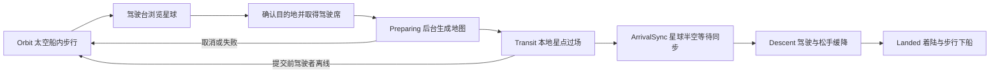

# 太空到星球流程：实现与验收记录

2026-09-26。以已合并运行时地形工作台的主分支 `31aaecf` 为基线，在 `ft-20260926-space-planet-flow` 开发。对应[设计](SPACE_TO_PLANET_FLOW_DESIGN.md)与[完整待验收清单](SPACE_TO_PLANET_ACCEPTANCE.md)。

**状态：用户已要求执行全部验收，当前正在验证和修复。** Local Unity 导入、编译与 Mono r2 构建通过；Core 1048/1048、航程纯回归 1903/1903，Editor 按影响合并 323/324。实际 Bootstrap Play 已完成船内移动、目的地选择、星点过场、自动缓降着陆及步行下船。多人、弱网、IL2CPP 与性能结果按本批产物逐项更新到验收清单；以前的通过数不替代本批证据。

2026-09-27 登船体验修正：相机改为平滑跟随角色／飞船取景目标，船壳剖切改为渐变；乘员在舱内使用飞船地板与顶棚约束的跳跃运动；玩家手动移动速度提高至原来的 1.35 倍，自动居民速度不变。**本次改动尚未经过 Unity 编译、Play 或联机验证**，不计入上方既有通过数。

2026-09-28 着陆修正候选：指定泊位的地面接触、船壳净空与支撑有效时，服务端先制止船体横向滑出泊位容差；仍以接触前速度拒绝高速直接着陆，下一步满足安全速度才自动离座开门。偏离指定泊位、支撑或净空不足时仍保持驾驶。用户要求本次不再执行测试，人工 Editor 复验待完成。

## 本轮流程

- 正式远征启用航程配置后从太空开局，首次 Ready 的本人角色进入船舱。非驾驶者可以继续在船内走动。
- 靠近右侧驾驶台，通过原远征面板的驾驶入口打开目的地列表；浏览不占席位。确认请求携带本人角色、目标船、控制租约及航程修订，服务端从可信连接取身份，在同一事务内选择目的地并占用唯一驾驶席。
- 地图在后台以冻结配置生成。固定种子只尝试一次；随机种子最多尝试三次，包括初次，失败重试使用可追溯衍生种子；实际成功种子写回权威航程。取消、超时及旧任务完成不会直接改变世界。
- 过场消费冻结航程投影。`star-shift`、`fade`、`none` 通过 `ITravelTransitionPresentation` 接口和注册入口切换本地表现；阶段推进由服务端决定。新增策略仍须补齐配置白名单和内容身份版本，不接收任意类名或脚本。
- 完成最短过场后准备地图权威对象，事务替换地图静态数据及矿床，将飞船、乘员和随船设备平移到目标上空。保留原船员对象与身份，清理输入并增加会话 epoch。
- 地图、背景、对象投影和可见表现共同门控 Ready。提交后等待本次参与者，超时后允许已就绪成员继续；未就绪驾驶者被撤销驾驶席，慢端继续同步。房主未 Ready 或暂停时不解锁下降。
- 驾驶者使用 A/D 平移、空格上升、S 加速下降；松手按 `balance.expedition.Ship.IdleDescentSpeed` 缓降（默认 6）。服务端限定飞行包络并进行船体扫掠；对准指定泊位且满足安全速度、支撑与坡道净空后自动着陆，立即释放驾驶席、更新租约并清除输入。舱门经过配置的 `DoorSeconds` 后才可通行，不再显示手动着陆按钮。下降阶段允许离座；无人驾驶、断线或到达同步时仍安全悬停，可由合法船员接管。

## 配置和 Editor 面板

唯一作者来源为 `Game/Assets/DarkNights/Res/Objects/WorldSession/WorldSession.asset` 的 `SharedConfigs`。该现有资产增加 `ExpeditionFlowConfig`，并装配 `ExpeditionFlowBehaviour` 与 `ExpeditionJourneyBehaviour`，保留原 GUID 和其他配置。

导入就绪后的菜单入口：**`Dark Nights/配置/星球与航程`**。

| 内容 | 本轮作者字段／能力 |
| --- | --- |
| 流程 | 启用、准备超时、到达同步超时 |
| 星球表格 | 最多 32 行，稳定 ID、名称、说明、启用、固定种子；空种子表示服务端随机 |
| 生成和降落 | 泊位列、地表行、平台宽度、到达高度、水平范围、最大升高 |
| 本地表现 | 最短过场时间、过场策略、星点数量／速度、太空和天空颜色 |
| 编辑 | 选择详情、新增、复制、启用／停用、删除、排序、Undo／Redo、草稿应用／取消、外部改动冲突保护 |
| 预览 | 后台运行纯生成器，主线程展示地图格子、泊位、到达点和矿床；15 秒超时，可取消，不创建网络会话或读取存档 |

`ExpeditionFlowBehaviour : PooledBehaviour` 通过 `RequireConfig`／注入读取 `IConfigData`，进入会话即冻结目录。`ExpeditionJourneyBehaviour : SessionStateBehaviour<ExpeditionJourneyState>` 是航程状态唯一所有者；船体和乘员继续使用已有 Building／Actor State。没有新增并行 WorldState 或逐实体 NetworkTransform。

面板采用 UI Toolkit；运行时目的地选择页沿用现有 UGUI 远征面板及 YYGC Interaction Sessions。选择页和本地天空目前由所属表现组件创建，属于首轮界面原型，尚未整理成新的人工维护 Prefab。

## 联机、存档和故障边界

- 游戏协议常量改为 **15**，存档版本改为 **v11**；AMP1 地图帧协议保持原样。星球作者配置指纹加入正式内容握手，目录和航程通过现有完整投影发送。
- 新增 `SelectDestination`／`CancelJourney`，继续走 Gateway、可信连接、请求去重、策略修订、epoch 和角色租约校验；Host 走同一入口。
- 当前可以保存的稳定阶段为 Orbit、Descent、Landed。Preparing、Transit、ArrivalSync 拒绝保存、加载和重开请求，避免写入未完成切换。
- 保存冻结目录、航程 ID／修订／阶段、星球 ID、实际种子、地图 ID、内容指纹、阶段时间及错误；沿用最终地图和背景参考存储。读取同时核对正式配置指纹及全部目录字段／顺序，拒绝只保留旧指纹却篡改目录的文件。
- 恢复后清除旧连接控制身份、驾驶占用和速度；下降中的船保持悬停，等待当前连接重新接管。旧档严格拒绝，原文件不删除或覆盖。
- 地图交换预先复制静态数据，登记回滚，并在状态成功提交后释放旧地图。`ObjectMutationBatch` 对提交后通知逐个捕获并记录异常，继续后续回收；通知异常不能将已提交状态误当成失败并释放当前地图。这一处通用边界变更也纳入后续回归清单。
- 暂停保留网络和就绪收集；不推进生成结果提交或放行下降。到达超时使用服务端网络 tick，暂停时即使超时也保持悬停。

## 相对设计的首轮取舍

1. 太空使用空载体地图复用现有 AMP1／背景／Ready 生命周期，仅保留地图合同要求的底边基岩；首轮没有引入“无地图会话”协议。运行时不渲染该地图，也不启用地面探索。
2. 星球沿用固定 `320×192` 格的天然洞穴生成器，在其上生成开放天空、连续地表、受保护平台和下洞步道，继续使用 StrataCave。默认提供“灰松星”，可增加共用同一生成模板的预设，尚无多套星球美术或独立生成资产引用。
3. 每个星球只有一个指定降落点；不支持任意地形着陆、多资源点选择、战略小地图或返太空。旧返航入口在新流程 UI 中隐藏；已有地面生存和结算代码保留，不能据此宣称完成星际往返循环。
4. 飞行速度、加速度、舱门规则和着陆容差继续使用已有 balance 配置；船壳、驾驶台和坡道几何仍为已有 `ShipGeometry`。本轮单面板尚未迁移全部飞船几何和所有旧规则。
5. 预览是同一生成器的蓝图，尚非复用正式材质渲染的可行走预览。当前纯回归覆盖 160 个配置／种子组合的真实坡形采样；Editor 已实际驱动角色完成默认及高泊位的下船、步道进出洞和归船，不把有限路线覆盖写成全图任意路线能力。

## 本批修复、工作区与证据

本批使用薄 worktree：`C:/Users/Jobscn/.codex/worktrees/space-planet-flow/unity-projects`。Local 主分支已有的生成状态文件改动和 `terrain-test-results/` 保留；没有启动第二个 Unity，也没有创建、复制或链接 `Library`、构建输出与导入缓存。

验收修复了真实地图生成步道落在竖井、存档阶段与地图种子不一致仍被接受、池化 Interaction Sessions 重入丢失单例，以及用户反馈的手动着陆无法下船和闲置悬停。松手缓降速度进入唯一 balance 来源及内容指纹；安全着陆检查使用碰撞前速度，不能用高速撞地后的归零速度冒充安全着陆。新天空 Mesh 顶点色先转换为线性值，再进入现有渲染器，保留作者十六进制颜色含义。

Unity 已生成新增 `.meta`，YYGC／MemoryPack 正式生成器已注册航程 State Tag 19，原有 Tag 与资源 GUID 保持。并行启动修复由游戏提交 `4f270dc` 接入；本批复用既有单例补丁，隔离 YYGC 提交 `19d8f5b`，2026-09-27 已随框架分支合入 YYGC `master` `fee1864`，详见[YYGC 改动账本](YYGC_CHANGES.md)。活动包原有改动保留，manifest／lock 未变；目前仍使用已有本机包路径，不能据此宣称全新机器依赖恢复通过。

原始机器报告、失败复现、实际 GameView 截图和构建位于 `artifacts/space-planet-flow/`。Mono r1 的后台启动没有实际相机回执，Ready 正确保持关闭；同一产物仅改为窗口模式即可完整 Ready。网络夹具因此采用图形窗口，不跳过地图或表现条件。既有按钮主题 EditMode 1 项仍失败，实际 Play 5 项通过；ArchitectureGuard 保留基线 10 条存量命中，本轮新增违例已清零。真实第二机器当前不可用，原生桌面自动化工具初始化失败，相关项目不虚列通过。待清理产物只归档到统一目录并保留清单，不永久删除。
