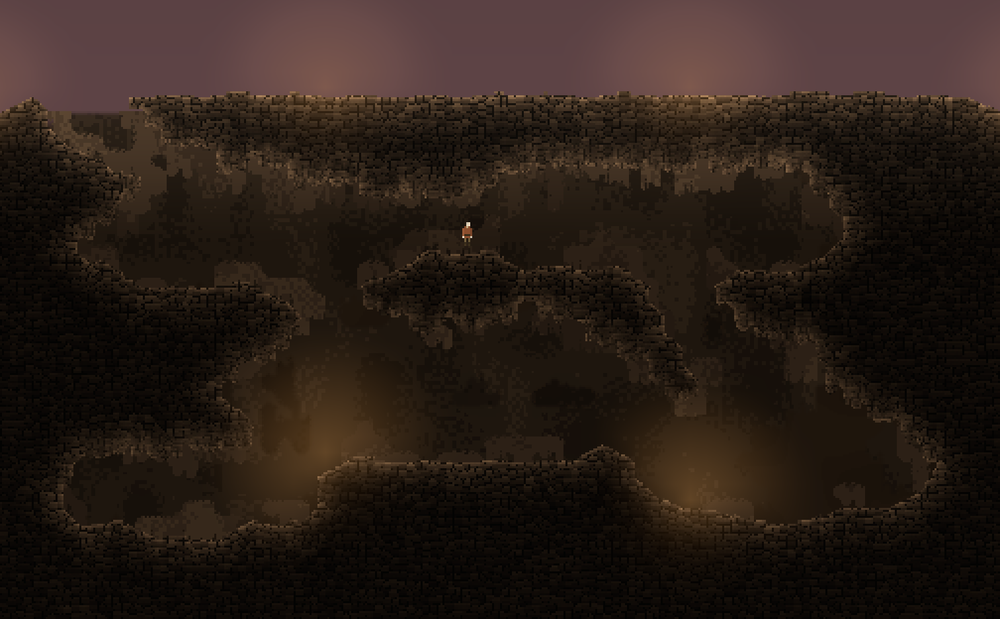
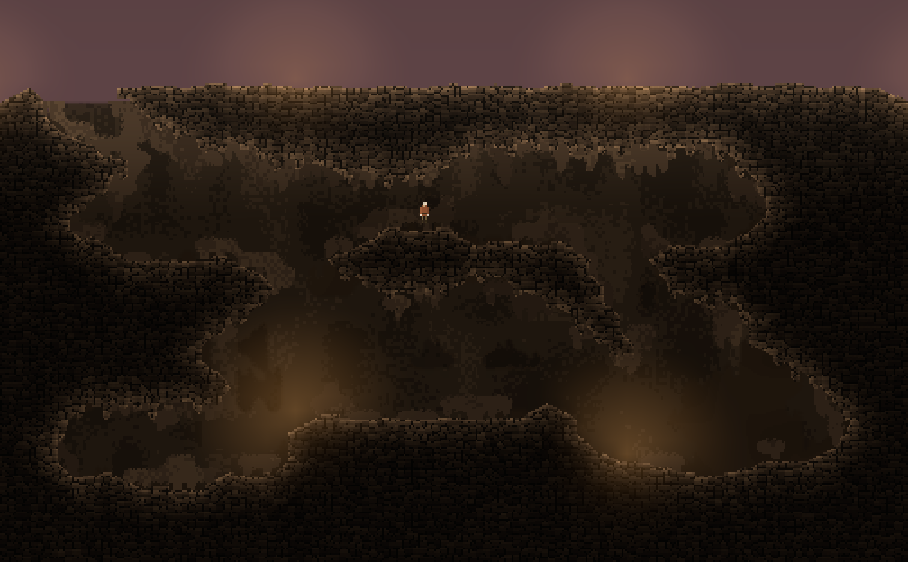

# 地形 Modifier 与可插拔点缀层进度

更新时间：2026-09-23。分支：`ft-20260922-terrain-modifiers`，基于 `aaf92a1`（可步入远征飞船分支）。本页是本次工作的独立交接入口。

**当前状态：两种下缘规则及可插拔点缀生成器已接入主工程，资产已保存，相关 Editor 检查和实际 Play 检查通过。用户要求尽快收尾，本轮停止扩展验证；尚未构建本批 Mono Player、运行本批联机矩阵或完成前台性能验收。** 不把历史 Player／联机结果计入本批。

## 已实现

### 两种规则均为可选 modifier

- `ICaveMaskModifier` 为纯 C# 扩展合同；`CaveModifierAsset` 提供 Unity 资产入口。新增规则实现这两个入口即可，不需要在页面缓存中增加模式分支。
- `CaveModifierStack` 保存有序、冻结的配置，最多八项。空列表关闭，列表顺序决定组合顺序；丢失引用在后台任务开始前报错。
- **下坠岩齿**保留 H5 v3 算法和用户参数 `7 / 100 / 5 / 0 / 89`（长度／密度／宽度／尖锐度／变化）。密度 100% 解除固定随机禁生区，仍受支撑、间距及净空约束。
- **花菜圆簇**保留宽肩、多瓣椭圆和距离场融合，默认 `8 / 20 / 3 / 90 / 65`（厚度／宽度／小瓣／密度／变化）。局部岩粒融合可单独关闭；点缀层使用自身色阶，不套用前景岩粒。
- 每次从原始基础轮廓重新计算，不在上次修饰结果上累积。两种实现仅增补表现下缘；当前格子、真实坡形碰撞、采矿及网络权威状态不变。冰层资产仅提供尖长形状，不包含冰材质或冰地图。

前景生成顺序：当前只读格形 → 原外轮廓 → modifier 栈 → 新距离场／岩块明暗 → 原材质 → 动态光。

### 点缀层独立可替换

- `ICaveBackgroundGenerator / ICaveBackgroundLayout` 定义背景算法和只读三槽布局；Unity 入口为 `CaveBackgroundGeneratorAsset`。当前轮廓跟随算法封装为 `ContourBackgroundGenerator`。
- `Background.asset` 独立引用生成器，并分别提供近／中／深层的 modifier 列表、显示开关和中层柔边。前景与三层背景互不强制跟随同一种规则。
- 当前生成器开放独立种子、三个层各自的密度／范围／贴边参数。后续可替换算法，复用现有着色、分页和缓存。当前渲染合同仍是近、中、深三个槽位；增加任意数量的渲染层不在本批实现范围。
- 背景仍只读保存并同步的**初始参考**；挖掘不重生成背景。修改配置后通过 R／重新进入场景创建新预览，活跃预览不追随资产修改而混用新旧页面。
- 所有 modifier 参数、顺序、生成器版本及配置进入 `VisualIdentity`，沿已有地图视觉身份校验链使用。协议仍为 **14**，存档仍为 **v10**；没有修改参考封套、YYGC 或依赖锁。

### 分页与缓存

H5 锚点采用全局优先级选取，不能在每页独立求解。开启前景 modifier 时，后台先生成同一份完整轮廓，再供各页着色。编辑后重新求解完整轮廓，并比较新旧掩码及岩粒字段；差异扩展 25px 材质距离场范围，只有受影响页面重烘焙。连续输入合并到最新版本，旧结果不发布。空栈继续原有局部分页路径。

这里仍有明确成本：每次有效前景编辑会重新计算完整 modifier 轮廓，圆簇还需要完整距离场和岩粒字段。当前不是局部增量锚点算法。下方有纯算法微基准；Unity 端到端耗时、峰值内存、连续输入负载和前台帧时仍待测量。

### 2026-09-24 拆填刷新微基准

输入为固定 `ReferenceChamber.cells.bytes`（320×192 格、61,440 格），输出表现尺寸为 2,560×1,536 像素、3,932,160 像素；配置与当前 `StrataCave/Style.asset` 一致：HybridB 轮廓和活动的 RoundedRock（8／20／3／90／65，岩粒开启）。Core 算法取自 Unity 已编译的 `DarkNights.Core.dll`，由 .NET 8 Stopwatch 调用。多次进程复测结果：

| 阶段 | 测得时间 | 范围与边界 |
| --- | ---: | --- |
| 基础外轮廓（不含 Modifier） | 196–198 ms | 完整 2,560×1,536 输出 |
| 基础外轮廓 + RoundedRock 完整烘焙 | 281–286 ms | 单格变化仍完整重算；比基础轮廓多约 85 ms |
| 新旧掩码／岩粒字段比较 | 39–132 ms | 全量比较 3,932,160 像素；不同进程离散较大，视为范围而非稳定值 |
| 单格变化命中的 4 张岩壁页 | 46–47 ms | 四页顺序烘焙的 CPU 总时间，不含 Unity 上传和逐帧调度 |
| 运行时副本变化检测 | 2.8–3.1 ms | 70 个 Chunk、71,680 个采样；CaveWallTuner 不走此哈希检测路径 |

最大已测阶段是 `CaveRockGeometry.Tick` 启动的 `CaveModifiedTerrain.Bake`：每次变化将 61,440 个逻辑格换成整张 393 万像素轮廓和 Modifier 结果。接着 `CaveMaskChanges.DirtyPages` 又扫描整张新旧结果，最后才重烘焙受影响页。仅这些算法阶段合计约 366–464 ms，**不是**实际输入到屏幕的端到端延迟；Unity `UnloadRegionAsync`／`LoadRegionAsync`、AnyRuleD `controller.Tick`、`Texture2D.Apply`／`Graphics.CopyTexture`、Tuner 的 2,560×1,536 `Camera.Render` 和帧间等待均未由该微基准计时。动态光约 1.8 ms 是带 `Mathf` 替身的托管估算，也不是 Unity/GPU 计时。

这解释了“格子链路已经提交、画面仍慢一拍”：AnyRuleD 可刷新逻辑区块，但前景 `CaveStrata` shader 从 `_RockSurface` 取墙面并按其 alpha 裁剪；活动 Modifier 时，最终可见岩面要等完整轮廓、全量差异比较和页面上传。计算运行在后台，不等于画面能立即显示新墙。连续笔触会增加几何 revision；旧任务不会因 revision 改变而中止，完成后结果被丢弃，再启动最新 revision 的整图烘焙，因此笔触期间可能持续看到上一版。

运行时若使用 Expedition 场景当前绑定的 `StrataCave/Style.asset`，也会经过相同 `CaveRockGeometry` 算法；`TerrainReplicaSource.NotifyChanged` 额外的约 3 ms 扫描不是主要耗时。Tuner 直接由 `TerrainBlueprintSource` 通知变化区块，避免了这项运行时哈希扫描。编辑器另外使用整图离屏 `Camera.Render`，所以本结果不能证明 Editor 与 Player 的端到端帧时相同。微基准源码和产物已归档在 `artifacts/待清理/20260924-cave-wall-refresh-benchmark/`，供复核；正式游戏代码没有加入临时计时脚本。

## 策划／美术入口

编辑态调参窗口：Unity 菜单 **Dark Nights / Terrain / Cave Wall Tuner**，窗口标题同名。默认读取固定样板 `ReferenceChamber.asset` 和现有 `Style.asset`；左侧可调宽度的单列面板通过资产下拉框切换样式、背景、点缀生成器及各层 Modifier 的**草稿**，仅需纵向滚动。改动先只影响草稿预览；每个变更的序列化参数旁有 ↺ Reset，可单独恢复到该草稿打开时原资产的值。只有按 **Apply** 才将变更字段写入并保存对应原资产，**Cancel** 或关闭窗口丢弃草稿；如果原资产的同一字段在窗口外改动，Apply 拒绝整批提交，须先 Cancel 后重新编辑。多个层共用同一 Modifier 时使用同一份草稿。Apply 后共享样式仍会影响固定样板、随机样板和远征；需要独立试验应先复制资产并重新指定引用。

右侧由一个临时空白 Editor Preview Scene 中的正式 `TerrainPreview` 相机输出 **2560×1536** RenderTexture；该场景只放预览根节点、相机及当前地图的运行时表现组件，不加载或搬动正式游戏场景／角色。相机使用该 Preview Scene 的 Scene culling mask，避免 `Camera.Render` 把其他已加载 Scene 的对象带进来（此隔离设置尚待 Unity 实际画面复验）。相同蓝图与样式走同一 AnyRuleD chunk renderer、`CaveVisualSource`、分页岩壁／背景缓存和 Cave shader，不再把 CPU 合成图当最终显示。地图修改更新可变蓝图源，只通知变化区块，再复用运行时卸载／重载和岩壁刷新路径；背景参考固定为本次打开草稿的原始地图。画布继续负责缩放、平移、浅色网格与笔触叠层。样式参数停止变化约 0.4 秒后重建预览；绘制格子不等待编辑器烘焙 debounce。Tuner 不运行游戏会话或实例对象，因此没有角色、设备灯和运行相机后期效果；地图基础照明、墙面与最终 Cave 材质由同一运行时实现生成。关闭窗口释放临时相机、预览 Scene 与渲染资源；地图资产仍只在显式“应用地图”后写回，不改网络或存档。

2026-09-23 先前窗口布局曾为左侧可滚动资产 Inspector、右侧 504×312 裁剪画布；松开平移后按新取景位置重新烘焙。当前版本已改为上述全图缓存与自适应完整显示；滚轮仍围绕指针缩放（0.5–8 倍）。画布左上方显示编辑器画布刷新 FPS 和最近一次烘焙耗时；该 FPS **不是**游戏 Player／前台性能指标。旧 `Map generator` 窗口标题仍标记“旧版”，生成／导出行为不变；菜单入口已移至 `Dark Nights / Terrain / Legacy / Map generator`。

2026-09-23 旧地形制作、测试场景／Player 和独立 Debug 入口统一收进 `Dark Nights / Terrain / Legacy`，`Assets / Create / Dark Nights / Terrain / Legacy / Map recipe` 同步归类。仅调整菜单路径，不运行初始化、构建或删除资产；`Cave Wall Tuner` 仍在 `Dark Nights / Terrain`，当前 Modifier 首版安装入口仍在 `Dark Nights / Art`。

本次改窗后的 Unity Editor 脚本编译无错误，定向 `TerrainStylePreviewTests` 1/1 通过；中键、滚轮、Inspector 连续调整的人工画面操作尚待窗口中实际确认，不宣称 Player 性能或视觉验收通过。

2026-09-23 编辑态窗口新增后，Unity 脚本编译、Core 构建及 ArchitectureGuard 通过；定向 `TerrainStylePreviewTests` 已提交，但共享 Editor 正处于 Play／测试场景恢复冲突，Test Runner 未得到可用结果，已请求取消本次测试任务。此项和窗口实际拖动观察仍待退出 Play 后验收；不把编译通过写成视觉或 Editor 测试通过。

2026-09-23 后续复验：退出 Play 后，`TerrainStylePreviewTests` 定向 Editor **1/1 通过**，确认固定地图与当前资产只读烘焙、背景开关改变画面且源格子字节及视觉身份不变。窗口实际拖动、不同缩放与最终相机光照对照仍未作为人工视觉验收签署。

2026-09-23 本次全图改窗：`TerrainStylePreviewBaker.BakeFull` 复用原局部烘焙管线；新增完整输出尺寸及局部像素一致性回归。定向 C# 编译（窗口／烘焙器／测试源码）和 ArchitectureGuard 489 文件／12 自测／0 错误已通过。当前打开的 Editor 尚未重新导入这些脚本，**新增 Editor 测试和窗口操作验收未取得结果**；外部 `dotnet build` 被 Unity 包的 `PassesData.cs` 编译错误挡住，不作为项目 Editor 编译结论。完整烘焙耗时、峰值内存及视觉交互仍待在 Unity 中实测。

2026-09-23 用户补充显式 Apply／Cancel 及逐参数 Reset 后，窗口改为 `TerrainStyleDrafts` 会话草稿；新增“未 Apply 不写盘、Reset／Cancel、外部冲突阻止整批提交”回归。上述全图改窗的编译状态是草稿功能加入前的阶段结果，不代表本次最终 Unity 编译或 Editor 测试已经通过；本次结果以完成后的补记为准。

2026-09-23 本次最终源码检查：窗口／草稿／全图烘焙器及四个 `TerrainStylePreviewTests` 方法均通过定向 C# 9 编译；ArchitectureGuard **490 文件／12 自测／0 错误**，`git diff --check` 无误。Unity 曾在改动途中重新编译 Editor 和 Tests 程序集并显示全图预览及 Apply／Cancel；最后一次源码修改之后尚未取得 Test Runner 的有效结果，**全图像素一致性、Reset 数组、Apply 写盘／冲突与最终窗口视觉操作仍待 Unity 实跑**。外部整工程 `dotnet build` 的 Unity 包 `PassesData.cs` 错误不算本批脚本编译通过或失败的证据；定向编译只验证源码及已引用 API，不等于 Unity 运行验收。

2026-09-23 交互回归修复：草稿副本原用的 `HideAndDontSave` 含 `NotEditable`，导致参数 Inspector 禁用；改用不保存但可编辑的 `DontSave`。画布输入改在左侧滚动面板绘制前处理，避免滚轮及中键事件先被面板消费。当前打开的 Unity Editor 已重新编译，`TerrainStylePreviewTests` **4/4 通过**（含全图像素、Reset／Cancel 和 Apply／冲突）；窗口实操确认 Stone Size 改值后预览更新、滚轮放大及 Cancel 还原。中键拖拽的代码路径已核对，但本次自动鼠标接口不能发送中键拖拽，实际手势仍待人工确认；此项不扩展为 Player 性能或最终画面验收。

2026-09-23 增加 Cave Wall Tuner 地图绘制：左侧可选平移／拆／填、填入材料（1–7）及显示地形网格。**平移模式**左键拖拽移动画布；**拆／填模式**左键单击或拖动连续改格，笔触跨格补齐；中键拖拽与滚轮始终用于取景。网格原生间距为 8px，缩小时按多格间隔显示，放大后显示每格。绘制修改独立的初始地图草稿，**应用地图**才写回该地图同名 `.cells.bytes` 并重新导入，**取消地图**或关闭窗口丢弃；源文件若在窗口外变化则拒绝应用。边界、保护格、基岩跳过，填入的格子恢复整格形状；共享格子文件或非同名文件不允许写回。草稿中的前景按新格子重烘焙，三层背景保持原始初始参考，符合 HTML demo 的拆造遮挡语义。样式资产原有 Apply／Cancel 仍独立。此编辑器工具不改运行时权威状态、协议或存档版本。

2026-09-24 根据用户指出的左键拖拽语义，窗口画布与左侧说明已按平移／拆／填模式分别显示操作，避免把平移模式误写成绘制。新增代码及定向测试的 C# 9 编译为 0 警告／0 错误，ArchitectureGuard 493 文件／12 自测／0 错误；当前 Unity Editor 尚未在这次文案修正后完成导入和定向 EditMode 复跑，不能计为本批 Unity 测试通过。

2026-09-24 先前拆填刷新尝试（现由下条共享运行时链路替代）：运行时逻辑格与贴图使用 AnyRuleD 局部更新，而当时 Cave Wall Tuner 独立生成 RGBA 预览；先后将全图烘焙改为局部页计算，但仍整张上传 CPU 合成纹理。独立计算曾用于确认局部输出等于全图输出，不代表真实 Editor／Player 性能或画面一致性。

2026-09-24 编辑器共享运行时渲染链：Tuner 在临时空白 Preview Scene 托管正式 `TerrainPreview`；地图源报告变化 Chunk 后复用和网络副本相同的区块刷新器，样式草稿组装为临时样式图，静态背景参考不随拆填漂移，默认开启浅色格线。场景里只有相机、预览根节点及地图表现，不加载正式游戏场景或角色；相机显式限制到该 Preview Scene，避免跨 Scene 绘制。以正式 AnyRuleD chunk renderer、`CaveVisualSource` 与 Cave shader 取代 `TerrainStylePreviewBaker` 显示结果。共享链仍有已知等待：打开整图让 60 个岩壁／背景页都可见；启用 Modifier 时 `CaveRockGeometry` 会先重算完整 2560×1536 轮廓，再按页烘焙，因此运行时实际镜头和全图 Tuner 的页数及耗时不同。当前静态 C# 9 编译 0 错误、12 个重复源／旧 View 程序集警告，ArchitectureGuard 495 文件／12 自测／0 错误；Unity Editor 曾编译首版共享链，但最新相机 Scene 隔离修改后尚未复编译，新增 EditMode 区块刷新用例、相机隔离和画面对照均未执行，不宣称 Editor 画面已经验收。

资源目录：`Game/Assets/DarkNights/Res/Terrain/StrataCave/`。

| 资源 | 用途 |
| --- | --- |
| `Style.asset → Modifiers` | 前景有序规则列表；当前默认 `RoundedRock` |
| `Background.asset → Generator` | 当前引用 `ContourDecor`；可换成后续生成器资产 |
| `Background.asset → Near/Middle/Deep Modifiers` | 三个层分别选择规则；当前均引用 `RoundedDecor` |
| `Modifiers/DownwardRock.asset` | 用户确认的下坠岩壁参数 |
| `Modifiers/DownwardIce.asset` | 长 15px、尖锐度 90% 的形状预设 |
| `Modifiers/RoundedRock.asset` | 花菜圆簇及局部岩粒融合 |
| `Modifiers/RoundedDecor.asset` | 相同圆簇轮廓，关闭前景岩粒融合 |
| `Modifiers/ContourDecor.asset` | 原 v16.1 点缀生成器及三个层的生成参数 |

要切换下坠模式，把目标列表中的圆簇资产替换为 `DownwardRock`；要关闭则清空列表。独立样板 `ReferenceChamber.unity`、`RandomCave.unity` 已于 2026-09-23 保留 GUID 移至 `Res/Scenes/Workbenches/Terrain/`，与当前默认远征仍引用相同 StrataCave 样式；见[场景索引](SCENES.md)。首版安装菜单拒绝覆盖已有 modifier 资产，后续直接在 Inspector 编辑和另存资产。

## 本批真实验证

| 检查 | 结果与边界 |
| --- | --- |
| Core 构建 | C# 9／.NET Standard 2.1，0 警告、0 错误 |
| H5 算法对照 | 原 JS 独立生成的 12 组轮廓哈希逐像素一致；覆盖两种规则、不同强度与宽图。源 JS 原样冻结在 `tools/terrain-modifiers/reference` |
| 页面与编辑 | 36 组完整 RGBA 切片与整图一致；验证输入不变、原固体保留、连续附着、深度上限、栈顺序、确定性及编辑失效覆盖 |
| 原有地形回归 | v16.1 六轮廓／岩壁／背景金样仍通过；24 生成向量、100 个资源分布种子、100 个洞穴隐藏图检查通过。没有重跑 Core 1048 全集 |
| 架构守卫 | 483 个手写文件，12 个守卫自测，0 错误 |
| Unity Editor | 48/48 相关用例通过，包含新增 modifier 的 9 项；资产保存、场景保存重开、独立背景实现替换及配置冻结通过。不是完整 Editor 全集 |
| 固定样板实际 Play | 无 modifier、下坠、仅前景、仅背景、圆簇五种配置正常；实际行走 0.9375 格；连续三次破坏，背景提交 6→6，前景 6→8 |
| 随机样板实际 Play | 下坠与圆簇正常；实际行走 0.9375 格；连续三次破坏，背景提交 6→6，前景 6→7 |

Play 图像来自 Unity 实际相机，Linear，原生 8px／格。运行时对比配置均为临时克隆，未回写资产。两种模式在固定样板的生成就绪约 1.27s／1.66s，这只是本次 Editor 观察值，包含调度，不代表目标设备性能门槛。

固定场景另存了 `ReferenceChamberModifiersPreview.png` 作为新的 504×312 原生 Editor 预览，已通过 Unity 导入并保存重开 Sprite 引用；旧 `ReferenceChamberPreview.png` 字节保留。

随机地图首个验证请求在进入 Play 的脚本域重载中被清除，查询返回 `Job Not Found`；确认请求已不存在后重新提交，最终检查通过。没有把被清除的请求算作通过或重复启动活跃任务。

冻结证据位于 [本批证据目录](evidence/terrain-modifiers-2026-09-22/results.json)，完整工作报告和截图保留在 `artifacts/terrain-modifiers/`。

## 待验证与接续步骤

1. 本批 **Mono Player 尚未构建**，正式开局、独立 Host／Client、晚加入、重连和保存恢复须复用同一个新构建验证；旧飞船 Player 不含本批实现。
2. 模式／参数不同的两个客户端，需实际验证视觉身份不一致时拒绝就绪；当前只完成配置身份和现有校验接线检查。
3. 测量大地图连续编辑、页面切换、取消和换世界的 CPU／内存峰值，以及前台 p50／p95／p99 与 GPU 上传。当前截图、后台吞吐和 Editor 就绪时间不代表前台性能通过。
4. 尚未进行 IL2CPP、双机器、全洞穴角色路线和最终美术验收。需要 IL2CPP 时仍按项目约定先取得明确授权。

接续工具已保存：`ModifierEditor.Build` 是尚未执行的单次 Mono 构建入口；`tools/walkable-ship/test_network.py` 新增可选 `--player / --output-root`，可复用现有正常／弱网检查而不覆盖旧证据。`ModifierPlay.Run` 和 `ModifierEditorBatch.Run` 可按改动影响重跑，已通过项目无需无理由重复。

## 产物与清理

- 主工程源码、新 modifier 资产和本批证据纳入 Git；独立 H5 预览仍保留在 `D:/Downloads/方案/`，未覆盖用户调参。
- 本批 .NET 可重建输出直接集中在 `D:/Downloads/方案/临时待删除/20260922-terrain-modifiers/dotnet`，不散落源码目录。此前本会话同类清理被自动审批以 `blocked by policy` 拒绝，本轮未重试删除；清单、体积和后续条件见本批 `cleanup.json`。名称不表示自动删除授权，实际释放空间为 0。
- 复用 Local 唯一 Unity Editor 及现有 Library，没有另建缓存、Player 或修改包依赖。检查结束退出 Play 并恢复原固定样板场景。
- 中文提交并推送本功能分支；本轮没有合并 `main`，没有创建 PR。
