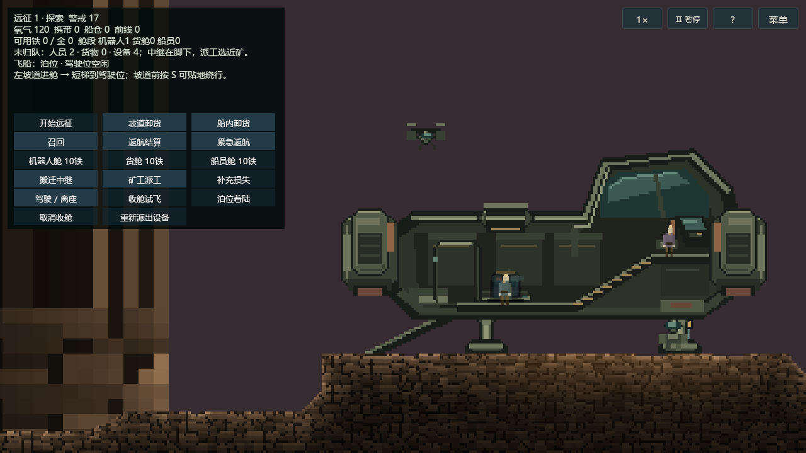
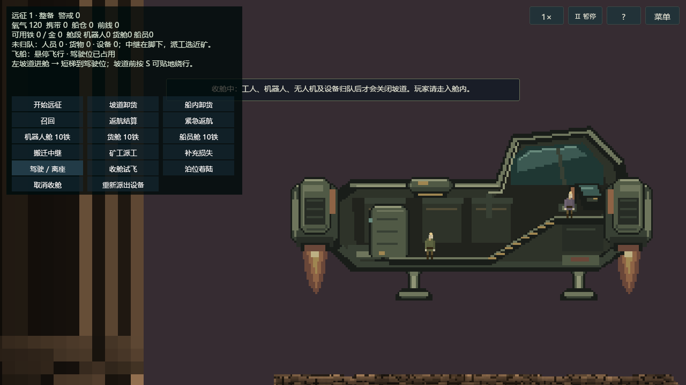

# 可步入远征飞船

2026-09-22，分支 `ft-20260922-walkable-expedition-ship`。这是游戏实现切片，协议 **14**／存档 **v10**。旧格式严格拒绝，用户已有存档不删除。YYGC 锁定和框架源码不变。

## 行为与范围

- 左侧坡道连续连接工作舱、短梯和右侧驾驶位。登船角色仍显示并可步行；坡道前按 S 可从下方绕行到矿区。
- 到驾驶位点击“驾驶 / 离座”。席位唯一，持有本人角色租约的玩家才能驾驶；切换席位更新租约，迟到输入不能接管。
- “收舱试飞”先召回工人、搬运机器人、侦察无人机及所有设备，再关闭坡道。受阻时等待，可取消，不按超时瞬移归队。
- A/D 平移，空格上升，S 下降，松开制动悬停。第一版限制原泊位左右 128、高度 192 权威单位，并扫掠原地形坡形。只支持原泊位低速着陆，不宣称全洞穴航线或任意斜坡着陆。
- 机器人舱包含一台地面搬运机器人和一台侦察照明无人机。无人机经顶舱口离船巡检，不自动采矿；矿工继续既有工作和货袋逻辑。正常返航结算和明确确认的紧急返航保留独立入口。
- 失焦、暂停、输入超时和断线撤销持续推力；空中读档保留位置与乘员，释放驾驶占用并归零速度，玩家走到席位重新接管。
- 登船后镜头为整船、顶部无人机和左侧面板留出空间；下船恢复原有角色跟随与缩放。舱内隐藏不可用的手持道具栏。

## 试玩入口

使用 Unity 正式 Bootstrap 的主菜单创建房间，或运行本批 `artifacts/walkable-ship/player-mono/DarkNights.exe`。默认远征已经绑定当前 StrataCave 风格，无需额外美术开关。

1. 按 D 从左侧坡道走上船，沿舱内短梯走到最右侧驾驶台，点击“驾驶 / 离座”。
2. 点击“收舱试飞”。其他玩家必须走进舱内，工人、机器人、无人机和设备必须实际归队，随后关闭舱门。
3. A/D 平移、Space 上升、S 下降。回到原泊位低速停止后点击“泊位着陆”，再点击“驾驶 / 离座”下船。
4. “开始远征”沿用现有探索流程。购买“机器人舱 10铁”后，下一次展开包括地面搬运机器人与侦察照明无人机；矿工由“船员舱”提供。首次开局没有免费赠送升级，也未更改已有购买价格。

坡道入口按住 S 可贴地绕过登船触发区，继续前往右侧矿区。试飞不会代替“返航结算”，也不会把玩家瞬移到远处矿房。

## 美术与地形

来源为 `D:/Downloads/飞船/岩层适配_v2` 的 50 张原生透明 PNG。字节保持原样；来源 SHA、几何及可重建像素绘制器在 `tools/walkable-ship/art-source`。原生 176×104、8px/格、每像素两权威单位。没有额外 AI 生图：这些图需要精确共边、透明边缘和坡道锚点，采用确定性像素绘制。

船体 PPU=50、根缩放=1；机器人/无人机 PPU=100，经现有洞穴角色显示倍率 2 得到同一密度。船体前后层可容纳独立角色，玩家在船内时仅本客户端剖切舱壳。原居民主角及既有氧气、中继、仓箱、炮塔等设备 Prefab 保留；这批完成船体、搬运机器人和侦察机，不宣称全部远征设备已经统一重绘。分层素材不提供碰撞，碰撞由 `ShipGeometry` 与服务器坡形查询决定。

本分支远征模板在显式安装时绑定当前 `ContourDefinition` 和 `StaticBackgroundStyle` 为默认样式；因此正常进入远征也使用当前 StrataCave 岩层及三层背景。独立地图调试场景和新矿物美术候选不改写。`--dn-contour-static` 仍可使用。

`Dark Nights/Art/安装可步入飞船首版` 是一次性安装入口：新建 `Res/Objects/ExpeditionShip` 下的船体、机器人、无人机、HUD；原船体与旧 Prefab 保留。已有 ship/hauler 定义 GUID 不变；只更新 PrefabRef、Addressables 和远征场景中的同一放置身份。目标 Prefab 已存在时拒绝重写。

## 状态归属与恢复

船的 BuildingState 拥有阶段、驾驶者、速度、泊位和门计时；ActorState 拥有唯一角色位置与归队标记。不存在第二套世界状态或客户端推进。冻结 `ExpeditionShipData` 进入同一投影与原子存档。船体位移和乘员位移同事务提交。角色手持装备在舱内停用。

## 本批验证状态

已完成 Unity 批量导入与原生 Prefab／场景保存重开，50 张源图的字节、原生尺寸、透明边缘和导入设置 200/200。飞船几何／权威新增 16 项及远征回归 8 项合计 24/24。按失败影响合并后，Editor 236 个不同用例中 235 通过；既有 `NativeButtonThemeTests.InteractableChangesUpdateWithoutPointerMovement` 仍失败，不宣称完整 Editor 全绿。修正过存档版本单一来源、空中坐标校验和驾驶者断线释放。

Core 1048/1048；六个程序集 C# 9 编译通过；架构守卫 458 个文件、12 自测、0 错误。首次 Mono 画面发现镜头截断船体后，集中修改船内视野并进行一次受影响重建。最终构建（2026-09-22 18:57，Mono）在独立 Host／Client／LateJoin 三进程中，正常网络 **28/28**、约 **200 ms RTT + 5% loss + 25 ms jitter** 弱网 **28/28**；两批执行程序集 SHA-256 一致。包含实际登舱、客户端驾驶、非法租约拒绝、超时制动、晚加入、重连、空中真实写盘读档、下降着陆、机器人／无人机出舱及四设备归舱。没有把隐藏窗口截图当作前台性能数据。

完整[证据索引](evidence/walkable-ship-2026-09-22/results.json)记录实际用例、构建身份、网络中继计数与素材合同；[资源引用检查](evidence/walkable-ship-2026-09-22/resource-reference-check.json)确认 76 项相关 meta 无新增重复 GUID，原 ship／hauler 定义 GUID、Packages 和 ProjectSettings 无变动。

网络部署段使用明确标记的“已购买机器人舱”独立存档夹具，只修改该升级标记，不把它算成真实赚取铁矿的验收。所有自动化存档位于本任务 artifacts；未访问或覆盖玩家存档。`--dn-role` 与 `--dn-input-replay` 同时存在时，显式回放替代本地键盘采样，镜头、HUD、正式 Gateway、服务端校验和网络投影仍正常运行，避免无键盘输入的保活包抵消回放。

IL2CPP、双机器、前台性能及全洞穴飞行不在本批通过声明中。运行截图来自真实 Mono 场景相机与 UGUI 的离屏捕获，不作为前台性能证据。

薄 worktree 不启动 Unity、不复制或链接 Library。编译与静态报告输出到 `D:/Downloads/飞船/游戏接入验证_20260922`；随后借用 Local 已有唯一 Editor 完成一个集中验证批次。

## 产物与保留目录

- 游戏资源及修改已落在当前功能分支，Local 复用单一 Unity 验证通道；原 `ft-20260922-embedded-ore-art` 分支保留。
- `artifacts/walkable-ship/player-mono` 约 193 MiB，保留为本批试玩与复验产物。网络报告、截图及独立测试存档保留，以便追溯正常／弱网的实际过程。
- `D:/Downloads/飞船/游戏接入验证_20260922/compile` 与 `static` 合计约 424 MiB。删除其中可重建 bin／obj 的操作被自动审批以 `blocked by policy` 拦截；未执行清理、未换工具重试，源码与报告一并保留。预览清单在 `artifacts/walkable-ship/cleanup-preview.json`。
- `C:/Users/Jobscn/.codex/worktrees/walkable-expedition-ship/unity-projects` 保留为无 Unity 缓存的初始 checkpoint；其中首次 C# 试编产生的 CoreBuild bin／obj 共约 0.41 MiB。没有执行 `.codex` 清理，也未删除或移动该 worktree。
