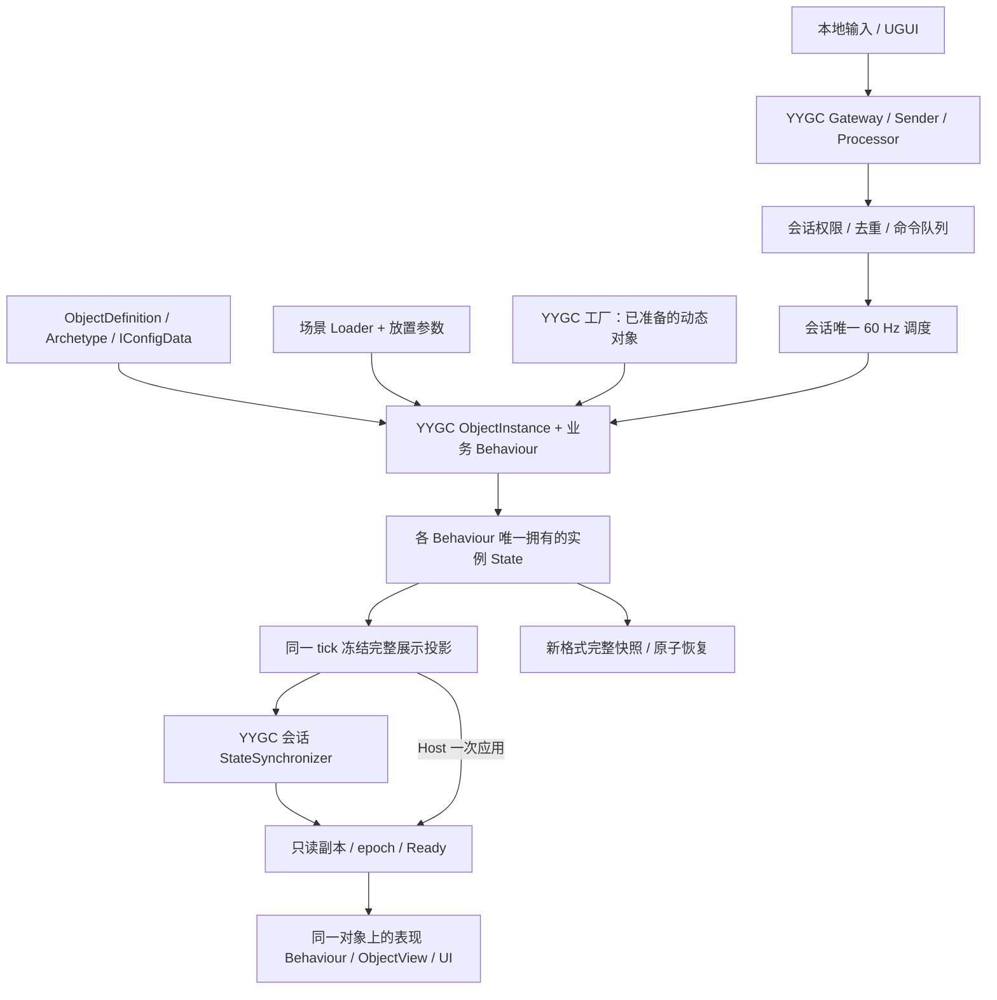

# YYGC 统一对象架构分阶段重构执行计划

日期：2026-09-13。决策：**正式游戏统一采用 YYGC 的 ObjectDefinition、ObjectInstance、Behaviour、实例 State 和能力配置；Core 收缩为纯算法、只读配置及数据合同。** 原有 Core Entity 不再作为另一套运行实体保留。

本计划已完成源码迁移和最终本机功能矩阵。**U0–U5 已完成；旧运行世界和旧档入口已删除，一倍速三夜／无人照料结果与冻结记录一致。U6 最新协议 7／YYGC `745f3d2` 已通过 144 项 Editor／Play、同一 Mono 产物的 350 项自动检查及 240 秒摘要容量检查 21 项；前台验收按用户选择暂缓，性能签署和受自动审批限制的清理仍未完成。** 当前结果见[性能修正与验收](YYGC_UNIFIED_PERFORMANCE.md)及[协议 7 证据](evidence/yygc-unified-u6-compression.json)；早期 U2、U4、U5 与 U6 的结果按输入保留在[实施记录](YYGC_UNIFIED_IMPLEMENTATION.md)。本计划接续最后一轮架构评估，取代 [C 方案](C_REFACTOR_PLAN.md)作为后续重构方向；C 方案和[场景入口修复](SCENE_DEFINITIONS.md)仍是历史证据。

2026-09-14 已完成后续 [M5 UI 校准的五个阶段](M5_UI_CALIBRATION.md)：源码 `2fff198`，155 项 Editor／Play 按影响合并通过（首轮 154/155，相关 22/22 复验），真实鼠标 19/19，新 Mono 相关检查 31 项通过。新产物位于 `artifacts/m5-ui/player-mono`，本切片未修改 YYGC／FishNet；完整世界画面对照、前台性能及外部验收仍单列。新调试目录清理被自动审批拒绝，未重复尝试；见[本批机器证据](evidence/m5-ui-calibration-2026-09-14.json)。

## 1. 已确认范围

| 决策 | 执行含义 |
|---|---|
| 统一采用 YYGC 对象模型 | 实例创建、能力装配、状态所有权和释放归同一对象生命周期；不只给 Actor 再套一层 Behaviour |
| 允许升级、适配和修复 YYGC | 对有证据的能力限制或 BUG，在框架内完成必要改动；不因当前 API 限制长期保留两套对象／状态系统 |
| 无需旧数据适配 | 不导入 Godot 旧档、不兼容当前 Unity v1 存档或协议 5 客户端、不保留游戏侧旧 Kind／旧整数身份兼容入口 |
| 新分支实施 | 游戏分支已创建：`codex/yygc-unified-object-migration`，起点为 `7072b260fdd43061ce5d13f97bc18cefab7c5747`；后续各阶段在此提交，不推送远端 |
| 保持现有玩法与人工资源 | 灰松谷、2–4 人、共享营地、数值、初始顺序、波次、攻击时机、文本、布局及素材字节继续保持 |

“无需旧数据适配”不取消新架构自身的保存／恢复、坏档校验、重连和加载原子性。现有 Prefab、场景、动画及其 `.meta` 仍是需要保留的制作成果；允许一次性更新当前资产的必要组件和绑定，不增加长期旧版资产读取分支，也不重生成场景或美术。

规则数值仍以 `balance.json`／关卡波次 JSON 为唯一人工来源。此次没有授权将数值编辑源同时迁到 SharedConfigs；IConfigData 负责能力参数、规则引用和表现配置，规则值只读派生。无需把 R3 用作每个玩法方法的调用总线。

## 2. 开始时的真实状态

| 项目 | 核对结果 | 对本计划的影响 |
|---|---|---|
| 游戏代码 | `7072b26`；创建分支前工作区干净 | 从当前代码推进，不从早期 M0／M1 重新开始 |
| 现有对象模型 | Core 的 GameSession／WorldState／Actor／Building／Worksite 拥有玩法状态；YYGC 个体 Behaviour 主要负责表现 | 必须迁移状态与 Tick 的所有权，最后删除原运行模型 |
| 现有命令／网络 | 已接 YYGC Gateway、Sender、Processor；会话完整投影经 StatefulBehaviour／StateSynchronizer 发布；游戏协议为 5 | 保留可信命令链和可靠完整投影策略，适配新的状态来源与协议 |
| 最新场景修复 | 17 个 Definition 配置、16 个场景放置实例、Loader 静态装配和视图借还已实现；仅有编译及静态检查 | 不能把 2026-09-12 的 C 方案 Player 结果当作 `7072b26` 已通过回归 |
| YYGC | 用户仓库和隔离依赖 HEAD 均为 `ccd61e01f15332b1197cfa5ee72af8777c4a0b49`；用户仓库本次读取时干净 | 框架能力结论针对这个提交；实施前重新核对工作区 |
| 隔离依赖差异 | `.deps/YYGC` 有六个已跟踪修改，以及 SampleAssemblyAccess.cs／.meta；路径对应已有补丁 | 它不是干净的裸提交；U0 还需精确核对补丁内容，不能直接清理或覆盖 |
| 未完成交付项 | M5 的字体／菜单画面、可信性能记录、IL2CPP、双机器 LAN 仍有未验收项 | 本重构完成与 M5 完成分别记录 |

现状依据：[开发状态](DEVELOPMENT.md)、[C 实施记录](C_REFACTOR_IMPLEMENTATION.md)、[场景修复](SCENE_DEFINITIONS.md)、[YYGC 账本](YYGC_CHANGES.md)。本次只读源码，没有据此新增运行通过记录。

## 3. 目标架构与所有权

### 3.1 一套运行实体，明确分离权威状态和展示副本

下表记录已落实的职责与所有权；具体实现文件及完整字段见[状态迁移表](YYGC_UNIFIED_STATE_MAP.md)。会话职责按 CampSimulation、Economy、Wave、Projectile 等能力拆分，旧运行模型已于 U5 删除。

| 位置 | 目标职责 | 明确不再保留的职责 |
|---|---|---|
| ActorBehaviour／ActorState | 单位身份、坐标、HP、订单、目标、朝向、行动／攻击／AI 计时；驱动移动、采集、战斗能力 | 独立 Core Actor 对象、另一套 Entity Tick 和额外可写 HP 副本 |
| BuildingBehaviour／BuildingState | 建筑身份、HP、施工进度、工人占用、训练队列、相关工位关系 | Core Building 的并行状态与生命周期 |
| WorksiteBehaviour／WorksiteState | 资源余量、生产计时、占用者、变体和来源建筑关系 | Core Worksite 的并行状态与生命周期 |
| 会话 ObjectInstance 上的业务模块 | 经济、人口、统计、波次、箭矢集合和随机数；按业务职责分模块 | 另起一个 GameSession 作为真实世界，Behaviour 仅转发 |
| CampSessionBehaviour | 会话启停、角色就绪、固定调度、激活／退休；持有本局模块引用 | 集中实现所有单位逻辑，或把可写世界注册为应用全局单例 |
| SessionEntityIndex | EntityId 到本局 ObjectInstance／业务能力的查询及稳定遍历顺序 | 拥有第二份 HP、位置、库存、工位状态或独立实体对象 |
| WorldSessionBehaviour／SessionProjector | 从业务 State 冻结完整投影，并经既有网络链分发 | 从投影反向结算经济、生产或伤害 |
| 现有个体表现 Behaviour | 从冻结副本解释动作、施工阶段和锚点；Host 也走相同展示入口 | 再持有一个有独立生命周期的“逻辑实体包装” |

目标是在 YYGC 内让 StatefulBehaviour 支持**状态权威来源与网络发送方式分离**：Local 游戏对象也能由可信会话赋予权威写入；需要同步的会话对象继续复用现有网络合同。业务状态进入 YYGC 的状态生命周期和检查工具，不能只把原 Actor 塞进一个 PooledBehaviour 字段。

首版仍按会话发送可靠完整投影。单位不增加独立 NetworkObject／NetworkTransform；个体 State 不因每次变化自动发 RPC。同步包和保存 DTO 都是冻结数据，不是运行实体。是否拆流由 U6 测量决定。

### 3.2 能力装配与配置

- 首批按单位、建筑、资源点三个实际家族组织 Archetype；能力优先采用移动、战斗、采集、施工／训练等有复用价值的组合，不为每个字段建立 Behaviour 或接口。
- 每个家族明确一个实例状态所有者。其他能力通过该所有者的受控操作协作；共享工位、支付和队列由会话事务协调，不能各自复制状态。
- 使用 `RequireConfig`、IConfigData、SharedConfigs 和现有绑定／注入生成器。Workshop 补齐配置后，运行时确实读取这些配置；仅能在 Inspector 看见配置不算接入完成。
- IConfigData 中的规则引用使用明确的 RuleKey，编辑器从对应 JSON 目录选择并展示只读数值；不继续从 `unit.*`／`building.*` 的 Key 后缀猜规则身份。DefinitionGuid 是对象定义身份，RuleKey 仅定位规则条目，两者不维护第二张手填映射表。
- 每个配置对象按共享只读数据使用。当前 HP、订单、库存、工作进度和训练队列只进实例 State；运行时修改某个工人不得污染同 Definition 的其他工人或资产。
- 缺少必需能力、配置、类型注册或绑定时，在 Editor 和 Player 都拒绝激活并报告具体 Definition／字段，不允许半装配实体进入调度。

### 3.3 调度与权威门禁

全局只有会话调度器推进玩法。通过 YYGC 的更新入口累积未缩放时间，再以 60 Hz 调用业务能力；个体不依赖 Unity 帧顺序各自执行玩法 Update。

原顺序保持为：已接受命令 → 经济 → 建筑 → 单位 → 工位 → 箭矢 → 波次。各阶段的遍历顺序、增删可见时点和胜负短路保留现行语义，不能统一改成 Tick 末尾才创建／删除。2×仍在一个入口使用 `2/60` 的模拟 delta，不改成两个 `1/60`；随机数调用顺序、按 ID 派生的 AI 时钟、训练部分成功顺序一起验证。

| 对象阶段／角色 | 能否初始化或修改权威 State | 能否推进玩法 |
|---|---|---|
| Editor 预览、已装配但未绑定会话 | 否；仅配置与被动外观 | 否 |
| 服务端会话已绑定但尚未激活 | 仅受控准备／恢复操作 | 否 |
| 当前 epoch 的已激活权威对象 | 由会话授权的业务入口修改 | 由唯一调度器调用 |
| 客户端副本 | 仅接收验证过的冻结副本 | 否 |
| 已退休、旧 epoch、旧连接或归池对象 | 否；先撤销写权限再释放引用 | 否 |

门禁不能由 Inspector 中一个“我是服务器”布尔值赋予，也不能把 `Network == null` 当作服务端。Host 每个实体只保留一个运行 ObjectInstance，表现读取本地冻结副本；网络回环不能再创建一个对象或再次执行命令。

单对象 MutateState 不等于跨对象事务。支付、占用和创建先完成全部检查，在同一服务端处理片段提交；提交期间不 await，也不让 R3 订阅重入玩法。网络和 UI 只消费完整提交后冻结的帧。

### 3.4 场景对象直接进入同一生命周期

`ObjectDefinitionLoader` 保留通用定义装配职责；`LevelPlacementMarker` 保留场景实例参数。二者不需要合并成包含游戏规则的框架组件。

1. Marker 增加稳定的场景放置键，保留 SpawnOrder、名字和变体。放置键由 Editor 创建、复制时校验唯一性；它不是 EntityId，也不是资源 `.meta` GUID。
2. Loader 装配当前 Prefab 的 ObjectInstance，但未绑定当前会话前保持被动。场景预置与动态工厂对象随后进入同一套准备、激活、调度、退休流程。
3. `LevelLayoutAuthoring.CreateLayout` 收缩为边界／放置描述的冻结、校验及摘要输入；不再把描述交给另一个 GameSession 生成一套 Core 实体。
4. 服务端按既有初始化顺序分配 EntityId，并产生明确的“放置键 → EntityId”关系。保留农田派生工位及其 ID 顺序；16 个手工放置项不等于全部逻辑实体数量。
5. 每个进程按放置键找到对应场景 ObjectInstance 并绑定身份，删除 `SceneEntityViews.Borrow(kind)` 的任意同类借用。客户端只在收到权威基线后绑定，不能先按场景产生自己的开局状态。
6. 动态招募、建筑、敌人、派生工位仍由 YYGC 工厂创建。Host 投影应用只查已有权威对象；客户端缺少对象时才按新投影建立副本实例。加载／重开时撤销旧身份再重置或释放，不通过全局重复生成掩盖身份错配。

初始布局在场景激活前从制作数据冻结。后续重开复用这份不可变描述，不能读取已经移动到战斗位置的运行时 Transform 作为新开局布局；运行坐标也不反写场景制作数据。

### 3.5 程序集与目录

继续使用四个运行程序集，不新增一组“YYGC 版 Core”平行运行程序集。

| 目录 | 重构后职责 |
|---|---|
| `Scripts/Core/Config`、`Core/Logic` | 只读规则、坐标／数值／范围／伤害等纯计算及必要枚举；没有长期运行实体、世界容器或 Tick 生命周期 |
| `Scripts/Core/ViewData`、`Core/Save` | 冻结展示／存档合同、纯校验；不引用 YYGC 类型或文件系统 |
| `Scripts/Runtime/Objects` | 随实际切片新增的业务 Behaviour、实例 State、能力配置和对象登记／事务协调 |
| `Scripts/Runtime/Session` | 可信会话、权限、去重、固定调度、epoch、激活及恢复协调 |
| `Scripts/Runtime/Network`、`Runtime/Save` | 命令／完整投影适配、新格式编码和原子文件操作 |
| `Scripts/View` | 只读表现、UI、本地输入和场景制作组件 |
| `Scripts/Entry` | 启动及跨程序集装配；退出业务计算和双对象生命周期协调 |

Core 继续 `noEngineReferences`、C# 9／.NET Standard 2.1；实例 State 因依赖 YYGC／MemoryPack 放 Runtime。普通规则函数留 Core，不为接框架伪造 Unity／YYGC stub。代码长度、中文 XML summary、生成文件隔离和绑定检查沿用 [AGENTS](../AGENTS.md)。

## 4. YYGC 前置改动与验证门槛

下面区分源码已确认的限制与待验证风险。路径相对于锁定的 YYGC；**这是候选改动范围，不是已修改文件清单**。

| 编号 | 当前证据 | 计划处理与验收 |
|---|---|---|
| F1 状态与网络上下文耦合 | `Runtime/Objects/NetworkStates/StatefulBehaviour.cs` 的 IsServer 要求 `_context.Network`；MutateState／MutateStateAsync 拒绝 Local 对象 | 在 YYGC 内分开状态生命周期、可信权威来源和发送模式。默认网络行为保持明确语义；会话托管的 Local State 无需伪造 NetworkObject。验证未授权写入、客户端误写、未开局、退休和池化重入 |
| F2 会话容器的装配时机 | `ObjectInstanceFactory` 先 await 加载；`ObjectInstance.CreateAndInitBehaviours` 从 SessionScope.Current／Root 取父容器；Local initializer 无显式会话参数 | 给工厂／initializer／装配链提供显式、可验票的会话上下文。资源加载在 scope 外，最终装配在主线程同步段完成；静态 Loader 和池化重入也必须拿到当前会话依赖 |
| F3 创建与支付之间的异步屏障 | 现有工厂入口是异步加载再实例化；原规则建造、招募和农田派生工位是同步事务 | 在 YYGC 资源／工厂路径补齐“预加载完成后同步装配”的有限入口。开局前准备必需定义；未就绪请求在支付前拒绝。对象装配失败不得留下扣款、占用、半注册身份或提前消耗的 EntityId 序号／随机步骤 |
| F4 配置／能力缺失不阻止运行 | `ObjectInstance.CreateAndInitBehaviours` 的缺引用检查是 Editor 分支，日志明确继续运行；Workshop 会按 RequireConfig 自动补配置 | 复用现有检查，增加正式激活前的严格校验及失败清理；在实际 Player 验证必需能力、重复配置和绑定缺失被阻止。正常美术打开／预览不启动权威会话 |
| F5 状态副本与池的语义 | StateMutationScope 调用 CopyFrom／Equals，ReplaceState 在同步订阅后归还旧状态；公开 State 仍可暴露可变引用 | 针对新列表／队列验证深复制、相等性、Reset、订阅释放和冻结边界；防止 View／异步任务持有可写或已归池状态。不能把 record 自动当作深冻结 |
| F6 重入、转职和网络注册 | ObjectInstance 有快速重入路径；新业务 State／能力将改变生成注册和状态枚举 | 验证换会话依赖刷新、同定义复用、跨定义重新装配、Role／epoch 失效、状态索引与具体类型注册；缺陷复现后修改，不先宣布这些路径存在 BUG |

F1–F4 是 U1 必须解决的合同。具体 API 名称在 U1 锁定，本文不把拟议接口写成现成能力。状态托管模式还必须让 StateSynchronizer 明确只发送指定会话投影，避免发现多个 IStatefulBehaviour 后意外逐实体／逐字段广播。

框架修改流程：

1. 在新的隔离 checkout 和 `codex/` 分支研究及验证，记录原提交、现有补丁和每个具体失败；不直接覆盖当前 Editor 使用的 `.deps/YYGC` 或用户仓库的工作区。
2. 修改落在最小公共能力范围。游戏的权限、工位事务、epoch、Ready 和存档恢复仍归游戏；不把灰松谷规则塞进 YYGC。
3. 真实 Unity 测试通过后提交框架版本，核对用户仓库当时分支和改动，再以保留现有改动的方式落地。不能因本次读取时干净，就在后续盲目快进／重置。
4. 游戏锁定完整框架提交，维护 `tools/prepare-lan-sample.ps1`、必要补丁及 UPM manifest／packages-lock；路径未变时记录复核结果，不制造无意义锁文件改动。已吸收进新框架的补丁从准备链退出，其余精确复用。
5. 在 [YYGC_CHANGES](YYGC_CHANGES.md)逐项记录实际文件、原因、隔离／用户仓库落点、提交及验证。冻结源码生成器输入／输出的来源，不手改生成结果。

不需要为同一已授权框架适配重复请求许可。若出现真正的结构阻断，应记录复现、涉及范围和修正方案，再调整阶段工作量；不能悄悄恢复长期双系统，或自动切到已放弃的轻量路线。

## 5. 分阶段执行

阶段有真实依赖，按 U0 → U1 → U2 → U3 → U4 → U5 → U6 推进。每阶段集中准备代码，等编译就绪后再集中改定义／绑定／资源；同一 Editor 串行。以下估算包含对应实现与回归，不是执行时限承诺。

空间约束（2026-09-13 用户补充）：每阶段开始及构建前记录系统盘和项目盘可用空间；阶段完成立即清理本阶段可重建中间产物，并记录路径、释放量及剩余空间。只保留下一阶段仍需复用的 Player、当前 Editor 导入缓存、源码、场景保护副本和证据。禁止复制整套 Library 作为验证环境，禁止删除活动任务正在使用的缓存；所有递归清理先验证绝对路径和链接，限定在本任务目录。空间余量不足以容纳预计峰值时先完成受控清理，不冒险继续构建。

| 阶段 | 可审查交付 | 预计人日 | 当前状态 |
|---|---|---:|---|
| U0 分支与基线 | 决策、输入记录、比较方法、阶段验收门槛 | 0.5–1 | 功能基线与 1997 项输入归档完成；缺少有效 Player 性能基线已记录 |
| U1 YYGC 前置能力 | 状态权限、显式会话装配、同步创建、严格配置检查 | 1.5–3 | 完成；框架 ddce2ff，分批 Editor／Play、Mono 14/14、Sample 30/30 |
| U2 工人／采集／建造切片 | 一套对象模型的可操作、可保存、可联机闭环 | 2–3 | 完成；框架 0305eb7，分批 126 个 Editor／Play、Mono 三进程 26/26 |
| U3 全部玩法能力迁移 | 15 类正式定义、完整权威状态和三夜流程 | 3–5 | 已完成；136/136 回归，未新增 Player 构建 |
| U4 场景／网络／存档产品接线 | 正式场景原实例、协议 6、新档 v2、UI 和会话恢复 | 2–4 | 完成；Play 2/2、会话 19/19、Mono 活跃恢复 14/14、四人恢复 24/24 |
| U5 旧模型退出与工具收口 | 删除旧运行实体和兼容链，更新守卫与生成入口 | 1–2 | 完成；134/134 Editor／Play，13 组 291 项业务断言，Core 1043/1043，框架 8faf74f |
| U6 完整验收与交付 | 同一最终 Mono 产物的完整矩阵、性能记录、提交 | 2–4 | 协议 7 Mono 350 项及 240 秒容量 21 项通过；前台验收由用户暂缓，性能未签署，部分清理受审批阻断 |

总量暂估 **12–22 人日**。U1 的实测结果可能改变范围；不含新玩法、美术重制、M5 既有画面修正及 IL2CPP／双机器外部等待。U2 退出后依据实际改动量重新估算余项。

### U0：冻结输入，建立比较方式

**输入：** 当前游戏／YYGC 提交、已保存场景、正式定义、规则 JSON、冻结规则证据、已有 Player 及工具。

**执行：**

- 保持新分支，记录工作区和两个 YYGC checkout 的实际差异；逐字节核对准备补丁，不清理未知修改。
- 归档涉及的源码、配置、16 个场景放置项、15 类实体定义、网络定义、生成注册及 `.meta` 哈希。检查是否有未保存的 Editor 制作改动，保留它们。
- 明确 `7072b26` 最新场景修复的未回归边界。历史 Player 可作历史参照；要比较性能，必须在隔离环境取得与其源码／依赖一致、采样有效的基线，不能借用隐藏窗口或工作集全零报告。
- 对冻结规则用例建立“业务断言 → 新 Behaviour 入口”的覆盖表。旧存档字节仅归档，不作为新版加载成功门槛；原初始布局、数值、RNG、攻击／生产时序等断言继续有效。
- 锁定 U6 性能采样条件及预算：相同硬件、分辨率、前台状态、负载、连接数和观测窗口。暂无可信基线时如实标记，先补有效采样，再谈优劣。

**输出／退出：** 可复现输入记录、规则覆盖清单、有效基线或明确缺失项。本文和分支创建不等于 U0 全部完成；输入无法对应时停止依赖该输入的比较，不重生成冻结期望值。

### U1：在 YYGC 内闭合前置能力

**依赖：** U0 的框架提交／补丁已核对。

**执行：** 批量处理 F1–F4，针对 F5–F6 增加真实生命周期探针；通过框架内的公共路径验证一份 Definition 可装配为被动预览、权威实例和客户端副本。单人也使用可信本地主持会话。

覆盖冷加载取消、加载过程中会话退出、同定义池化重入、换会话／换定义、缺配置、缺生成绑定、状态订阅异常与清理。工厂返回成功必须表示完成要求的装配；失败回收所有暂存对象和句柄。

**输出：** 实际框架提交、生成来源、API 合同、复现与测试结果、逐文件账本。先通过真实 Editor／Play 探针，再更新游戏的可重现依赖；常规网络 StatefulBehaviour 和独立 Sample 的基础合同也要回归。

**退出：** Local 权威状态可写且客户端不可写；当前会话依赖准确；预加载后的同步创建不跨 await；未完整装配对象不可激活。若任一项只能靠游戏侧私有状态基类、假 NetworkObject 或跨 await SessionScope 实现，U1 不通过。

### U2：工人移动、采集与住宅建造切片

**依赖：** U1 通过，状态所有权与激活 API 已锁定。

**输入／范围：** 现有 Worker、Trees、House 定义和原规则；隔离切片场景只验证这些对象及会话，不改正式 Pinewatch 的布局和数值。

**执行：**

- 新建实际用到的 Actor／Building／Worksite 状态所有者、会话经济和有限调度能力；Core 只供纯算法。切片入口完全不创建旧 GameSession／WorldState／Entity。
- 通过 Workshop 配置必需能力和 RuleKey，验证同定义两个实例相互独立；对测试定义副本增删能力能改变装配结果或给出明确缺失诊断。
- 接通同一命令链、共享工位、并发支付、自动派工和 Host 单次执行；保持原移动精度、到达阈值及生产／施工时间。
- 同时完成场景 Loader 原实例接管与动态建造，两者都进入 U1 的生命周期；投影从新业务 State 读取，不经过旧实体适配器。
- 接入协议 6 和新档 v2 的最小合同：能保存并恢复该切片的单位、占用和施工状态；晚加入／重连可取得当前完整投影。

**验证：** Editor 中编辑、保存、重开配置和 Prefab；真实 Play 生命周期；一次本阶段 Mono 构建后复用产物运行单人、独立 Host＋客户端、暂停、SharedCamp／HostOnly、重发、晚加入、保存加载及创建失败。

**退出：** 同一个工人的状态、能力、定义和外观可从 YYGC 对象工具定位；没有隐藏旧 Actor；场景对象身份不按同类借用；一次命令只结算一次，坏恢复不替换当前世界。U2 通过是扩展门槛，不代表完整游戏迁移完成。

迁移过程中旧源码可以暂时存在供未迁移入口和历史测试使用，但一个活动会话只能启用一套实现。不得让已迁移对象回调旧 GameSession；U5 必须删除产品中的旧入口与切换开关。

### U3：迁移全部玩法与正式能力组合

**依赖：** U2 完整闭环通过。

**执行批次：**

1. 六类单位：Worker、Spearman、Archer、Zombie、Ghoul、Armored；迁入移动、索敌、前摇、近战／远程、死亡和转职。按当前职业组合能力，不改变玩法配置。
2. 五类建筑及四类工位：Tavern、House、Farm、Barracks、Tower；Trees、Stone、Iron、Farmland。迁入施工、修缮、容量、招募、训练、食物工位派生、采集耗尽与释放关系。
3. 会话模块：经济／食物消耗、人口与统计、随机数、三夜夜袭、胜负、在飞箭矢。箭矢仍由会话业务模块拥有集合，视觉特效不结算命中，不强制每支箭成为网络对象。

跨对象目标改用稳定 EntityId 查询 YYGC 能力；不保存另一套 Entity 引用图。转职在同步事务中保留 EntityId、位置与原规则规定的状态，按新定义重新装配所需能力，清理旧订阅；不能同时 Tick 两个职业对象。

**输出：** 15 类正式 Definition／能力／配置／Prefab 绑定、全部权威业务模块、纯算法和恢复字段覆盖表。业务声明、类型注册和资源按依赖批量生成；不改已有动画／原图字节。

**退出：** 新入口能完整运行三夜；正常与无人照料策略、1×／2×、暂停、伤害时点、训练／退款、农田工位和随机结果符合冻结业务断言。所有活跃实体只属于 YYGC 对象体系；未迁移能力不能回退调用旧实体。

### U4：接通正式场景、UI、网络与新存档

**依赖：** U3 全部业务状态已可捕获和恢复。

**执行：**

- 一次性更新 Pinewatch 的放置身份及必要绑定，保留 Prefab 连接、人工覆盖、Transform 和资产 GUID。删除同类视图借还，精简 SessionEntityViews 为副本分发／时间线职责；所有创建和释放统一交给对象生命周期。
- 保留当前场景副本试玩、编辑器预览和 UGUI 操作。输入带明确实体／定义参数，客户端选择、镜头、预览和菜单保持各自独立。
- 协议从 5 升至 **6**，新旧客户端在固定握手阶段明确拒绝，早于业务载荷解析。握手包含规则、布局、定义和生成注册摘要；正式定义继续 GuidFirst／GuidV2，不能把游戏协议 6 与 YYGC 的 GuidV2 混为一个版本号。
- 完整投影包含新状态产生的 EntityId、DefinitionGuid、必要放置关系、epoch／revision、策略、实体及在飞箭矢；有界缓存最新完整帧，按原子应用／真实 Ready 解锁。单对象 State 变化不单独发包。
- 新档固定 `dark-nights.world` **v2**，覆盖全部权威状态、定义身份、稳定实体关系、训练／施工／箭矢和 RNG。使用独立版本存储目录，保留 0–9 槽位；旧文件不自动读取、改写或删除，显式选择旧格式时返回“不支持的存档版本”。
- 捕获在 Tick 边界冻结；恢复先解析和验证全部 DTO，再在未激活的会话上下文准备新对象及关系。成功才在主线程切换、增加 epoch、退休旧世界并重新 Ready；失败／取消保留当前世界和暂停／倍速。保存不恢复房间控制权限，不写入连接 ID／FishNet ObjectId。

恢复暂存对象不渲染、不 Tick。可复用的场景实例在提交点才解绑旧身份并应用新状态，准备阶段不得重置当前对象；准备失败清理暂存资源，提交路径也必须有明确的失败恢复边界。

**退出：** 正式入口只启动新版；2–4 人同一营地可运行，Host 无重复对象；晚加入、重连、活跃施工／训练／在飞箭矢保存加载、旧 epoch 拒绝均有实测。旧数据不兼容是明确结果，不能以异常崩溃或误读默认为兼容策略。

### U5：删除旧模型并收口开发工具

**依赖：** 正式入口和完整新档恢复已使用新版。

**执行：** 按第 6 节逐项退出旧运行实体、旧核心世界、Kind 后缀适配、旧档导入及过渡入口。同步更新程序集、生成注册、测试工程和 Editor 检查，不把旧代码移到另一个 Runtime 目录继续运行。

`tools/CoreRegression/CoreRegression.csproj` 当前直接编入 Runtime/Session、Runtime/Save 和部分 Network 文件；迁入 YYGC 后必须重新划定可独立运行的纯函数测试与真实 Unity 集成测试。不能为保住历史测试数保留旧世界，也不能用假的 YYGC 对象替代装配测试。

**输出／退出：** 删除／替代清单、纯算法和 Unity 回归覆盖映射、可从锁定输入重建的生成结果。搜索及程序集守卫确认产品无旧 GameSession／WorldState／Entity 引用、无旧格式导入入口；Core 无引擎／框架依赖，Entry 无玩法计算。已删除的兼容测试说明原因，仍有效的业务断言有新落点。

### U6：最终验证、性能比较与交付

**依赖：** U5 完成；源码、框架、配置和生成输入冻结，先通过静态／Editor／Play 检查。

对最终输入只构建一次正式 Windows Mono Player，复用同一产物执行第 7 节矩阵；框架变化涉及独立 Sample 时，它是另一个配置，只构建对应 Mono 一次。历史、U2 切片及最终产物按输入分别记录，不能混用通过结果。

修复导致输入变化时只重建受影响配置并重跑受影响检查；测试等待超时不重新启动仍在运行的任务。记录任务 ID，通常 20–30 秒轮询并退避，单次阻塞不超过 60 秒。

**输出：** 新架构实施记录、实际修改／删除清单、完整 Player 及哈希、规则和多进程报告、有效性能数据、YYGC 逐文件账本、仍待验证项；审查差异后提交当前仓库成果，不推送远端。

当前收尾顺序和状态：

| 工作 | 状态与下一步 |
|---|---|
| 实测热点和容量积压修正 | 已完成。YYGC 仅缓存不变装配声明；游戏协议 7 增加有界压缩，继续使用原可靠完整投影链 |
| 最新正式 Mono 矩阵 | 已完成。`4e3798f`／`745f3d2` 的 144 项 Editor／Play 与 350 项 Mono 检查通过；Sample 沿用未受压缩修改影响的 `a7bb926`／同框架 60 项证据 |
| 后台容量长测 | 已完成一次 240 秒摘要报告观察，21 项通过；48 组抽样最大落后 0.3 秒，Host 预热后约 230 秒工作集变化 +0.191 MiB。不能扩大为长期无泄漏结论 |
| 普通前台性能 | **用户明确暂缓**：“暂不显示，保留前台验收待办”。保留已验证 Mono，待允许前台运行后再执行完整三夜和容量采样，不重新请求显示窗口或以隐藏窗口结果代替 |
| 本阶段空间清理 | 工具中间产物已释放 32,992,560 字节；已被拒绝的旧目录未重试，新 Player 调试目录 245,875 字节的清理也被自动审批拒绝。保留报告、源码和后续验收产物，记录实际剩余空间 |
| M5 画面及外部验收 | 字体／菜单已在 `2fff198` 的 [UI 切片](M5_UI_CALIBRATION.md)完成相关 Editor／新 Mono 验收；完整同状态世界画面对照仍待完成。IL2CPP 未获授权，双机器 LAN 缺第二台物理 Windows 主机。与源码迁移的完成状态分别记录 |

## 6. 现有文件的迁移与退出清单

以下路径从 `Game/Assets/DarkNights/Scripts` 起算。保留表示保留相应职责，不承诺不修改源码；列出的旧运行入口已在 U4–U5 删除或替代，具体覆盖见[U5 回归迁移](YYGC_UNIFIED_TEST_COVERAGE.md)。

| 现有入口 | 目标处理 | 完成门槛 |
|---|---|---|
| `Core/Logic/Entities/Entity.cs`、`Combatant.cs`、`Actor.cs`、`Building.cs`、`Worksite.cs` | 迁入 YYGC 业务 Behaviour／State 后删除旧运行类型 | 不能在 Behaviour 内继续 new 旧实体或委托其 Tick |
| `Core/Logic/GameSession.cs`、`Core/Logic/State/WorldState.cs` | 由会话模块、唯一调度和只索引 YYGC 对象的登记替代 | 无另一套可运行世界或世界恢复入口 |
| `Core/Logic/Commands/*`、`Core/Logic/Systems/*` | 状态操作迁入所属对象／会话能力；纯计算留 Core | 命令／生产／战斗／波次只写新状态，业务顺序不变 |
| `Runtime/Session/SessionAuthority.cs`、`SessionOperations.cs` | 保留可信身份、队列、权限和去重；改为访问本局 YYGC 能力 | 不依赖 GameSession／Actor 类型，Host 与远端统一执行 |
| `Runtime/Network/CampSessionBehaviour.cs`、`SessionServer.cs` | 改为管理新会话模块和激活／退休 | 不再构造旧模拟；退出／重入没有残留 Update |
| `Runtime/Network/WorldSessionBehaviour.cs`、`SessionStatusState.cs`、`SessionProjector.cs` | 保留会话投影传输职责，重定新状态来源和载荷 | 一份冻结投影，生成注册与当前协议 7 一致；U4 初次接线的协议 6 已退出 |
| `Runtime/Framework/DefinitionRuleIndex.cs` | 删除 Key 前后缀兼容推导，规则绑定来自 Definition 的 IConfigData | 可修改定义显示名／Key 而不误换规则；GUID、类型及 RuleKey 均明确验证 |
| `Entry/SceneEntityViews.cs` | 删除按 Kind 借还视图流程 | 场景实例用放置键精确登记，Host 不再任意借一个同类对象 |
| `Entry/SessionEntityViews.cs` | 移出创建／释放职责，保留必要展示时间线与分发 | 权威对象／副本对象的生命周期没有第二个所有者 |
| `View/LevelPlacementMarker.cs`、`LevelLayoutAuthoring.cs` | 保留实例参数和布局校验，接入稳定放置键 | 不从描述再创建 Core 世界；预览无权威副作用 |
| `View/*PresentationBehaviour.cs`、`NativeVisual.cs` | 复用外观解释／采样，绑定新只读副本 | 不直接读可写 State、不由动画结算伤害 |
| `Core/Save/SnapshotMapper.cs`、`Runtime/Save/LegacySnapshotJson.cs`、`Core/Save/LegacyDisplayState.cs` | 替换旧实体映射，删除旧格式和旧显示状态导入 | 新 v2 捕获／恢复直接面对新状态；产品无旧档 fallback |
| `Runtime/Save/GameSaveJson.cs`、`GameSaveStore.cs`、`SessionStorage.cs` | 保留有界解析、槽位、冻结与原子文件边界，适配 v2 | 原文件／当前世界在失败、取消、锁冲突时保留 |
| `Editor/SceneDefinitionUpgrade.cs`、`CRefactorContentUpgrade.cs` 等旧升级入口 | 核对引用后退出仅服务旧架构的入口，保留当前制作／只读验证工具 | 普通导入／构建不触发资产迁移或覆盖美术 |
| `tools/CoreRegression`、`tools/ArchitectureGuard`、`Tests`、生成注册与依赖准备脚本 | 按新职责更新覆盖和生成入口 | 不复制旧期望、不隐藏失败、不把被删旧档测试计为通过 |

旧的独立 LAN Sample 和 YYGC 面向其他项目的历史兼容 API 不属于游戏清理范围。游戏侧不再使用它们；共享框架默认行为受本次修改影响时仍需回归。

## 7. 验证矩阵与停止条件

表内是约定的验收门槛，实际结果见[实施记录](YYGC_UNIFIED_IMPLEMENTATION.md)。静态、集成及最终 Mono 功能证据已取得；容量性能和普通前台测量尚未达到签署条件，不能将自动脚本通过替代这些门槛。测试数随有效覆盖变化，不能照抄旧的 1361／95 等数量作为目标或已通过结果。

| 层次 | 必须验证 | 通过标准 |
|---|---|---|
| 静态／纯算法 | C#9／netstandard2.1、程序集边界、旧类型退出、绑定／注册、原始素材哈希 | 无第二套运行世界；Core 无引擎依赖；生成可重建；551 项原始素材字节不变 |
| YYGC 装配 | F1–F6、能力／配置缺失、池化、换定义、换会话、异步取消 | 状态只有授权所有者可写；错误不激活；无旧容器、状态和订阅泄漏 |
| Editor 制作 | Workshop 能力／IConfigData、Prefab 与场景修改／保存／重开、Definition 拖拽、复制放置项 | 配置真实驱动能力；位置、Prefab overrides、GUID 和引用保留；重复放置身份被发现 |
| 规则 | 初始 ID／农田工位、移动、工位、支付、训练／退款、战斗、RNG、1×／2×、暂停、三夜／无人照料 | 在原明确容差内保持业务结果和时序；不重新生成冻结结果 |
| 生命周期 | 新局、退出、重开、转职、同场景副本试玩、加载取消、Domain Reload 开／关的重复 Play | 无双重 Tick、幽灵对象、重复订阅、提前归池和过期异步创建 |
| 双进程／四进程 | 独立 Host＋1 客户端；Host＋3 客户端；共享支付、共享工位、非法实体、重发和改参重发 | 一次合法输入只执行一次；顺序可解释；库存、占用及结果一致 |
| 权限／策略 | HostOnly 的移动、训练、建造自动派工；旧 PolicyRevision、非房主时间／存档请求 | 执行点拒绝越权；已生效任务继续；加载保持当前房间策略 |
| 快照／恢复 | 初始基线、第二夜晚加入、120 秒凭据恢复、暂停连接、新档活跃施工／训练／箭矢组合 | 原子应用；真实 Ready；无旧 revision 回退或旧 epoch 污染；Host 表现只应用一次 |
| 新格式边界 | v2 往返、坏字段／关系、超限、取消、文件锁、旧 Godot／Unity v1 和协议 6／5 拒绝 | 新格式严格校验；失败保留文件和世界；旧版本不误读、不自动迁移 |
| 弱网 | 复用既有九组四进程矩阵，覆盖 RTT 0／100／200 ms、抖动、丢包 0／1／5%及乱序 | 可靠状态收敛、无重复扣款、缓存有界；保存网络扰动参数与四端结果 |
| 容量时效 | 零丢包、零延迟 LAN；256 实体／1024 箭矢合成投影，Host 为 17 个真实对象 | 本轮新增门槛：观察窗口每 5 秒抽样，客户端最多落后 60 服务端 tick；持续发布且四端 Ready。原报告不回填 |
| 性能 | 正常高峰、容量投影、完整三夜、胜利后静置；相同前台与硬件条件 | 记录模拟步时、帧时 p95、GC、OS／托管内存、大小、带宽和积压；继续要求可用 60 FPS、无持续积压或内存增长。U0 未冻结更细预算且无可信旧性能基线，当前证据不足以签署性能通过 |
| 画面／操作 | 1280×800 与 1600×900、昼夜、转职、施工、残骸、五页 UI | 原布局、脚底、动作帧及文字不因重构回退；既有字体／菜单问题单列，不冒充本次已修复 |
| 可复现构建 | 干净目录、锁定 YYGC／FishNet、正式 Mono、必要 Sample Mono | 不依赖用户工作区未提交内容、旧 Library、Godot 或参考目录；产物哈希和来源可对应 |

复用现有 `tools/test-game-delivery.ps1` 及 startup、session、concurrency、recovery、active-load、network-matrix、battle、campaign、pressure、visual 脚本，按新协议和格式更新必要断言。先通过纯算法／Unity 集成，再提交 Player 构建；同一产物执行对应全部场景。仅检查状态序列化或 Host 单窗口不算联机验收。

失败立即停止依赖阶段：状态双写、未知会话依赖、重复实例、冻结业务差异、半提交事务、旧 epoch 接受、坏档替换、注册遗漏和资源引用损坏均不得带入下一阶段。保留已完成证据；只有相关输入变化、失败或新疑点才重跑已通过检查。

IL2CPP 仍需用户明确确认后才构建和验证；双机器 LAN 必须使用真实第二台 Windows 主机。没有这两项证据时可以单独交付 Mono 重构结果，但必须继续标记 IL2CPP／双机器未验收，不签署 M5 全部完成。

## 8. 完成定义与阶段记录

本重构的完成条件是：正式运行入口只有 YYGC 对象模型；业务状态由所属 Behaviour 唯一拥有；Core 无独立实体生命周期；能力配置可编辑并实际生效；静态和动态对象共用生命周期；新存档、联机和完整 Mono 矩阵有新证据；旧模型与兼容链已退出。

每阶段记录：输入提交／哈希、实际修改与删除项、YYGC 变更及落点、完成／失败计数、生成方式、日志／产物路径、未验证项和下一阶段依赖。游戏和框架分别提交，必要时按完整阶段提交回退；不自动重置用户工作区，不通过恢复已废弃的双模型开关回退，不推送远端。

U0–U5 已完成，正式入口只启动完整 YYGC 对象会话，旧运行模型与旧档入口已退出；v2、规则、制作与重复 Play 的集成回归通过。U6 首轮 `9e69a76` 使用没有旧 Library 的源码目录建立缓存；最新 `4e3798f`／`745f3d2` 复用该缓存构建一次 Mono，通过 350 项完整矩阵和 240 秒容量 21 项。前台验收按用户选择暂缓；性能签署、M5 既有画面、IL2CPP／双机器和受审批限制的清理继续分别标记未完成，不能把源码迁移完成写成所有交付条件均满足。
