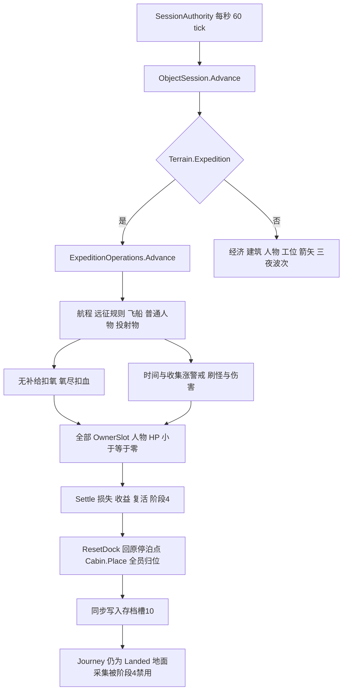

# Dark Nights 业务规则和组件职责审查

2026-10-03后续：氧气业务已在独立源码候选中移除，实际范围和待验证项见[执行记录](OXYGEN_REMOVAL_VALIDATION.md)；本页仍保留2026-09-30审查时点与旧源码行号。其他规则及职责问题不因此视为已整改，全项目业务“干净”仍须逐项收口。

2026-09-30。用户要求先审查整理，规则不必保留。本报告列出当前源码中的自动规则、数值来源、触发条件、状态写入及整改建议；未删除规则、修改生产代码、启动 Unity 或构建 Player。

**审查结论：目前不能认定业务干净。** 权威状态仍由 YYGC Actor、Building、Camp、Economy 和地图各自持有，但旧远征生存与结算规则继续作用于新航程，货物、警戒、死亡、复活、登船、地图运动和存储存在职责耦合。正式画面缺少部分规则的反馈。优先处理结算后的状态断路和强制归位，再决定氧气、警戒、设备成长等玩法是否继续存在。

## 范围和证据

- 当前默认入口是 Bootstrap 到 Expedition，`--dn-camp-mode` 才进入旧 Pinewatch；源码 `ObjectSession.IsExpedition` 依据 `Terrain.Expedition` 判断，不能仅凭组件存在判断规则生效。
- 本轮包含未提交的采矿改动。审查过程中源码从协议 18／存档 v13 变化到 **协议 19／存档 v14**；以交付时的文件指纹为准，不将旧 Player 或历史测试计数作为当前证据。
- 读取业务 Objects、Session、网络授权、Terrain 破坏与运动、Core 配置和生成、Entry／View 的业务反馈及对应 Definition／JSON。历史策划用于追溯规则来源，不能自动授权当前保留。
- 表中的秒默认指**模拟秒**，距离指**权威逻辑像素**，16 单位等于 1 格。2 倍速会加快氧气、警戒、装备冷却及地面计时；连接、输入租约和部分同步截止使用服务端 tick／真实时间。
- “默认生效”指可从当前入口和调度到达；“条件生效”依赖购买模块、显式命令或恢复状态；“旧模式”指默认远征未调用其 Tick，且营地命令受到服务器拒绝；“残留入口”不是当前默认玩法。
- 本轮是源码审查。潜在问题的运行频率、各阶段联机和异常原子性未实测；未证明所有路径没有遗漏，也不宣称已完成整改。
- 文件指纹、扫描范围与文档引用检查见 [审查证据](evidence/business-rule-audit-20260930.json)。源码链接指向本机工作区，后续修改时须按指纹重新核对行号。

## 当前调度和强制返航链路

入口：[会话调度][AUTH] 120–142 行、[模式分流][OS] 220–237 行、[远征步进][EO] 25–39 行。缺氧与全员死亡：[EO] 142–157 行；复活与归位：[EO] 160–194 行、[ES] 118–123 行、[CAB] 125–128 行。

## 生存 死亡和结算规则

| 编号 | 触发与当前数值 | 玩家影响和来源 | 生效范围及建议 |
|---|---|---|---|
| E01 | 安全着陆调用 BeginGround，阶段设为1；重置风险、损失、任务；所有友方满血满氧 | [FLOW] 192–196、[EO] 112–125；不是只初始化刚下船者 | 默认；阶段转换与复活应分开，决定是否允许着陆补满 |
| E02 | 舱外无补给每秒氧气 −1，最大120 | 最大值在 [BAL] expedition；消耗倍率在 [EO] 148 硬编码 | 默认；保留与否待定，不宜继续作为隐藏时限 |
| E03 | 舱内、坡道脚附近或中继覆盖内每秒氧气 +12 | [EO] 145–148；补充速度未在 balance 配置 | 默认／中继条件；应归角色生存能力 |
| E04 | 飞船补氧点实际在 `Ship.X + RampToe` 附近，水平差 <30、高差 <8；中继半径120且有电、有视线 | [EO] 18–19、[DEV] 51–53；“船附近”并非整艘船包络 | 默认／中继条件；交互、卸货和氧气不宜共用含糊的 AtShip |
| E05 | 机器人 Role1、无人机 Role4 在舱外免耗氧；矿工 Role2 和玩家不豁免 | [EO] 146 | 条件；以能力配置表达，不靠角色编号隐式特判 |
| E06 | 氧气归零后每秒 HP −1，忽略护甲；默认 worker HP10 | [EO] 149–152、[BAL] units.worker；满氧满血无其他伤害约130模拟秒倒下 | 默认；此伤害直接写 HP，绕过通用伤害／死亡入口 |
| E07 | 缺氧死亡立即 Boarded=true，个人铁金全损失并清空 | [EO] 152；未移动到船上就声称已登船 | 默认；死亡与登船状态必须拆开 |
| E08 | 战斗死亡的专属玩家保留对象，标记已登船、清货物，提前返回 | [LIFE] 55–66；没有正常尸体、死亡声音和普通倒下通知 | 默认；同 E07 不同死亡入口，需统一死亡策略 |
| E09 | 所有 `OwnerSlot >= 0` 对象 HP<=0，立即 Settle；不等待确认 | [EO] 156–157；按所有者标记，不按当前 Ready／在线名单 | 默认；单人倒下立即结算；断线对象也参与，策略须明确 |
| E10 | recall 将阶段1变2，矿工 TaskPhase=5、目标飞船 | [EO] 77–82；阶段2仍会耗氧、增风险、刷怪、采矿 | 显式房主命令；“撤收”并未冻结危险或主角开采 |
| E11 | launch 仅阶段2、所有友方登船、设备Stage0/6才接受；emergency 在Active且停泊时可直接开始 | [EO] 83–90；未收回设备会影响普通起飞 | 命令条件；需定义独立撤离规则 |
| E12 | 起飞倒计时8秒；阶段3只推进设备和倒计时，然后 Settle | [EO] 131–136、[BAL] RecallSeconds；该阶段不继续氧气与威胁 Tick | 命令条件；危险在倒计时阶段突然停止，需确认产品意图 |
| E13 | 结算所有玩家满血满氧，ControlLease+1，保留身份与装备 | [EO] 172–178；没有独立复活过程 | 默认／命令；保留与否待定，应独立于财务结算 |
| E14 | 未登船／死掉的NPC退役，补充费 ModulePrice/2，当前5铁 | [EO] 167–170；战斗死亡NPC也加补充费 [LIFE] 59 | 条件；缺氧NPC没有走正常死亡退役入口 |
| E15 | 结算时所有个人包剩余矿物都损失，即使人物已经登船 | [EO] 180–181；船仓满后留在身上的部分也清零 | 默认；“进船”不等于保住背包，必须明确或删除 |
| E16 | 非船设备Stage不是0/6则退役；设备内货物全损，按 ceil(建筑铁成本) 加补充费，当前各2铁 | [EO] 184–186；部署、搬运、已放置、撤收中都可能损失 | 条件；资源损失及设备生命周期不能暗藏在全局结算 |
| E17 | 船仓铁金结算进入共享 Stock，而不是 Credits；船仓清空，阶段=4 | [EO] 187–190；与商店个人出售为两套用途 | 条件卸货；旧入仓收益与新信用点交易需明确选哪条 |
| E18 | 飞船回 DockX／DockHeight，所有友方瞬移至舱内 HoldX=-40，清输入；自动保存槽10 | [ES] 118–123、[CAB] 125–128、[SERVER] 53 | 默认死亡／命令结算；直接归位，没有实际返航；原地着陆不会更新原Dock坐标 |
| E19 | 写盘 IOException／UnauthorizedAccessException 时回滚本步并暂停，取消暂停重试 | [EO] 25–47、[STORE] Save；结算写盘在模拟事务中同步执行 | 条件异常；建议准备冻结结算结果，由存储流程完成后提交，保留原子性 |
| E20 | 开局共享 Stock 清零，船标记Stage3、Powered=true；远征次数设1 | [EO] 50–56；Economy 初始化的旧营地初始资源随后被清空 | 默认；应在模式初始化时直接建立正确初值 |

## 警戒 敌人和伤害规则

| 编号 | 触发与数值 | 代码与影响 | 范围及建议 |
|---|---|---|---|
| R01 | Active阶段每秒风险 +(1 + 0.15×非船有电建筑数) | [EO] 139–140；不采矿、待在船内也涨 | 默认；文案“开采声”不能解释时间自动刷怪 |
| R02 | 采集每单位货物风险 +2 | [CARGO] 11–18；货物接收函数同时写 Camp风险 | 默认；从货物操作拆出警戒业务，是否保留待定 |
| R03 | 风险>=180且敌人数<6，尝试刷1只 zombie，扣180风险 | [THREAT] 15–25；找第一个有合法视线的矿床，不按玩家位置或实际采矿点；不存在合适矿床时不扣风险 | 默认；配置180来自balance，数量上限6硬编码 |
| R04 | 敌人找全图最近的存活舱外友方，不使用职业Aggro68／Leash | [THREAT] 28–38；持续追击，距离<20且射线通才攻击 | 默认；这是独立远征AI规则，不是职业通用索敌 |
| R05 | 敌人固定伤害2，间隔读取zombie的1.65秒，无职业0.45秒前摇 | [THREAT] 38；忽略职业Damage1–5和Range10，HP仍读职业20 | 默认；应由角色战斗能力执行，威胁组件负责生成与目标策略 |
| R06 | 远征寻路步速 max(30,职业Speed)，飞行路径再×2 | [NAV] 58附近；zombie配置12，实际此路径至少30，即2.5倍 | 默认／NPC条件；不要用全局最低速度覆盖职业数值 |
| R07 | 有电炮塔射程<160，伤害6，间隔1.2秒，按最小ID选目标并检查射线 | [THREAT] 40–49；炮塔伤害写在威胁组件，未走建筑攻击能力 | 模块条件；与刷怪职责分离 |
| R08 | 通用伤害=round(incoming−armor, AwayFromZero)，至少1；建筑不减护甲 | [COMBAT] 66–85；HitFlash0.15秒，死亡走Lifecycle | 通用；这是明确伤害规则，应作为唯一结算入口 |
| R09 | 默认远征杀敌只加Kills，不奖励职业Gold；旧营地zombie/ghoul给2/3金、armored5金 | [LIFE] 72–75、[BAL] units | 按模式；不要把旧战利品配置当远征实际收益 |

## 货物 交易和成长规则

| 编号 | 触发与数值 | 代码与影响 | 范围及建议 |
|---|---|---|---|
| T01 | 个人货袋24，前线仓80，船仓160；货舱模块使船仓×2=320 | [BAL] expedition、[EO] unload、[DEV]；铁金共占容量 | 默认／模块；容量属于库存能力，明确入仓和出售差别 |
| T02 | 转移按铁优先，再金，不够只转实际接收量 | [CARGO] 20–34；满容量不会直接删来源 | 条件；保留明确守恒规则，优先级是否需要可配置待定 |
| T03 | 起始30 Credits；铁售价1、金4；手枪10、镐4、背包14 | [BAL] Trade、[ECON] Prepare、[TRADE] Sell/Buy | 默认；与共享Stock铁金各自独立 |
| T04 | 卖矿仅本人角色、舱内、近出售终端、非驾驶、开门完成、Orbit或Landed | [TRADE] 17–59；包内实际数量必须与请求一致，信用总额<=10000000 | 显式E交互；金额和权限应保留服务器核验 |
| T05 | 买装备前核对InventoryRevision、钱和Definition；四格无空位或已拥有则拒绝 | [TRADE] 64–105、[INV] 25–35；喷气背包独立，不占四格 | 默认购物；容量及重复规则应归装备库存能力 |
| T06 | 买非矿镐商品后若钱不足4，且全队没有任何存活人物携带镐，则拒绝购买 | [TRADE] 82–87；预留钱依赖全队装备，不仅本人 | 默认；隐藏保底策略，UI按钮目前只判断价格／是否拥有 [EQUIPUI]，需决定删除或显式展示 |
| T07 | 买背包后立即Owned=true、Equipped=true、燃料填满2秒 | [TRADE] 97–101；付钱与装备变更同事务 | 默认购物；自动穿戴及充能需明确 |
| T08 | 三模块各10共享铁，仅房主、阶段0/4且停泊；模块最多1级 | [EO] 91–99、[EXPCONTROL]；机器人模块还附带无人机，船员模块附带矿工和第二氧气站 | 条件／调试操作；不是普通商店Credits商品 |
| T09 | ResupplyCost不为0禁止缺失NPC／设备免费补齐；付款一次清零，然后后续部署才重建 | [EO] 100–103、[DEV] 20–43；不是自动恢复所有设备 | 条件；先决定旧成长系统是否保留，不应靠调试面板承担必需业务 |
| T10 | 非远征Collect直接进共享Stock，不进人物货袋，也不涨警戒 | [CARGO] 16–18 | 旧模式；同函数按模式更换经济含义，适合显式模式策略 |

## 采矿 地形和资源生成规则

| 编号 | 触发与数值 | 代码与影响 | 范围及建议 |
|---|---|---|---|
| M01 | 仅worker；选中矿镐、可控制、存活、舱外、Active阶段、冷却结束 | [GEAR] 22–58、[MINE] 13–25、[CARGO] 7–8 | 默认；不可只检查鼠标格有效，角色及阶段也会拒绝 |
| M02 | 距手部到目标最近点<=16，手部高度+9；真实坡形射线检查 | [MINE] 24–25、[MININGQUERY]、[WORLDDEF]；距离单位是逻辑像素 | 默认；几何可供UI复用，奖励／执行仍由服务器决定 |
| M03 | 采矿每次冷却0.48秒，基础伤害10 | [WORLDDEF] 104–105、[GEAR] 56–58 | 默认；参数实际归会话Projectile的HandheldConfig，而不在镐Definition里 |
| M04 | 前景伤害=max(1,floor(基础伤害×效率百分比/(100×max(1,Hardness)))) | [RULES] PickaxeDamage；当前8种材质效率100；只有完成产出前检查包容量 | 默认；作者材质耐久、硬度目录与派生产出配置必须一致 |
| M05 | 材质耐久作者值：loam20、slate40、basalt55、copper55、iron65、gold75、moss30、bedrock2147483647 | [TERRAINDIR] 各 `*-terrain.asset`；运行时读取编译GameplayCatalog，非本轮Unity重新编译验证 | 默认材质配置；最终值须以编译目录／游戏显示复核，不以作者字段代替运行验收 |
| M06 | copper和iron前景破坏各产1铁，gold产1金，loam/slate/basalt/moss无产出 | [WORLDDEF] 61–93；基岩禁止破坏；配置产出不等于当前地图确实生成对应材质 | 配置／地图条件；铜被映射为铁是现有规则，是否保留待定 |
| M07 | 独立矿床耐久40，每完成一轮产1；还有剩余则耐久重置40 | [DEPOSIT] HitByHand、[DEPOSITDEF]；默认镐通常4次完成一轮 | 默认矿床；NPC旧ExtractByHand是一次打满耐久，与玩家过程不同 |
| M08 | 矿床RoomKind=boss或Rarity=rare产金，其余产铁 | [DEPOSIT] ResourceId；普通/稀有资源键在Definition | 默认；类别映射显式化，不能从视觉颜色猜收益 |
| M09 | 请求核对WorldId、MapEpoch、格材质Flags、ContentVersion及矿床EntityId | [MINE] 17–40；矿床只在前景格为空时可采；完成时包满则保留最后一点耐久 | 默认；明确幂等和占用，属于必须保留的权威约束 |
| M10 | 完成采集才加货物和+2×数量风险；无产出岩壁破坏不涨这项风险 | [MINE] 31–43、[CARGO] 18 | 默认；风险与实际“敲击声音”不一致 |
| M11 | 爆破地形为固定13格掩码，各扣32耐久；基岩排除；不会调用货物收集 | [DESTRUCTION]、[MAP] 78–84；地形范围不是爆炸伤害半径36的连续圆 | 炸弹装备/恢复条件；两种半径和不掉货需明确 |
| M12 | 当前破坏规则忽略旧protectedCell、softRock标记，除基岩外都可伤害 | [DESTRUCTION] CanDestroy、[RULES] CanDamage；protected不是“不可破坏” | 默认；与生成器命名可能误导，待决定保留何种保护语义 |
| M13 | 当前天然洞穴固定3×4共12洞室，每矿床容量80；索引n>7为rare，n%3==1部分锚点置于前景内 | [CAVEGEN] Generate/Rooms；4个后序矿床通常为金矿，最终可能被泊位／保护过滤 | 默认生成；容量、稀有度、锚点遮挡全硬编码 |
| M14 | 当前cave-exploration生成分支绕过旧FillOres；OreDensity、Surface、OrganicCaves在此分支没有实际对应使用 | [GEN]、[CAVEGEN]；Amplitude参与当前地表噪声；不是调高矿密度就会增加矿床 | 默认生成；应移除无效选项或实现清楚的合同 |
| M15 | 星球泊位列36、行40、宽32、厚3格；清空泊位行以上整个天空；入口步道为Modifier默认兜底 | [WORLDDEF]、[PLANETGEN]、[FLOWCONFIG] EffectiveModifiers | 默认生成；地形整形需要显式配置，旧schema兜底不能长期隐藏 |
| M16 | 空Seed候选最多重试3次，并改实际seed为-retry1/-retry2；固定Seed只1次 | [PLANETGEN] GenerateCandidate；失败不一定复用用户输入种子本身 | 默认随机；报告实际种子，保留明确的失败边界 |

## 人物运动 输入和装备规则

| 编号 | 触发与数值 | 代码与影响 | 范围及建议 |
|---|---|---|---|
| H01 | 地面与船内步速112，即7格/秒；Shift倍率11/7，约176即11格/秒 | [BAL] hero_control、[CONTROL] PlayerMoveSpeed；没有冲刺体力消耗 | 默认；不要误以为Shift会减少氧气或燃料倍率 |
| H02 | 跳速160、重力320；普通最大Height128，星球模式按DockHeight放宽；地形下限来自地图尺寸 | [BAL]、[MOTION] 24–27、[TERRAINMOTION] Tick | 默认；最大高度是世界高度限制，不是从脚下可跳128 |
| H03 | 喷气只有空中、装备已购已穿、按住跳且不是起跳当步、有燃料时推进 | [MOTION]、[TERRAINMOTION]；加速度项gravity+jetpackSpeed×4，向上速度上限70 | 条件；与普通跳跃同一个按键语义 |
| H04 | 燃料最大2模拟秒，空中使用每秒−1；着地每秒+2；没有氧气联动 | [BAL]、[MOTION]、[TERRAINMOTION]、[CAB] | 条件；三个运动入口各有恢复实现，需避免漂移 |
| H05 | 船内MovePlayer处理跳跃、重力、天花板与燃料恢复，但没有地形运动的喷气推力分支 | [CAB] 83–114 对照 [TERRAINMOTION] 89–93 | 条件；当前船内外能力不完全一致，需确认是否刻意限制 |
| H06 | 主角碰撞半宽8、高44；视觉4倍、步动画64；NPC碰撞半宽5、高22 | [HERORULE]、[TERRAINMOTION]；地形位移2单位分步、坡面水平适配约±2.05、落速最低−900 | 默认；这是运动/几何合同，不是经济或生存规则 |
| H07 | 地形分支不执行旧平台drop，清除DropRemaining/IgnoredPlatform；无地形旧平台下穿0.3秒、初速−15 | [MOTION] 22–42、[TERRAINMOTION] 79；坡道前S另设ShipEntryBlocked | 默认／旧平台；按模式明确动作，不应保留假有效参数 |
| H08 | 手枪伤害12、弹速360、寿命1.5、射击间隔0.22、半径1；未实现弹药消耗 | [WORLDDEF]、[GEAR]、[PROJECTILE]；子弹只打Enemy | 购买后；攻击配置来源与显示应一致 |
| H09 | 炸弹蓄力最多1.2秒，速度65–180、上抛65、重力220、引信3、冷却0.65；碰撞半径2，伤害32、爆炸半径36 | [WORLDDEF]、[GEAR]、[BALLISTIC]；投出扣1份炸药，只伤Enemy，无自伤/友伤，触墙停住等引信 | 残留装备／恢复条件；默认空装备、炸药0，商店无炸弹，当前普通获取链缺失 |
| H10 | 装备四格、禁止重复；换槽清自动工作、蓄力、目标与装备动作，死亡复活保留装备 | [INV]、[GEAR] Cancel、[EO] Settle | 默认；库存变更和工作取消分别应有明确入口 |
| H11 | 舱内取消手持使用；选槽命令也拒绝舱内；UseHeroItem旧离散采矿入口始终false | [CAB]、[HEROS] 134、[INV] 51–54；采矿只走新主角输入 | 默认／残留入口；应清理失效协议、客户端发送残留及文档 |
| H12 | 无输入超过30 tick约0.5秒清移动/冲刺/蓄力；输入ObservedTick落后>60 tick拒绝 | [HEROS] ValidInput/Expire；这只清输入，不暂停氧气或警戒 | 默认技术约束；保留，用户离开窗口仍可能缺氧 |
| H13 | 失去控制或暂停清输入并更新租约；断线保留角色，释放ControllerSlot，OwnerSlot保留 | [CONTROL] Release、[AUTH]、[HEROS]；不是所有离线者自动无敌 | 条件；与全员死亡检测如何处理离线者需统一 |

## 飞船 航程和归属规则

| 编号 | 触发与数值 | 代码与影响 | 范围及建议 |
|---|---|---|---|
| F01 | Orbit且驾驶台附近、本人有控制权、没有其他驾驶者、所有存活友方都Boarded才选星球 | [FLOW] 80–100；AtPilot水平±16、高度±4 | 默认；舱外NPC和Boarded虚假标记可能影响屏障 |
| F02 | 准备地图超时30模拟秒取消；准备/过场驾驶者不可用则取消；Transit至少0.8秒 | [WORLDDEF]、[FLOW] Tick/Pump/TakeArrivalCandidate；消息只进日志 | 默认；是航程失败策略，不是复活策略 |
| F03 | 到达换地图和矿床，增加epoch、清所有输入租约；飞船置于原Dock上方176 | [TRANSFER] Install、[FLOW] ArrivalCommitted、[ES] Arrive | 默认；携带Boarded乘员，角色不自行生成第二世界 |
| F04 | 到达同步30秒截止，房主仍必须Ready；未Ready来宾超时可不阻塞下降，相关驾驶者会被释放 | [TRANSFER] 39–65；按server tick计算，不随倍速等比例加快 | 默认技术／业务交界；保留安全屏障，明确悬停恢复路径 |
| F05 | 水平60、升降44、加速度120；有人驾驶时松手默认下降6，无驾驶者悬停 | [BAL] Ship、[FLIGHT] 19–29 | 默认下降；自动缓降是现有显式产品规则，不应误删 |
| F06 | 有驾驶者、目标下降且横纵实际速度<=8、安全支撑及净空则自动着陆，释放驾驶位、门计时1秒 | [FLIGHT]、[ES] CompleteLanding；高速撞地清零不能伪装满足安全速度 | 默认；着陆只负责船和席位、开门，地面开始由阶段协调 |
| F07 | 当前星球横向距原Dock最多240，高度范围原Dock到原Dock+448 | [WORLDDEF]、[FLIGHT] Clear；旧无航程默认范围128、升高192不代表当前生效值 | 默认；飞行碰撞与配置边界分开记录 |
| F08 | 原地着陆仍要求高度在原DockHeight到+6范围；支撑点x−56、x+104、坡脚−168，并检查坡道净空 | [FLIGHT] TryLandingHeight/Supported | 默认；不是任意地形高度都可落；界面需解释拒绝原因 |
| F09 | 驾驶者每步被固定在PilotX96、Height80，Boarded=true、输入动作取消 | [CAB] 23–27；船动时Boarded乘员及Stage0/6设备直接加船位移 | 条件；这是席位约束与载具随动，不是自动返航 |
| F10 | 步行入船须Open、向右跨RampToe、脚高差<=4；舱内水平被Clamp在坡脚/闭门侧到CabinRight128 | [CAB] 29–81；错误Boarded可使外部人物按船内范围纠正 | 默认；登船标志必须与实际空间归属一致 |
| F11 | 坡道出口允许跳跃跨界，切Boarded=false，续一次地形运动；S在坡脚附近阻止重新登船 | [RAMP]、[CAB] 34–37 | 默认；交界适配还直接推进装备Tick，运动函数含业务副作用 |
| F12 | 旧takeoff收舱、自动等NPC/设备就绪、关门再飞；Flow启用时takeoff、land、depart被禁用 | [ES] Command、[EO] Command | 旧飞行条件；不要将旧返回流程套进当前航程 |
| F13 | 终端必须恰好2个Anchor；读取activeSelf、Definition引用及Transform×100，按水平/垂直各自半径18判近 | [TRADE] 17–42、[SERVICE]；不是圆形距离；作者视图结构直接参与权威许可 | 默认交易；应冻结逻辑服务点配置，视图开关只影响表现 |

## 设备和自动任务规则

| 编号 | 触发与数值 | 代码与影响 | 范围及建议 |
|---|---|---|---|
| D01 | 有机器人模块且补充费0自动创建hauler和scout；有船员模块自动创建miner | [DEV] 16–35；按RuleKey全世界是否存在来判缺失 | 条件；生命周期不能由模糊存在判断跨越死亡状态 |
| D02 | 机器人模块自动布置氧气、仓储、炮塔、灯，船员再加氧气；位置Ship.X−130+i×80、目标高度0 | [DEV] 36–48；未按实际着陆高度设置目标，船舱HoldHeight40 | 条件；世界高度硬编码0与星球基准需要统一 |
| D03 | 总电力12；炮塔4、氧气3、其余1；Stage3、父节点有电、距离<=360才供电 | [DEV] 82–90；按ID顺序分配，不足即断电，不是同时满足全体需求 | 条件；供能应独立能力，优先级和拓扑显式配置 |
| D04 | 撤收优先非氧气设备，其次按ID倒序；搬运和部署耗时3秒 | [DEV] Robot；撤收也复用DeploySeconds | 条件；氧气后收是隐藏优先级规则 |
| D05 | 机器人无设备任务时从第一个已放置仓储取货，背包24，铁优先；携货即回船 | [DEV] 123–132、[CARGO]；空闲或撤收也回船 | 条件；设备搬运和货运是同一协调器两种职责 |
| D06 | 矿工氧气<25、满包24、撤收或矿床空则交货；低氧／撤收优先回船，其他优先可用仓储 | [DEV] 138–147 | 条件；25硬编码，不能仅看配置120理解返程时机 |
| D07 | 矿工到达矿床并有视线，每2秒ExtractByHand一次；Collect默认加1 | [DEV] 150–156；与玩家镐冷却/耐久不同；配置UnitsPerHarvest变更可能使扣矿与入包不一致 | 条件；当前1单位相符，后续需统一采集结果合同 |
| D08 | 中继重放需有hauler、父节点ID更小、有电、距离<=360、双向可达 | [DEV] RequestRelay；父节点选择依赖创建顺序，不仅连接关系 | 条件；用显式父拓扑，减少ID业务含义 |
| D09 | 无人机自动出顶舱巡检，口高度156、机库84、巡检+24；sin(时间×0.35)水平±80 | [DRONE]；召回或船飞行沿舱口返回，不耗氧 | 条件；巡航参数应归无人机定义 |
| D10 | 寻路网格8，搜索节点<18000，边界x16–5100/y−2400–128；停滞约3秒后仅重寻路并记日志 | [NAV]；目标容差4/20，路径点12；地形提交清缓存；没有此处的回船传送兜底 | 条件AI；几何预算不等于生存数值，不宜全扔进balance |

## 旧营地规则

以下规则仍在代码和定义中，但**当前默认远征不推进 Economy.Tick、Building.Tick、Worksite.Tick、Wave.Tick**，营地建造／训练／招募／修缮／开夜请求也被 [CMD] 17–18 行拒绝。不能把这些表述成导致当前远征人物自动回船的原因。

| 编号 | 数值和自动行为 | 来源与归属 | 审查意见 |
|---|---|---|---|
| L01 | 初始食物60、木100、石80、铁40、金0；人口为存活友方数，容量为所有完工建筑capacity总和 | [BAL]、[ECON] | 旧模式；当前远征初始化另清Stock |
| L02 | 每30秒食物−人口×0.3，最低0 | [ECON] 67–77 | 经济消费规则，默认远征不运行 |
| L03 | 食物0持续15秒，全体友方受1伤害且无视护甲；有食物重置饿计时 | [ECON] 78–84 | 生存伤害目前藏在经济组件，旧模式也需拆职责 |
| L04 | 招募12食物、冷却6秒、要求完工酒馆和空余容量；人物出生酒馆x+35 | [CAMP] Recruit/SpawnResident | 支付和创建应由各能力执行，协调层只组合 |
| L05 | 新手动主角不消费招募费、不占旧居民；远征worker出生并放船内 | [CAMP] SpawnDefaultResident、[HEROS] | 默认主角路径与旧招募不同，不算资源漏洞 |
| L06 | 修缮花10木5金，即时+80HP，上限最大HP | [CAMP] Repair、[BAL] | 旧模式；无修缮倒计时 |
| L07 | 建筑新建20%HP；每进度增加补其最大HP的80%，不会直接消除已有受伤差值 | [BUILDING] Prepare/Tick | 旧模式；进度和生命增长关联规则硬编码 |
| L08 | 建造吸附4单位，建筑额外间隔8、工位间隔6；无选中可用工人时自动找全局最近worker | [PLACEMENT]、[CONSTRUCT] Place | 旧模式；自动派工可能撤销原工作，不仅建造表现 |
| L09 | 农田完工创建food工位，并将建造者自动派去耕作 | [BUILDING] 64–68 | 旧模式；建筑生命周期包含自动任务策略 |
| L10 | 木/石每4/5秒产3/2，存量120；铁每6秒产2，存量90；食物每5秒产3、无限 | [BAL] worksites、[WORKSITE] | 旧模式；换任务清Progress，负Amount表示无限 |
| L11 | 训练长矛/弓箭，时长12.483333秒、队列5；先扣每人物成本，队首到达后才计时 | [BAL]、[CAMP] Train、[TRAIN] | 旧模式；批量允许部分成功；工人死掉取消队列未退费，兵营毁坏退剩余队列费 |
| L12 | 职业索敌每0.25秒；攻击取职业随机伤害、前摇及冷却；守卫脱离战斗距集结点>8回防 | [AUTO]、[ACTORCOMBAT]、[COMBAT] | 旧模式自动控制；部分能力也装在远征演员上，但远征Role3走独立Threat路径 |
| L13 | 队列群体移动间距8，弓箭队列再后移32；已有工位占用时自动找同类最近空工位 | [WORK] Issue | 旧模式策略，应与移动能力区分 |
| L14 | 三段白天90/70/70秒，刷怪间隔3.8/3/2.7；夜晚7/11/16敌人；清场给补给，最后一夜全清胜利 | [LEVEL]、[WAVE] | 旧模式；波次计时不解释默认远征180警戒刷怪 |
| L15 | 酒馆被摧毁立即失败，Won/Lost停止模拟；建筑毁坏退训练队列费，农田工位一起退役 | [LIFE] BuildingDestroyed、[OS] Advance | 旧模式胜负；权威生命周期与模式胜负仍耦合 |
| L16 | 守望塔射程145，随机6–9伤害，间隔1.7；箭矢耗时max(0.15,水平距离/180)，会追更新目标位置 | [BAL]、[TOWER]、[PROJECTILE] | 旧塔与远征炮塔两套规则，箭矢不是手枪地形扫掠模型 |

### 旧职业数值唯一来源

| 职业 | HP 护甲 | 伤害 | 速度 射程 警戒 | 冷却 前摇 | 成本或掉金 |
|---|---|---|---|---|---|
| worker | 10 / 0 | 1–3 | 30 / 11 / 13 | 1.5 / 0.35 | 无职业造价 |
| spearman | 30 / 2 | 4–7 | 30 / 17 / 150，leash110 | 1.2 / 0.32 | 食10木5铁5 |
| archer | 20 / 1 | 4–5 | 30 / 112 / 155，leash136 | 1.65 / 0.45 | 食10木10铁5 |
| zombie | 20 / 0 | 1–5 | 12 / 10 / 68 | 1.65 / 0.45 | 旧模式金2 |
| ghoul | 20 / 0 | 3–6 | 21 / 12 / 78 | 1.3 / 0.36 | 旧模式金3 |
| armored | 40 / 3 | 3–7 | 10 / 10 / 70 | 1.8 / 0.5 | 旧模式金5 |
| hauler | 10 / 0 | 1–3 | 30 / 11 / 13 | 1.5 / 0.35 | 远征专用AI，不按本行伤害自动进攻 |
| scout-drone | 10 / 0 | 1–3 | 45 / 11 / 13 | 1.5 / 0.35 | 远征巡航AI |
| miner | 10 / 0 | 1–3 | 30 / 11 / 13 | 1.5 / 0.35 | 远征采矿AI |

来源 [BAL]。主角步行读取hero_control，不使用worker的Speed30。远征zombie伤害和追击不完整使用本表；这就是“配置存在，但组件又覆盖”的具体例子。

### 建筑和设备的作者数值

| 对象 | HP | 占宽 | 建造秒 | 人口容量 | 成本 |
|---|---|---|---|---|---|
| tavern | 320 | 58 | 30 | 6 | 默认空成本，普通命令禁止新建 |
| house | 100 | 28 | 10 | 3 | 木25 |
| barracks | 200 | 74 | 24 | 0 | 木60石30 |
| farm | 70 | 30 | 8 | 0 | 木20 |
| tower | 200 | 28 | 20 | 0 | 木45石35铁10 |
| ship | 320 | 192 | 3 | 6 | 铁2 |
| oxygen | 70 | 32 | 3 | 0 | 铁2 |
| storage | 70 | 32 | 3 | 0 | 铁2 |
| turret | 70 | 32 | 3 | 0 | 铁2 |
| lamp | 70 | 16 | 3 | 0 | 铁2 |

来源 [BAL]。设备业务实际以DeviceStage和DeploySeconds推进，不调用普通建筑施工Tick；船体可行走碰撞则使用ShipGeometry，不使用本表的旧width192作为完整船体包络。这些作者字段存在不表示普通建造命令在远征有效。

## 技术门禁 调试倍率和表现计时

| 编号 | 数值和条件 | 来源与影响 | 分类及建议 |
|---|---|---|---|
| B01 | 60Hz、每帧最多补8步、积压保留；只允许倍速1/2 | [CLOCK]、[OS] SetTime、[CAMPSTATE] BeginStep | 技术调度；保留，与玩法数值分栏 |
| B02 | Application.runInBackground=true；打开控制台/商店/失焦主要阻断输入，不自动SetPaused | [STARTUP] 87–107、[HEROS] Expire | 默认；解释离开窗口后缺氧；暂停行为需产品决定，不能误以为UI模态会停世界 |
| B03 | EditorPrefs可使新开局主角速度×8；Development参数--dn-debug-hero-speed接受1–16，Release返回1 | [STARTUP] 112–127；倍率进入服务器PlayerMoveSpeed | 调试；持久偏好可能遗留，显示有效倍率；不影响氧气每秒倍率 |
| B04 | 四连接槽、每玩家待处理16、回执窗口64、每秒可信请求>60断开 | [AUTH]、[SERVER] Sender；Ready超时90秒断开 | 网络边界；不属于应删除的隐藏经济规则 |
| B05 | 临界epoch、PolicyRevision、本人ControlLease、generation不符拒绝；HostOnly释放来宾控制 | [AUTH]、[HEROS]、[EXPCONTROL] | 权限与一致性；保留，业务组件不从请求PlayerId授权 |
| B06 | 准备/过场/到达同步阶段禁手动保存/加载/重开；已有存储任务排他 | [FLOW] CanSave、[AUTH] Execute | 存储门禁；应有清楚的UI反馈 |
| B07 | 10存档槽；自动结算始终写第10槽，文件存在即原子替换，不另设专属自动槽 | [SERVER] 53、[STORE] Save | 用户数据影响；会覆盖该槽已有档案，建议独立自动存档身份或显式保留策略 |
| B08 | 实体上限256、EntityId上限1000000；弹道池128，总投射物1024 | [INDEX]、[CAMPSTATE]、[HANDHELD]、[PROJECTILE] | 技术预算；满池拒绝发射，未成功不耗炸药，保留有界资源 |
| B09 | 装备使用输入30Hz限速、10Hz保活；换epoch/租约取消挂起输入 | [SAMPLER]、[HEROS] | 输入技术约束，和装备冷却不同 |
| B10 | 紧急起飞界面4秒内二次点击确认；航程请求12秒没回执只日志告警 | [HUD] Submit/Update；服务器emergency无二次确认凭据 | UI行为；不能把前端确认当服务端业务约束；本次没有扩大授权验证 |
| B11 | 伤害闪烁0.15、手枪动作0.12、炸弹动作0.25、爆炸视觉0.3、音效防连播等 | [GEAR]、[COMBAT]、[BALLISTIC]、View/CampAudio | 纯表现数值应独立标记；爆炸实体Kind3寿命与伤害完成时间也须明确 |
| B12 | 全部message/banner转YYLogger，Toast/Banner隐藏；ExpeditionPanel固定SetActive(false)，数值只在开发调试面板读取 | [CAMPHUD] 85–104、[PANEL] 34–66、[HUD] 166–227 | 默认反馈缺口；界面清理没有同步停用背后规则 |

## 组件职责问题和处理优先级

这里的“问题”既包含可从条件分支确定的逻辑不一致，也包含结构改进建议。建议不是已实施结论。跨对象短事务本身合理，不因为某个函数调用了另一对象就认定存在第二份状态。

| 编号 | 优先级 | 已核实的问题 | 建议落点 |
|---|---|---|---|
| Q01 | 高 | Settle设远征阶段4但不改变Journey.Landed；Flow启用拒绝depart/takeoff，SelectDestination仅Orbit，Active采矿仅阶段1/2。缺少普通再次探索路径 | 先决定死亡/撤离后的产品去向，再由航程协调完成一致转换；不能只删除teleport留一个不可玩阶段 |
| Q02 | 高 | 缺氧直接写HP并Boarded；战斗玩家死亡在Lifecycle提前返回；二者都可保留“死亡且已登船但坐标仍在洞穴”的对象 | 统一伤害和死亡入口；死亡、获救、登船各自明确状态，空间归属由载具交界维护 |
| Q03 | 高 | 结算同时复活、清背包、销毁设备、进账、重置飞船、同步写盘；对新原地着陆仍回旧Dock | 结算只计算清楚的收益和损失；重生、载具定位、存储完成分别有显式步骤，必要操作同事务组合 |
| Q04 | 高 | 氧气和风险在运行，普通UI却隐藏其数值，低氧没有告警；最终“已返航”看不出死亡原因 | 对每条主动保留规则提供状态、阈值反馈和原因；删除的规则从Tick退出，不只隐藏控件 |
| Q05 | 中 | ExpeditionCargo.Collect修改货物同时加风险；只在产出时增加“采矿声”风险 | Cargo只管库存接收/转移；警戒通过明确采集结果由自己的能力结算，或整个退出 |
| Q06 | 中 | ExpeditionThreat同时刷怪、全图选目标、移动、近战伤害、炮塔射击；覆盖职业伤害/射程/前摇，NAV最低速度又覆盖Speed | Threat只负责遭遇生成；角色决策、运动、攻击和建筑武器各归对应能力，统一数值来源 |
| Q07 | 中 | ExpeditionDevices混合生成NPC、配置设备、供能、机器人货运、矿工采集、无人机巡检；Role/TaskPhase数字隐含多个状态机 | 分离确实需要的设备供能与任务能力；对象状态继续原YYGC所有者，不额外复制世界；不用无必要接口包装每一步 |
| Q08 | 中 | 手枪/矿镐/炸弹参数集中挂会话Projectile；矿镐行为反查Projectiles.Settings，物品Definition只标身份 | 由装备/采集配置提供参数，Projectile只管发射和轨迹；内容指纹随配置冻结 |
| Q09 | 中 | 喷气燃料恢复分别写在船内、无地形、地形运动；船内漏掉/禁止喷气推力；坡道适配主动调用装备Tick | 公共运动能力管理能量规则，控制入口只选运动空间；坡道只完成空间过渡，装备每步由单一明确调度点推进 |
| Q10 | 中 | 终端业务许可依赖GetComponentsInChildren、恰好2个节点、activeSelf、Transform；UI隐藏/改Prefab可能改变服务端交易资格 | 启动冻结服务身份、范围及逻辑坐标；视觉活跃与交易启用显式分开 |
| Q11 | 中 | 新Credits交易与旧Stock入仓结算、模块购买并存；旧普通返航按钮在航程界面隐藏；B07自动槽可能覆盖用户第10档 | 选择清楚的经济闭环与自动存档策略；若退出旧成长，则连同命令/配置/保存校验一起收口 |
| Q12 | 中 | 构造兜底与实际配置不一致：Threat90/实际180、Credits16/实际30、Sprint1.8/实际11/7；地图/手持也允许默认配置兜底 | 正式路径缺配置失败，调试默认显式构造；报告只列实际配置为当前值，不靠fallback代替作者来源 |
| Q13 | 中 | 矿工ExtractByHand不消费镐冷却和多次耐久；丢弃实际harvested却Collect默认1；当前1单位相符，将来配置改产量可漂移 | 若保留矿工，采集能力返回唯一采集结果，容量预检和产出使用同一结果；若删除自动矿工则整链退出 |
| Q14 | 低 | 老UseHeroItem可通过形状校验但Use永久false；Tag3订阅保留但AuthorizeTerrain永久null；炸弹定义/配置/存档仍在，普通获得链缺失 | 明确这些是退出接口还是计划玩法；删除前逐项核对命令注册、指纹、存档和测试，不把移除测试算修复 |
| Q15 | 中 | 生成器固定矿床80、按索引稀有度，当前分支的Surface/OreDensity/OrganicCaves选项不完整生效；保护标签不再保护破坏 | 生成内容规则与运动几何分别配置；移除无效选项/命名，核对步道可破坏对可达性的影响 |
| Q16 | 中 | 主角碰撞高度已44，但枪口/采矿手部高度仍9；子弹敌人命中体上界18，地形NPC碰撞高度22，爆炸选点又用Height+9 | 这些未必都是错误，但尺寸来源分散且存在旧比例假设；由角色/武器几何合同声明各锚点，结合实际画面验证，不能只统一碰撞数值就宣称装备比例一致 |

### 状态归属和建议职责

| 组件或层 | 应负责 | 当前审查结果 |
|---|---|---|
| ActorBehaviour / ActorState | 唯一人物状态、能力装配、生命周期内调度 | 状态唯一归属成立；生存、角色任务、装备、船内归属字段集中较多，调用者各自改HP/Boarded需收口 |
| 角色生存能力 | 若保留，氧气、补给、缺氧请求 | 当前缺失专门能力，规则写在ExpeditionOperations |
| ObjectCombat / 死亡处理 | 所有伤害、一次死亡事件，委托模式决定后续 | Combat已有统一入口，但氧气绕过；Lifecycle掺入远征保留/登船/损失策略 |
| ExpeditionOperations | 组合远征阶段、指挥显式撤离 | 目前拥有规则计算、伤害、复活、损失、船重置、存储，责任过宽 |
| ExpeditionJourneyBehaviour / Flow | 唯一航程状态、准备、过场、下降与到达协调 | 唯一状态较清楚；需要与结算后的阶段一致，后台任务不成为另一份世界 |
| ShipFlightMotion / Cabin / Ramp | 船体运动、席位约束、登船交界及随动 | 大体职责正确；不能以Boarded表示死亡；Ramp不应成为装备业务的隐藏调用点 |
| Cargo / Economy / Trade | 库存守恒、货币权威、交易组合 | 唯一Actor/Building/Economy状态成立；Cargo改警戒、Trade写穿戴能量、两种经济用途不清楚 |
| Threat / 角色AI / 武器 | 生成遭遇、角色决策、武器执行分开 | 当前Threat包办三者；普通职业数值被局部替代 |
| Building设备能力 | 装配、供能、放置阶段、设备专用行为 | Devices与Threat代办任务及炮塔，业务配置分散 |
| MineralDeposit / TerrainMapAuthority | 各自唯一存量和耐久，返回清楚采集结果 | 当前方向正确，最新采矿事务未运行验证；NPC结果合同还残留旧路径 |
| SessionAuthority / SessionHeroControl | 可信身份、权限、去重、租约、推进 | 主要边界清楚；具体采矿校验和请求写入仍需对照统一业务入口维护 |
| View / Entry | 冻结数据展示、输入和装配 | 未在常规非Terrain生产View/Entry发现HP/氧气/库存主动结算赋值；存在只读有效性预览，合理；终端Transform被Runtime拿来授权是反向依赖 |
| SessionStorage / GameSaveStore | 冻结快照编解码、串行原子写盘、完成回执 | 手动路径分离；自动结算直接同步Save，存储回调绑定在Network.SessionServer |
| Core | 纯规则和生成计算、冻结合同 | 未恢复第二套Core世界；不能用“Core没有引擎引用”证明业务职责已干净 |

## 可选择的整改范围

1. **先裁决玩法，再改结构。** 氧气死亡、时间警戒、货袋上限、自动返航、背包全损、NPC/设备补充费、旧船仓Stock成长、购物保底、炸药等分别决定保留或退出，不能默认继承历史Demo。
2. **先修正状态闭环。** 明确死亡后停留、获救、重生或回太空哪一种；新航程状态、远征阶段、船位置、人物空间归属必须在同一条明确链上，不靠多个bool自动纠正。
3. **退出规则时整条退出。** 从Tick、命令、Definition、投影、存档校验、UI和回归入口统一移除；保护原始素材、用户旧存档与冻结证据，不将资源目录存在视为必须保留业务。
4. **保留规则时使其可见且归属明确。** 真正需要调平衡的数值有一个可追溯来源；几何常量、技术预算、权限门禁和表现参数分别管理，不全部堆成一个Manager或巨大balance。
5. **验证按裁决后的切片安排。** 死亡/复活、单人/多人/离线参与者、原地落地后归位、正常/紧急撤离、两种资源闭环、容量/采集结果、保存失败/成功重启恢复；本轮未执行这些验证。

本报告是审查清单和整改候选，不是保留清单，也不是完成证明。后续变更必须以用户选定的玩法边界为准。

## 源码索引

[BAL]: <D:/Developer/MiniGames/Dark Nights/unity-projects/Game/Assets/DarkNights/Res/Config/balance.json:15>
[LEVEL]: <D:/Developer/MiniGames/Dark Nights/unity-projects/Game/Assets/DarkNights/Res/Config/pinewatch.json:5>
[OS]: <D:/Developer/MiniGames/Dark Nights/unity-projects/Game/Assets/DarkNights/Scripts/Runtime/Objects/ObjectSession.cs:220>
[EO]: <D:/Developer/MiniGames/Dark Nights/unity-projects/Game/Assets/DarkNights/Scripts/Runtime/Objects/ExpeditionOperations.cs:128>
[ES]: <D:/Developer/MiniGames/Dark Nights/unity-projects/Game/Assets/DarkNights/Scripts/Runtime/Objects/ExpeditionShip.cs:118>
[CAB]: <D:/Developer/MiniGames/Dark Nights/unity-projects/Game/Assets/DarkNights/Scripts/Runtime/Objects/ShipCabinMotion.cs:19>
[FLOW]: <D:/Developer/MiniGames/Dark Nights/unity-projects/Game/Assets/DarkNights/Scripts/Runtime/Objects/ExpeditionFlowBehaviour.cs:110>
[FLOWCONFIG]: <D:/Developer/MiniGames/Dark Nights/unity-projects/Game/Assets/DarkNights/Scripts/Runtime/Objects/ExpeditionFlowConfig.cs:30>
[LIFE]: <D:/Developer/MiniGames/Dark Nights/unity-projects/Game/Assets/DarkNights/Scripts/Runtime/Objects/ObjectEntityLifecycle.cs:55>
[CARGO]: <D:/Developer/MiniGames/Dark Nights/unity-projects/Game/Assets/DarkNights/Scripts/Runtime/Objects/ExpeditionCargo.cs:7>
[THREAT]: <D:/Developer/MiniGames/Dark Nights/unity-projects/Game/Assets/DarkNights/Scripts/Runtime/Objects/ExpeditionThreat.cs:12>
[COMBAT]: <D:/Developer/MiniGames/Dark Nights/unity-projects/Game/Assets/DarkNights/Scripts/Runtime/Objects/ObjectCombat.cs:66>
[INDEX]: <D:/Developer/MiniGames/Dark Nights/unity-projects/Game/Assets/DarkNights/Scripts/Runtime/Objects/SessionEntityIndex.cs:40>
[DEV]: <D:/Developer/MiniGames/Dark Nights/unity-projects/Game/Assets/DarkNights/Scripts/Runtime/Objects/ExpeditionDevices.cs:16>
[DRONE]: <D:/Developer/MiniGames/Dark Nights/unity-projects/Game/Assets/DarkNights/Scripts/Runtime/Objects/ExpeditionDrone.cs:13>
[NAV]: <D:/Developer/MiniGames/Dark Nights/unity-projects/Game/Assets/DarkNights/Scripts/Runtime/Objects/ExpeditionNavigation.cs:28>
[TRADE]: <D:/Developer/MiniGames/Dark Nights/unity-projects/Game/Assets/DarkNights/Scripts/Runtime/Objects/ShipTradeService.cs:17>
[SERVICE]: <D:/Developer/MiniGames/Dark Nights/unity-projects/Game/Assets/DarkNights/Scripts/Runtime/Objects/ShipServiceConfig.cs:10>
[EQUIPUI]: <D:/Developer/MiniGames/Dark Nights/unity-projects/Game/Assets/DarkNights/Scripts/Entry/ShipEquipmentPanel.cs:70>
[INV]: <D:/Developer/MiniGames/Dark Nights/unity-projects/Game/Assets/DarkNights/Scripts/Runtime/Objects/HeroInventoryBehaviour.cs:25>
[GEAR]: <D:/Developer/MiniGames/Dark Nights/unity-projects/Game/Assets/DarkNights/Scripts/Runtime/Objects/HeroEquipment.cs:22>
[HANDHELD]: <D:/Developer/MiniGames/Dark Nights/unity-projects/Game/Assets/DarkNights/Scripts/Runtime/Objects/HandheldConfig.cs:14>
[MINE]: <D:/Developer/MiniGames/Dark Nights/unity-projects/Game/Assets/DarkNights/Scripts/Runtime/Objects/HeroMining.cs:13>
[MININGQUERY]: <D:/Developer/MiniGames/Dark Nights/unity-projects/Game/Assets/DarkNights/Scripts/Runtime/Terrain/TerrainMiningQuery.cs:36>
[RULES]: <D:/Developer/MiniGames/Dark Nights/unity-projects/Game/Assets/DarkNights/Scripts/Runtime/Terrain/FrozenTerrainRules.cs:47>
[MAP]: <D:/Developer/MiniGames/Dark Nights/unity-projects/Game/Assets/DarkNights/Scripts/Runtime/Terrain/TerrainMapAuthority.cs:78>
[DESTRUCTION]: <D:/Developer/MiniGames/Dark Nights/unity-projects/Game/Assets/DarkNights/Scripts/Core/Logic/Terrain/TerrainDestructionPolicy.cs:11>
[DEPOSIT]: <D:/Developer/MiniGames/Dark Nights/unity-projects/Game/Assets/DarkNights/Scripts/Runtime/Objects/MineralDepositBehaviour.cs:25>
[DEPOSITDEF]: <D:/Developer/MiniGames/Dark Nights/unity-projects/Game/Assets/DarkNights/Res/Objects/MineralDeposit/MineralDeposit.asset:49>
[WORLDDEF]: <D:/Developer/MiniGames/Dark Nights/unity-projects/Game/Assets/DarkNights/Res/Objects/WorldSession/WorldSession.asset:61>
[TERRAINDIR]: <D:/Developer/MiniGames/Dark Nights/unity-projects/Game/Assets/DarkNights/Res/Terrain/StrataCave/slate-terrain.asset:22>
[CAVEGEN]: <D:/Developer/MiniGames/Dark Nights/unity-projects/Game/Assets/DarkNights/Scripts/Core/Logic/Terrain/CaveExplorationGenerator.cs:45>
[GEN]: <D:/Developer/MiniGames/Dark Nights/unity-projects/Game/Assets/DarkNights/Scripts/Core/Logic/Terrain/TerrainGenerator.cs:24>
[PLANETGEN]: <D:/Developer/MiniGames/Dark Nights/unity-projects/Game/Assets/DarkNights/Scripts/Core/Logic/Terrain/PlanetTerrainGenerator.cs:26>
[MOTION]: <D:/Developer/MiniGames/Dark Nights/unity-projects/Game/Assets/DarkNights/Scripts/Runtime/Objects/HeroMotionBehaviour.cs:17>
[TERRAINMOTION]: <D:/Developer/MiniGames/Dark Nights/unity-projects/Game/Assets/DarkNights/Scripts/Runtime/Terrain/TerrainHeroMotion.cs:74>
[CONTROL]: <D:/Developer/MiniGames/Dark Nights/unity-projects/Game/Assets/DarkNights/Scripts/Runtime/Objects/HeroControlBehaviour.cs:18>
[HERORULE]: <D:/Developer/MiniGames/Dark Nights/unity-projects/Game/Assets/DarkNights/Scripts/Core/Config/HeroControlDefinition.cs:12>
[PROJECTILE]: <D:/Developer/MiniGames/Dark Nights/unity-projects/Game/Assets/DarkNights/Scripts/Runtime/Objects/ProjectileBehaviour.cs:23>
[BALLISTIC]: <D:/Developer/MiniGames/Dark Nights/unity-projects/Game/Assets/DarkNights/Scripts/Runtime/Objects/BallisticMotion.cs:23>
[FLIGHT]: <D:/Developer/MiniGames/Dark Nights/unity-projects/Game/Assets/DarkNights/Scripts/Runtime/Objects/ShipFlightMotion.cs:16>
[RAMP]: <D:/Developer/MiniGames/Dark Nights/unity-projects/Game/Assets/DarkNights/Scripts/Runtime/Objects/ShipRampTransition.cs:16>
[TRANSFER]: <D:/Developer/MiniGames/Dark Nights/unity-projects/Game/Assets/DarkNights/Scripts/Runtime/Session/SessionJourneyTransfer.cs:22>
[AUTH]: <D:/Developer/MiniGames/Dark Nights/unity-projects/Game/Assets/DarkNights/Scripts/Runtime/Session/SessionAuthority.cs:120>
[HEROS]: <D:/Developer/MiniGames/Dark Nights/unity-projects/Game/Assets/DarkNights/Scripts/Runtime/Session/SessionHeroControl.cs:151>
[EXPCONTROL]: <D:/Developer/MiniGames/Dark Nights/unity-projects/Game/Assets/DarkNights/Scripts/Runtime/Session/SessionExpeditionControl.cs:8>
[CMD]: <D:/Developer/MiniGames/Dark Nights/unity-projects/Game/Assets/DarkNights/Scripts/Runtime/Objects/ObjectSessionCommands.cs:15>
[SERVER]: <D:/Developer/MiniGames/Dark Nights/unity-projects/Game/Assets/DarkNights/Scripts/Runtime/Network/SessionServer.cs:43>
[STORE]: <D:/Developer/MiniGames/Dark Nights/unity-projects/Game/Assets/DarkNights/Scripts/Runtime/Save/GameSaveStore.cs:30>
[ECON]: <D:/Developer/MiniGames/Dark Nights/unity-projects/Game/Assets/DarkNights/Scripts/Runtime/Objects/EconomyBehaviour.cs:67>
[CAMP]: <D:/Developer/MiniGames/Dark Nights/unity-projects/Game/Assets/DarkNights/Scripts/Runtime/Objects/ObjectCampCommands.cs:52>
[CAMPSTATE]: <D:/Developer/MiniGames/Dark Nights/unity-projects/Game/Assets/DarkNights/Scripts/Runtime/Objects/CampSimulationBehaviour.cs:32>
[BUILDING]: <D:/Developer/MiniGames/Dark Nights/unity-projects/Game/Assets/DarkNights/Scripts/Runtime/Objects/BuildingBehaviour.cs:40>
[CONSTRUCT]: <D:/Developer/MiniGames/Dark Nights/unity-projects/Game/Assets/DarkNights/Scripts/Runtime/Objects/ObjectConstruction.cs:36>
[PLACEMENT]: <D:/Developer/MiniGames/Dark Nights/unity-projects/Game/Assets/DarkNights/Scripts/Core/Config/PlacementGeometry.cs:12>
[WORKSITE]: <D:/Developer/MiniGames/Dark Nights/unity-projects/Game/Assets/DarkNights/Scripts/Runtime/Objects/WorksiteBehaviour.cs:44>
[TRAIN]: <D:/Developer/MiniGames/Dark Nights/unity-projects/Game/Assets/DarkNights/Scripts/Runtime/Objects/TrainingBehaviour.cs:23>
[AUTO]: <D:/Developer/MiniGames/Dark Nights/unity-projects/Game/Assets/DarkNights/Scripts/Runtime/Objects/AutomaticActorControlBehaviour.cs:17>
[ACTORCOMBAT]: <D:/Developer/MiniGames/Dark Nights/unity-projects/Game/Assets/DarkNights/Scripts/Runtime/Objects/ActorCombatBehaviour.cs:49>
[WORK]: <D:/Developer/MiniGames/Dark Nights/unity-projects/Game/Assets/DarkNights/Scripts/Runtime/Objects/ObjectWorkOrders.cs:73>
[WAVE]: <D:/Developer/MiniGames/Dark Nights/unity-projects/Game/Assets/DarkNights/Scripts/Runtime/Objects/WaveBehaviour.cs:34>
[TOWER]: <D:/Developer/MiniGames/Dark Nights/unity-projects/Game/Assets/DarkNights/Scripts/Runtime/Objects/TowerAttackBehaviour.cs:22>
[CLOCK]: <D:/Developer/MiniGames/Dark Nights/unity-projects/Game/Assets/DarkNights/Scripts/Runtime/Session/SessionClock.cs:25>
[STARTUP]: <D:/Developer/MiniGames/Dark Nights/unity-projects/Game/Assets/DarkNights/Scripts/Entry/GameSessionStartupModule.cs:39>
[SAMPLER]: <D:/Developer/MiniGames/Dark Nights/unity-projects/Game/Assets/DarkNights/Scripts/View/HeroInputSampler.cs:65>
[HUD]: <D:/Developer/MiniGames/Dark Nights/unity-projects/Game/Assets/DarkNights/Scripts/Entry/ExpeditionHud.cs:44>
[PANEL]: <D:/Developer/MiniGames/Dark Nights/unity-projects/Game/Assets/DarkNights/Scripts/View/ExpeditionPanel.cs:34>
[CAMPHUD]: <D:/Developer/MiniGames/Dark Nights/unity-projects/Game/Assets/DarkNights/Scripts/View/CampHudBehaviour.cs:85>
