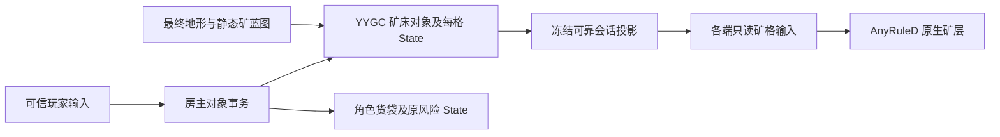

# 背景墙内嵌矿执行方案

日期：2026-10-04。源码调查基线：`9df79dc`；计划分支：`docs-20261004-embedded-ore-plan`。本页供后续实施和验收使用，本次任务只交付方案、审查记录和纯规则探针，没有实施矿层玩法或创建 Unity 资源。

采用一个独立的矿床表现层，直接复用 AnyRuleD 的规则编译、四角求解、资源加载、分页绘制和局部刷新。矿床的岩石基质、凹边、暗缘及透明退让由原生像素素材表达；不同矿种不自动连接，不制作矿种之间的专属混合过渡素材。矿床实例及每格采集进度由现有 YYGC 对象链拥有，矿层仅消费冻结副本。

现有锁定源码已通过本页候选四角规则的真实编译与纯求解检查，所以没有发现实现该规则需求必须修改 AnyRuleD 的缺口。但真实 Sprite 的几何裁剪、Alpha 边缘、材质和正式镜头尚未验证，必须先通过 P0 小样，才能把“不改框架”的规则可行性扩大为运行画面可行性。

## 范围及实施边界

| 项目 | 本方案约定 |
| --- | --- |
| 表现 | 一个矿层、一张矿种占用格表、一个原生 AnyRuleD 表现宿主；矿种是该格表里的不同材料 |
| 业务 | 一个有限矿床对象管理多格；不逐格创建 YYGC 对象，不按视觉连接分裂或合并对象身份 |
| 首批正式资源 | 铁、金；保持现有收益、耐久、货袋和结算规则。五矿仅用于规则与视觉交界检查 |
| 素材 | 原生 8px／格，复用现有候选作为源；若裁剪要求调整外缘，在新目录派生，不覆盖候选或人工源文件 |
| 生成 | 在正式最终地形生成后建立静态矿格蓝图；不修改前景材料、坡形、保护格或背景初始参考 |
| 网络 | 复用 YYGC 可靠会话投影和现有输入链；不再为矿层建立 AMP1 网络流、RPC 或逐格 NetworkObject |
| 地图 | 前景仍由唯一 TerrainMapAuthority 管理；矿层的只读 ARDMap 不启用业务写入、Overlay 或物理碰撞投影 |
| 自动矿工 | 迁移现有矿床读取／命中接口，保持已有能力边界；完整多格选工作位与全路线自动采集不是本批交付目标 |
| 爆破 | 沿用当前前景爆破语义，可挖开遮挡；不隐式新增背景矿床爆破伤害或矿物奖励 |
| 框架 | 使用现有锁定 YYGC／AnyRules，不修改源码、补丁或版本，不将玩法实施视为框架修改授权 |

铜、银、钻石若要成为正式可产出的资源，需要另行扩展装备匹配、货袋、设备货物、商店、结算、投影及保存合同。本批不会把三种图集直接映射成铁或金来冒充新资源。

## 当前实现和可以复用的入口

| 入口 | 当前事实 | 本批接法 |
| --- | --- | --- |
| `Core/Logic/Terrain/CaveExplorationGenerator` | 生成静态单点矿床，正式矿物不写入前景材料 | 复用房间与锚点来源，最终地形完成后生成有界矿格集合 |
| `Core/Config/Terrain/TerrainDepositBlueprint` | 只保存初始位置、容量和稀有度 | 增加矿种和不可变格分配；不保存运行中剩余量 |
| `Runtime/Objects/MineralDepositBehaviour` | YYGC 矿床状态所有者，扣耐久、取矿和枯竭均在对象事务内 | 转为按明确格坐标采集，保留对象身份和原 Archetype |
| `Runtime/Objects/SessionStateBehaviour` | `SyncMode.Session`，草稿只存在于短事务 | 继续使用，不改成独立逐对象网络广播 |
| `ObjectProjection`、`WorksiteWire`、`ReplicaEntityState` | 矿床目前混入工位完整投影，由会话可靠状态传输 | 一次迁到专用矿床 DTO 分支，复用同一个会话载荷 |
| `Entry/HeroMiningPointer`、`Runtime/Objects/HeroMining` | 选取与落镐按单点矿床校验，工具默认只采前景 | 改为矿格查询，扩展冻结目标，启用正式矿镐的矿床目标 |
| `View/Terrain/ITerrainInputSource`、`MapInputBatch` | 冻结输入安装到只读原生地图，支持范围失效 | 用矿床投影构造基线和变化格，直接交给矿层宿主 |
| `CaveVisualSource.SetMinerals` | 程序化岩层直接返回，旧矿点纹理没有参与当前正式矿层表现 | 正式调用迁到新矿层，退出旧 `_OreMap` 的矿床显示职责 |
| `Entry/SessionEntityViews` | 远征隐藏矿床 Prefab 的旧 WorksiteView 图形 | 保留 YYGC ObjectView 生命周期和绑定；矿格图像只由矿层绘制 |

源文件均位于 `Game/Assets/DarkNights/Scripts`。历史[按格矿层候选](ORE_LAYER_ART.md)与[图集接入说明](../../experiments/ore-dualgrid-v1/README.md)只有离线证据，不能作为本方案的 Unity 或联机验收。

## 四角规则及矿种边界

矿格以稳定矿种 Key 标识，渲染时按矿种对应的 Terrain GUID 解析 TileId。TileId 只是当前编译目录的局部编号，不写成业务矿种或保存身份。同格不得同时存在两种矿，客户端也不能靠绘制顺序解决冲突。

| 相邻情况 | 固定规则 |
| --- | --- |
| 同种矿水平／垂直相邻 | 连接，内部边不重复退让或描边 |
| 同种矿仅斜对角 | 不跨角桥接，mask 6／9 的中心保持断开；须检查真实裁剪后的画面 |
| 不同矿种相邻 | 各自绘制所属区域及普通外缘，不选择矿种对专属过渡 |
| 矿种与空格相邻 | 外缘透明部分露出已有基础后壁 |
| 同种矿不同耐久／剩余量 | 连接身份仍是矿种，不因状态变化拆成新材料 |
| 矿格耗尽 | 保留业务身份墓碑，表现输入变为空格，周围四角输出失效 |
| 尚未知的数据 | 保持 Pending，不把 Unknown 当 Empty 提前绘制 |

“不连接”表示不同矿种不参与同一种矿的连接形状，不表示禁止其相邻。交界若需要看出岩缝，使用矿种自己的通用凹边和透明退让，不通过强制隔开一整格改变空间或生成专属两矿混合图。

当前锁定编译器的 `NotThis` 不包含 Empty，`ExactCell` 只接受明确角条件，同一个四角组合只能有一个 ExactCell 所有者。旧实验 JSON 的 `ExactCell + NotThis` 不可直接导入。候选规则固定如下：

1. 各矿种使用独立 TerrainDefinition，不配置跨矿种 ConnectionGroup。
2. 每矿 mask 1–15；mask 0 无输出；只启用 Identity；每个形状四个边界兼容变体。
3. mask 中的自身角为 This，其余角为 AnyKnown；`Priority = popcount(mask)`。这样要求自身角最多的规则胜出，其余角可以为空或其他矿种。
4. 输出通道为 `ore`，Coverage 为 `TerrainSurface`，SortingDomain 为 Ground，BoundaryContract 为 None。
5. 每矿配置有效的 TileableFill，首选共用完全透明的 Fill 资源。它满足原生求解合同，不在矿图下面补出实心岩片。
6. 不使用特殊 `surface` 通道输出矿形。当前 MultiTerrainSolver 在多材料组合下会跳过这个通道的专用矿形，转为通用 Fill。
7. 不添加矿种对 BoundaryBand，不使用多矿整格 ExactCell 输出，不手写第二个连接求解器。

原生 TerrainSurface 按本材料区域裁剪 Sprite。旧候选的外扩柔边可能被裁掉，矿种自己的凹边应尽量画在该区域内。现有 PNG 是可编辑输入，不承诺原 RGBA 完全保留，也不通过放宽框架所有权合同来掩盖裁剪差异。

### 已取得的纯规则证据

[规则审查摘要](evidence/embedded-mineral-layer-plan-20261004.json)来自可重建的 [OreRuleReviewProbe](../../tools/OreRuleReviewProbe/README.md)：只读包含当前锁定包 41 个 Core／Compiler 源文件，使用真实 RuleCompiler、MultiTerrainSolver 和 RuleCatalogCodec，没有改依赖源码。

| 检查 | 本轮结果 | 支持范围 |
| --- | --- | --- |
| 75 组四变体候选规则实际编译 | 成功，0 警告、0 错误 | 条件、Coverage 和目录成立 |
| 五矿加空格四角组合 | 1,296／1,296 | 每种矿输出正确形状，没有专属过渡或整格冲突 |
| 非空矿种规则选择 | 3,355／3,355 | 优先级方案实际匹配正确 |
| Gameplay／Visual 编码恢复后再求解 | 1,296／1,296 | 本探针目录往返输出一致 |
| 各角 Unknown | 4／4 Pending | 不把未知区域当空格 |
| 旧 ExactCell、NotThis 空格、特殊 surface、多矿缺 Fill 反例 | 各按预期拒绝或降级 | 必须重建规则合同 |
| 依赖源码前后哈希 | 41／41 未变 | 没有修改 YYGC／AnyRules 源码 |

资源身份为人工测试标记，Fill 没有真实像素。此表不支持 Alpha、GPU 裁剪、Prefab、YYGC 对象、采集、保存或联机通过；先前仅 JavaScript 枚举不能替代本次实际编译证据。首轮单变体结果与最终四变体输入分别保留，不混称同一输入运行。

## 状态归属和业务身份

首批复用现有一个 `MineralDeposit.asset` 业务 Definition 与其 GUID／Archetype。矿种进入实例初始数据和 State，而不是新增多个同 RuleKey 的业务 Definition：当前 `ObjectSessionResources.Find` 使用 SingleOrDefault，保存定义表也按 RuleKey 建字典，多份 `mineral-deposit` 会冲突。AnyRuleD TerrainDefinition 与 YYGC ObjectDefinition 是两种身份。

推荐新增矿格值类型，仍由 MineralDepositState 的一份手写主体拥有。具体类型名称可按架构调整，但以下语义不得改变：

| 数据 | 唯一所有者及不变量 |
| --- | --- |
| 对象 Id、PlacementKey、矿种 Key、所属地图身份 | YYGC 矿床对象；加载和世界切换核对地图关联，连接外观不改变身份 |
| 初始格坐标与容量分配 | 冻结生成蓝图；运行 State 保存同样身份所需的实例数据，不回写蓝图 |
| 每格剩余量、当前采集耐久、内容版本 | MineralDepositState；剩余量非负，活跃格耐久为正，枯竭格耐久为零 |
| 总剩余量、整体 Available／Depleted | 从每格 State 汇总，不再另存可独立修改的总量或单点耐久 |
| 最大耐久、单次产量、最低等级 | Definition 配置冻结目录；不要再复制成第二套可编辑矿规则 |
| 坐标到对象／格的索引 | Runtime 只存引用，随对象创建、移除及世界切换更新；不存 HP 或储量 |
| 客户端占用格、绘制游标、页面缓存 | View 自有冻结副本，不能发奖、回写状态或影响服务端授权 |

矿格用 `(EntityId, U, V)` 定位，不用数组下标作为稳定身份。耗尽后不压缩重排身份；保留同坐标的枯竭记录和推进后的内容版本。视觉上一片矿被挖成两块，仍由原对象管理；两个同种对象相邻时可以视觉连接，业务储量互不转移。

当前单点 State 的 Remaining／Stage／Durability 不能与新矿格数组同时成为写入入口。迁移时删除单点权威写入和旧 HitByHand／Extract 语义，更新所有调用者；不长期保留两套矿床状态或兼容命令。

新增集合必须检查 YYGC 生成的 CopyFrom、Equals、Reset 与 MemoryPack 语义。事务草稿、权威 State、投影、客户端副本和恢复候选分别持有自己的数组；跨 await 的读取只能持有冻结数据，不能持有归池对象或数组。生成输出只通过现有生成器重建，不能手改。

## 生成和容量约束

沿用正式 `PlanetTerrainGenerator.GenerateCandidate`。所有地形 Modifier、天空、泊位和最终坡形完成后，使用最终保护位筛选旧矿床锚点，再生成矿格集合；这一步不修改前景，因此不需第二次修改背景参考。现有工作台预览和正式航程都从这个入口取得同一份蓝图，不能在 View 或客户端重新随机生成矿床。

首批建议以现有锚点为中心生成紧凑、有四向连通性的单矿种格簇。使用 `seed + 矿床稳定放置身份 + 矿生成算法版本` 的独立随机流，不消耗洞室、坡形或业务 RNG。矿床不可进入保护泊位、基岩、地图边界或不符合纯蓝图地下范围的格，不通过 GPU 后壁 Alpha 决定授权。

生成的矿格不得重叠。不同矿种允许相邻，同种不同对象也允许相邻；只有相同坐标的归属必须唯一。固定排序后分配容量，保证各格容量之和严格等于原矿床总容量。矿格数量不能超过总容量，避免零容量格。分配顺序及整除余数规则进入算法版本和指纹，客户端不重新分配。

建议初始参数为每床约 8 格、每床硬上限 64 格、每世界硬上限 4,096 矿格。这是防止无界输入的待验证工程预算，不是实测容量结论；P0 样板确认尺寸后冻结首版配置。世界的全部实体仍遵守现有 256 上限，完整投影仍遵守 524,288 字节上限，存档仍遵守现有大小限制。

超过上限或无法满足放置条件时明确失败并保留原世界，不静默截矿、减储量、覆盖其他矿或改变地形。正式只导入铁、金业务；五矿规则测试不自动扩大正式生成资源种类。

## 采集事务及旧调用迁移

扩展当前 HeroMiningTarget，同时区分 `ForegroundContentVersion` 与 `MineralCellContentVersion`。输入仍沿 HeroInputCommand，保留当前世界身份、地图代次、实体 Id、格坐标、工具身份和控制租约。内容版本只识别“这一份内容”，不是整个世界 revision；普通耐久减少不推进内容版本，避免合作命中互相使目标过期。

1. 本地选择器从当前冻结矿格表查询射线最近目标。前景仍使用真实坡形查询；前景没有挖开或射线被较近岩体挡住时不能命中后方矿格。
2. 房主从可信连接和装备槽重取工具，检查 Ready、共享策略、角色生命／登船状态、租约和输入序号。客户端伤害、材料、资源数量与可采标记不构成授权。
3. 检查对象属于当前地图、矿格归属唯一且版本有效，同时检查前景格内容、距离、遮挡、工具目标／材料／等级及 Definition 白名单。
4. 在同一 ObjectMutationBatch 内读取最新矿格耐久和角色货袋。即将产出时先检查实际产量能否容纳，再扣耐久、扣储量并发奖；任何异常或提交失败全部回滚。
5. 同镐命中门闩沿用原动作计时，Host 和客户端经过同一入口。两人同格命中按服务端接受顺序累计；已耗尽目标的后续命中不重复发奖。
6. 提交成功后才发布对象投影、更新查询引用和通知表现。查询索引没有第二份状态，不能用索引里的旧 HP 决定产出。

矿床采集只修改矿床、角色和原风险状态，不另开一张可写矿地图事务。前景爆破或采挖只暴露后方矿床，不顺带清除矿格。点缀层只影响视觉遮挡；不引入“读 Sprite Alpha 决定能否采矿”的授权路径。

正式矿镐 Definition 需把 Targets 从 Foreground 扩为 Foreground 与 MineralDeposit，保持原 Damage、Reach、周期、命中比例和等级；现有矿床最低等级及产量保持。编辑通过原生 Workshop，保存重开并检查生成装配；不能只临时改测试工具后宣称产品已开启。

`ExpeditionDevices` 等现有自动采矿调用须明确选择合法矿格，不能再通过一个聚合 Durability 或 Extract 绕过格耐久。无法找到现有能力范围内的双向工作位时保持明确 NoEffect／取消任务，不以矿床中心可见冒充可达。本批手采和联机验收不得借旧未实现路线测试充数，历史导航失败保留。

## 独立矿层的原生表现接入

新增薄的 `MineralLayerInputSource` 和 `MineralLayerView`，前者实现现有 ITerrainInputSource，后者持有一个 ARDMapController、自己的取消令牌和资源租约。不是新的连接算法、地图业务系统或全局调度器。

采用 `definition.Describe(world, seed, layer: 1)` 和接收 WorldDescriptor 的原生 CreateAsync 重载，显式提供目录、VisualAssetService 和正确 CellSize 的 RenderProfile。Layer 编号参与规则上下文，不替代 Unity sortingOrder；资源绑定服务在 controller 释放全部租约后才由其真正所有者释放。也可在 P0 验证后采用定义重载的默认逻辑编号，但不得假定 MapOptions 存在 Layer 参数。

配置为 SourceDrivenInputs、ReadOnly、LiveRules、TileTypeOnly，EnableBusiness／UseOverlay 关闭；矿种 Solid=false，不装配 CollisionProjection，不接入主角或飞船身体碰撞查询。该 ARDMap 的格数据都是 YYGC 矿床状态的只读投影，不注册网络兴趣服务、不保存可继续结算的矿地图。

初次基线必须明确包含已知空格。投影对比只为新增、移除或矿种变化发布占用变化格；耐久变化可更新目标提示和后续已定义的受损素材，不因为每次扣血重建整张格表或背景。变化格通过原生四角依赖范围失效，跨页邻角也必须刷新。后续需要扩展图形的受损阶段时，使用已有 VisualState 机制并单独验素材，不能换成新的矿种 TileId 破坏连接。

同一世界的变体选择上下文保持稳定，扣耐久或普通投影更新不推进 VariationEpoch，不让每次挥镐重选矿纹理。点缀可以遮盖矿的局部，但固定样板必须能辨识矿床的裸露图形；整床被遮住时先检查排序、放置与素材，不把透明 Alpha 变成服务端授权条件。

坐标统一使用 TerrainVisualCoordinates／TerrainMiningGeometry 的既有合同：蓝图行向下、AnyRules V 方向、Unity 坐标、16 逻辑像素／格和 8 原生像素／格分别处理。不能复制旧 `_OreMap` 的偏移计算当作新矿层坐标来源。

### 排序和材质

最终从后向前为天空、远景、基础后壁、矿层、深／中／近点缀、完整前景轮廓、前景及实体。保持已有三层点缀的源 RGBA 与形状，矿物不写入 BackgroundBakeDescriptor。

原生 GroundBatchKey 使用 `RenderProfile.SortingOrder + RecipePartKind`，预留 0–3 的完整区间，不能只塞入一个排序数字。现有 −100／−99／−98／−97 的相邻背景顺序没有足够间隔；游戏侧重新分配完整顺序，在样板中检查天空、外轮廓和所有点缀开关，不靠相同 sortingOrder 或材质偶然提交顺序解决交界。

矿层使用 Sprite 兼容、读取 MainTex 的透明材质。现有 CaveStrata Shader 不读取矿图 MainTex，不能直接作为矿层材质。优先验证现有 CaveBackgroundLayer Shader 对原生页网格的复用，共用本地图光场和统一环境亮度；若需要游戏侧材质薄适配，保持 Linear、Point 和源 Alpha，不增加深度渐隐或独立发光系统。

### 显示与退场

首次矿基线、资源加载、可见页规则输出及真实相机回执共同形成矿层 Ready。全空矿层也必须能完成 Ready，不能以“至少存在一个矿 Renderer”为条件永久等待。整体 PresentationReady 合取当前地形、后壁与矿层的绘制就绪，不让原来的 `view.Ready` 覆盖矿层尚未完成的状态。

世界更换、地图代次变化、断连和宿主销毁立即取消旧任务，清空旧矿格输入与引用；同帧迟到的旧页面不能重新显示。后台只操作冻结输入，页面发布检查自己的世界与输入游标。退出释放订阅、页网格、专用材质和租约，不释放共享光场或其他宿主资源。

## 联机投影和保存恢复

首批一次性迁出 Worksite 的矿床分支，新增专用的 MineralDepositViewData／MineralDepositWire／MineralDepositSnapshot 及矿格值合同。普通工位仍走原 Worksite；WorldViewData／WorldWire／SessionSnapshot 的矿床集合纳入同一完整会话投影和同一存档。删除旧混入工位的矿床投影与解析，不同时发布两份矿床事实。

这是现有会话 DTO 的职责拆分，不增加第二个同步频道。必须统一修改 ObjectProjection、ObjectSnapshotMapper、ReplicaEntityState、ObjectReplica、ProjectionValidation、保存 JSON、身份计数、实体上限、各端视图和目标查询；只改 StateData 或另加 MemoryPackable 类型不能自动串通这些入口。

完整投影至少包含矿床 Id、定义身份、地图身份、矿种、每格坐标／剩余量／耐久／内容版本和冻结初始容量关系。矿床总量来自格记录，客户端不重新生成 footprint，不根据画面反推产出。命令回执不替代可靠状态事实，运动包也不得创建矿格。

P4 验证对象投影和 AMP1 的跨流顺序：加入／换图先确认相同地图身份及代次，再安装当前矿基线。跨流依赖若需要明确游标，在游戏会话 DTO 中增加实际地形 CommitId 依赖，并核对副本源游标的含义，不假定两个通道自动同序。不以全局 revision 完全相等阻止后续输入；只等待有界的实际依赖，过期或超时走现有基线恢复。

加载先校验全部格、容量、矿种、身份、地图关系和内容指纹，再准备未激活对象及只引用对象的查询索引。新矿校验必须发生在切换前，不能在 ObjectWorldRestore.Commit 已替换对象后才发现地图矿格冲突。提交失败保留原对象、地图及索引；旧 epoch 的请求、页面和投影不得污染恢复后的世界。

保存最终矿格状态，不只保存 seed 或 initial blueprint。保存后重启必须恢复部分耐久和已经耗尽的格；未变更的初始容量不可因重生成而复活。拒绝重复坐标、跨矿床重叠、未知矿种、非法版本、负储量、异常耐久、总量不符、越界、超量或旧指纹，保留用户旧存档、不自动迁移或删除。

调查基线为游戏协议 23／存档 v17／AMP1 schema 2。本方案增加输入、投影和保存字段，实施时游戏协议与存档分别升版，预计为 24／v18，但并行工作可能先占用版本，开工时按实际常量重新确定。矿层不新增地图流，预期 AMP1 schema 2 保持，须用最终差异确认。矿蓝图、分配算法、工具目标能力、业务配置、矿目录及素材身份进入对应握手／保存／视觉指纹，不能拿 JS 哈希或人工临时 GUID 代替正式内容身份。

## 实施顺序和文件批次

| 阶段 | 输出及主要文件范围 | 进入下一阶段的条件 |
| --- | --- | --- |
| P0 规则和固定视觉样板 | 新矿 TerrainDefinition／AnyRuleD／TileVisualSet、透明 Fill、独立 Map Definition；小样原生矿层材质与排序 | 实际规则编译、真实混矿及 6／9 裁剪、空格／孔洞／外缘、页接缝、保存重开和相机画面通过 |
| P1 蓝图与冻结合同 | TerrainDepositBlueprint、最终星球生成、不可变矿格合同、作者配置冻结与指纹 | 同 seed／配置确定；保护位和重叠拒绝；容量严格守恒；正式与工作台来源一致 |
| P2 YYGC 权威采集 | MineralDepositState／Behaviour／Config、坐标引用索引、HeroMiningTarget／ActorState／HeroInputCommand、HeroMiningPointer／HeroMining、已有设备调用 | 真实对象装配、生成复制、事务回滚、并发最后一份矿、工具与遮挡检查通过 |
| P3 正式表现接线 | MineralLayerInputSource／View、RandomLevelEntry、SessionEntityViews、矿镐 Definition、原生绑定与编辑入口 | 主角选格对齐、局部跨页刷新、正式分层、全空图 Ready、退出与重开资源检查通过 |
| P4 投影与恢复 | WorldViewData／WorldWire、专用矿 DTO、ObjectProjection／SnapshotMapper／Replica、投影校验、保存 JSON、内容指纹、Ready 与游标接线 | 同一冻结帧、实际序列化限额、坏候选拒绝、真实写盘恢复和跨流先后检查通过 |
| P5 Mono 与局域网 | 一个最终 Mono Player，复用进行正常双人／四人及真实 UDP 弱网，形成机器摘要与截图 | 本批身份一致，各必需门槛有实际证据；失败记录和未验边界明确 |

P1–P4 可以在一次可审查源码切片中集中准备，先完成依赖再统一触发导入、生成和编译；阶段表表示验收依赖，不表示逐文件刷新或逐步请求用户“继续”。新增脚本先编译，再执行有限批次资源导入与绑定，不在暂停导入时等待编译。已有矿床资产、Prefab、原图集和场景 GUID 保留。

本次仅用薄 worktree 写方案和探针。未来实施默认仍保持薄 worktree 开发、Local 单一 Unity 验证通道；不复制、链接或生成第二套 Library。Local 验证前核对分支、未提交工作、Editor／Player 和剩余空间；资源改变导致的重导入集中执行。IL2CPP 只有取得明确授权后才安排，Mono 通过不计作 IL2CPP 或双机器通过。

## 验收矩阵及失败处理

| 类别 | 必需覆盖与判定 |
| --- | --- |
| 规则 | 五矿加空格四角组合、目录恢复、单点、孔洞、内角、6／9、三矿／四矿交点，无覆盖冲突，无专属过渡资产 |
| 真实素材 | 原生与正式镜头密度，裁剪后的凹边／透明退让，共边及四变体组合；两矿界面不会因 GUID 顺序改变相互盖住 |
| 地图生成 | 固定锚点与多个正式 seed，最终 Modifier 后无重叠／越界／保护位占用，同源预览，容量守恒；失败不修改当前世界 |
| YYGC 与采集 | 实际 Definition 装配，部分耐久、完整采集、枯竭；真实输入每镐一次，非法矿种／目标／工具拒绝，满袋不扣最终产出 |
| 原子性 | 状态准备、提交和发奖故障注入，恢复准备失败；矿格、货袋、风险与引用索引全部回滚，无先显示后回滚事实 |
| 并发与生命周期 | 两玩家同格、最后一份储量、相邻对象同矿连接、旧目标／旧租约／重发拒绝、换装取消，退池重用不遗留矿格 |
| 表现 Ready | 全空矿层、晚资源到达、页跨界、地图／矿基线两种到达顺序、实绘回执；旧任务不能在换图后覆盖新页 |
| 存档 | 部分耐久与部分耗尽写盘，停止 Player 后新进程恢复；坏 JSON、重叠／重复／总量不符／超量候选不破坏原世界 |
| 网络 | 独立 Host＋Client；Host 单次执行；四人并发；晚加入、重连、暂停、加载 epoch；状态与最终矿形收敛 |
| 弱网 | 同一 Mono 在 200 ms RTT＋5% loss＋25 ms jitter 下验证矿变化、基线、换图、晚加入／重连；当前既有 Ready 失败保留并单独归因 |
| 预算 | 最大矿格和实体合法场景的真实原始／编码载荷、保存大小、分页数量和分配记录，不绕过 256 实体或 512KiB 投影限制 |

正常、弱网、四人、Mono、IL2CPP、双机器和前台性能分别记录。前台性能沿用用户暂缓决定，不宣称整帧目标通过；记录明显全图重建及载荷异常不需要扩大成性能优化项目。若现有弱网 Ready 问题阻断新矿验收，完成其他独立阶段并明确报告整批未通过，不自动修改 YYGC，也不重复重跑掩盖失败。

每个受影响配置构建一次，复用产物；首次有界等待后只读取小状态摘要，未变化退避，长任务不重复触发。失败只修正并重跑受影响阶段，保留原报告、输入哈希和失败上下文。原生视觉与状态证据不得用离线图集或隐藏黑图替代。

## 深度审查结论和开工门槛

详细结果见[方案深度审查](EMBEDDED_MINERAL_LAYER_REVIEW.md)。已修正的关键设计问题包括旧 ExactCell 合同、特殊 surface 回退、透明 Fill 缺失、排序区间、材质读取、业务 Definition Key 冲突、聚合状态双写、集合冻结、矿格目标版本以及 Ready 和恢复的接线遗漏。

本方案有条件可执行。P0 必须先证明当前原生裁剪能表达用户认可的镶嵌外缘；不因规则探针通过而跳过该门槛。若失败，先调整游戏规则或派生素材。只有遇到明确无法在游戏侧解决的框架缺口，才列出具体框架文件、原因、落点、影响和验证计划，再按 AGENTS.md 取得范围同意；不得自行改 `.deps` 或换锁。

计划交付时状态：方案与审查完成，纯规则探针通过。2026-10-04 已开始实施，当前阶段与新批证据见[开发记录](EMBEDDED_MINERAL_LAYER_IMPLEMENTATION.md)；计划提交本身不等于正式集成或最终美术验收。
