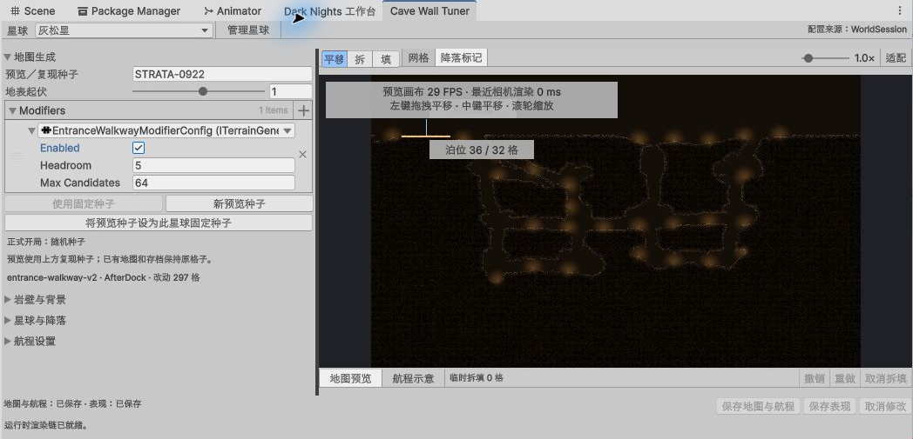
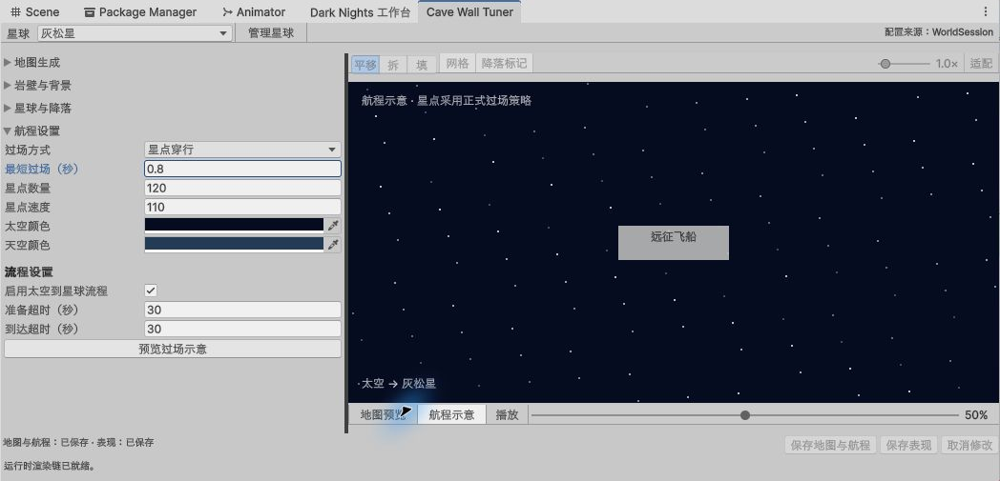

# Cave Wall Tuner 星球工作台

2026-10-04，分支 `ref-20261004-tuner-journey-workbench`，基线 `9df79dc`。用户评估交互草图后选择“折叠分组”，授权实施。仅改游戏侧 Editor 和相关测试；YYGC、运行业务、规则、协议23／存档v17／AMP1 schema2不变。

## 操作与作者来源

入口仍为 `Dark Nights → 工作台`。地图页的“打开星球工作台”和航程页的“编辑航程设置”进入同一个 Cave Wall Tuner；旧配置菜单转入航程折叠组，不再创建另一套参数页面。

参数栏保留纵向滚动和可拖动宽度，大画布保留原生渲染、平移、缩放、网格与临时拆填，分为四组：

- **地图生成**：预览／复现种子、地表起伏、权威生成步骤及入口步道；正式随机／固定种子状态明确显示，预览使用输入的复现种子。
- **岩壁与背景**：保留原资产选择和原生 Inspector，前景、三层背景和点缀沿用既有作者资产与逐字段冲突校验。
- **星球与降落**：名称、说明、启停、固定种子、泊位中心／地表行／宽度、到达高度和飞行包络、稳定ID；目录管理包含新增、复制、移除、排序。
- **航程设置**：过场方式、时长、星点、太空／天空颜色、流程启用和超时。右侧航程示意复用正式星点位移／淡出策略，支持播放、暂停和手动进度；不启动游戏会话或模拟真实飞船航程。

底部“保存地图与航程”只应用 WorldSession 中的 ExpeditionFlowConfig；“保存表现”只写发生变化的样式资产；“取消修改”丢弃这两类草稿。拆填不属于保存范围，下方有独立撤销／重做／取消拆填。已有地图和存档保留格子，新生成地图使用保存后的配置。

旧窗口已有未应用草稿时，保留其原始作者基线并深拷贝转入 Tuner，成功后关闭旧窗口；两边有不同草稿或存在临时拆填时保持原草稿并显示冲突，不覆盖、不自动保存。作者草稿使用 DontSave，避免 HideAndDontSave 中的 NotEditable 将原生输入控件禁用。

## 重建与生命周期

几何身份只包含天然洞穴设置、复现种子、泊位和权威步骤；名称、过场、超时、固定种子及到达标记调整不会无故重生整张地图。改变几何才重新生成，样式变更沿用原生渲染刷新。无效输入保留最后有效画面，并保留草稿供修正；同一失败输入不会不断重试。

窗口禁用或进入 Play 释放离屏预览，编辑态恢复后重建；关闭销毁其拥有的草稿及资源。作者草稿、表现副本和折叠分类具备窗口重建恢复路径；临时拆填仍是当前预览的临时内容。

## 验证状态

影响相关 Editor 按完整用例名合并 **45/45**，覆盖属性真实可编辑性、Undo／Redo、目录身份、显式保存／卸载重读、冲突拒绝、草稿迁移、重建影响范围、禁用／启用恢复、预览释放、正式生成一致性及原生工作台复用。首轮43项中41通过、2失败：新增断言将枚举值误作数值零，以及原生工坊在最小化状态下3秒回调超时；修正断言和有界回调等待后，恢复 Editor 并确认新程序集，R3补测4/4。R2曾在最新源码编译前排队，旧程序集结果及缺失的新用例不计作修正后的验收。原始报告、失败消息和合并方法保存在[机器证据](evidence/tuner-journey-workbench-20261004.json)及[原始批次](evidence/tuner-journey-20261004)。

真实 Unity Light 主题中，航程时长0.8改为1.1后出现未保存状态，Ctrl+Z还原；入口步道 Enabled 实点关闭并撤销；播放出现正式策略星点，完成后显示天空色与到达文字，手动进度50%停止播放。四组折叠、原生岩壁 Inspector 和约800px窄停靠栏已检查，并恢复原宽布局；最终地图显示0格临时拆填和全部已保存状态，未保存测试输入到正式作者资产。

入口步道的位置为 **地图生成 → Modifiers → EntranceWalkwayModifierConfig → Enabled**。保存地图与航程后，新生成星球使用此开关；已有地图不重新生成。

开始时8项未提交改动完整保留，包括工作台导航／排版和 ObjectArchetypeDatabase；其中 Catalog 仅本批两处工具入口文案另行提交，其原分类元数据仍保留为未提交改动。作者资产 **1111项磁盘SHA-256保持**，源文件备份、基线与原始截图位于 `artifacts/tuner-journey-20261004/`。独立测试夹具及 `.meta` 共7437字节已核对路径、无链接、无外部GUID引用和活动状态，归档至 `artifacts/待清理/20261004-tuner-journey-workbench/`，详情见其中 `清单.md`；仅集中保留，释放空间0字节。阶段结束C盘约10.6GiB、D盘约19.0GiB可用。

测试在保留既有导航未提交改动的当前工作区执行，源码哈希记录在机器证据中。仅验证相关 Editor 用例，未运行全工程测试。窗口禁用／启用及持久列表恢复路径已测，完整 Editor 重启和 Dark 主题视觉仍待检查。航程示意不计作真实飞船流程验收；没有本批 Player／Mono／IL2CPP、多人、双机器或前台性能结果。保留 YYGC 与 Runtime、协议23／存档v17／AMP1 schema2；本地分支候选未合并或推送。
