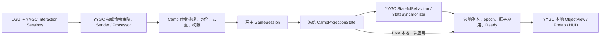

# YYGC 能力复评：优先复用联机实现

2026-09-12 更新：用户已授权必要时修改 YYGC。接入缺口、逐项修改落点与验证结果统一记录在[YYGC 改动账本](../YYGC_CHANGES.md)，完成报告必须逐项列出；下文为历史复评基线。

2026-09-11 后续实证：独立 [LAN Sample](../LAN_SAMPLE.md) 在 YYGC `10b8f0e` 复用命令／状态链，通过四进程基础及 UDP 弱网测试。原报告的问题记录保留，不代表新提交仍有相同缺陷；本次独立程序集与 VitalRouter 修补来源另见 Sample 依赖证据。正式游戏联机仍未完成。

日期：2026-09-10。范围：复核 YYGC 当前源码、生成器和现有适配方案；本报告记录的是执行前的静态复评，不包含后续为 Unity 宿主做的 Input System 兼容改动，也不开始游戏迁移。框架 HEAD 仍为 `6c3e0ff96221ac4a9fdfe0db85bf8f2cdc8dabc9`。用户说明联机能力尚未正式生产使用，因此本报告不假定已有生产可靠性。

**结论：YYGC 已有值得保留的联机实现，应先修正并验证这条链路，再接入 Dark Nights。上一版默认另建 CampCommandEndpoint、主要只复用 FishNet 的做法过早绕开了 YYGC。** 游戏仍保留集中式权威模拟，但命令传送、类型注册、状态发布和首次快照优先沿用框架。

这不是“原样接入即可”。本轮找到命令生成器与当前命名空间不匹配，并以小型探针确认了状态订阅和接口序列化的条件性问题。随后 Unity 宿主已完成 Player 启动基线，但 Host＋独立客户端仍未验证。

## 能力与复用边界

“已有”指在源码中存在；“修正后复用”不代表修正已完成。

| 能力 | 当前实现与限制 | Dark Nights 决策 |
|---|---|---|
| 启动、DI、对象装配 | AppStartup、Root/Session/Local DI、ObjectDefinition、ObjectInstanceFactory；工厂已有 Local/Network 分流 | 沿用；仅补依赖、构建和明确会话传递，不另建容器或 Spawn 总框架 |
| Prefab、资源、UGUI | ObjectView、Addressables/FastInstantiator、UGUIBehaviour 与绑定生成器 | 沿用现有工作流；游戏只写内容映射和视图绑定 |
| 本地交互互斥 | [Interaction Sessions](<D:/Developer/YYGC/Runtime/Interactions/README.md>) 已提供优先级、输入阻塞、取消和生命周期 | 建造预览、模态菜单、目标选择复用它；相机和选择值仍由各客户端保存。它不提供联机房间或游戏会话 |
| 命令传送 | LocalInput → Gateway → NetworkCommandSender.ServerRpc → Processor；有可靠/不可靠及广播标记 | 修正身份上下文和权威路由后复用，不在游戏里再写通用命令总线或发送器 |
| 服务端状态修改 | StatefulBehaviour.MutateState 检查服务端；变化检测、响应式发布、状态池已有实现 | 在会话对象上承载只读投影；经济、HP、生产仍只由 GameSession 计算 |
| 首次状态与在线更新 | StateSynchronizer：OnSpawnServer＋TargetRpc 初始状态，ObserversRpc 后续完整状态；Owner 包含/排除可选 | 优先用一个会话级状态承载营地投影，复用两类发送路径；并非必须逐单位联网 |
| 不可靠乱序过滤 | IStateData.Sequence、接收旧包丢弃、Despawn 重置 | 沿用并补边界验证；它尚不等于丢包恢复、插值或定期关键帧 |
| 类型标识、序列化、池 | GenericTypeRegistry、生成注册表、GenericTypeSerializer、MemoryPack、GenericTypePool | 保留统一机制，修复 formatter/生成器闭环；不新建平行协议 ID 系统或序列化框架 |
| 会话级承载形式 | 普通 StatefulBehaviour 已可挂在单个网络对象上；另有 NetworkedSingletonBehaviour | 优先普通会话 Behaviour；无须为复用框架改写成逐单位业务 Behaviour，也无须引入全局单例 |
| 存档 | YYArchive 已有模块和文件流程，但逐模块恢复允许部分成功 | 整个营地封成一个校验后原子替换的模块；展示投影不能替代完整存档 |
| 连接、场景和传输 | YYGC 引用 FishNet，工厂接入 ServerManager；本轮扫描未找到已完成的房间/重连/中继产品流程 | 使用锁定 FishNet 的现成能力；游戏补接入 UI 和玩家 Ready 流程，不自建传输、可靠重发或平台 SDK |
| 共享营地规则 | 未找到已实现的玩家权限、业务去重、营地 epoch、原子切世界 | 由 Dark Nights 实现；这些是游戏协议与规则，不能靠 RPC 所有权自动获得 |

未找到某项能力的范围是本仓库 Runtime、Editor、Tests 和架构说明，不代表用户的其他宿主工程不存在该实现。

## 新发现与处置优先级

### R01 · 命令生成器仍匹配旧命名空间：已复现，接入阻断

当前 [NetworkCommandAttribute](<D:/Developer/YYGC/Runtime/NetworkCommands/NetworkCommandAttribute.cs:39>) 属于 `GameCore.NetworkCommands`。本轮直接加载随包 `YYGame.NetworkCommand.Generator.dll`，用相同的最小命令执行 Roslyn 生成：

| 输入 | 生成文件数 | 观察 |
|---|---:|---|
| 当前 `GameCore.NetworkCommands.NetworkCommandAttribute` | 0 | 无诊断，也没有生成接口 |
| 仅将命名空间改为旧 `YYRuntime.NetworkCommands` 的对照 | 1 | 输出仍引用 YYRuntime 的可靠、ServerOnly 和 IAutoPublishCommand 接口 |

因此“DLL 已随包提供”不足以说明生成链路可用。这是实际 DLL 的隔离执行结果，不是完整 Unity 编译结果，也不说明所有手写命令都会失败。

**修正归 YYGC：** 找回对应生成器源码，修正识别和输出命名空间并重建 DLL、补样例验证。在此之前，可对少量游戏命令显式实现现有接口作为临时适配；不把整个框架改回旧命名空间，不另写一套生成器。StateData DLL 本轮未运行，应在同一入口验证。

### R02 · 类型 ID 注册不等于接口 formatter 注册：高优先级闭环缺口

[GenericTypeSerializer.cs:26](<D:/Developer/YYGC/Runtime/Middlewares/GenericTypeSerializer/GenericTypeSerializer.cs:26>) 调用泛型 `MemoryPackSerializer.Serialize(value)`；第 50 行同样以泛型接口 T 反序列化。查到具体 Type、从池中取出具体对象，不会把泛型 T 自动改成该具体类型。

现有两个 Editor 注册表生成器只生成 `GenericTypeRegistry.Register(typeof(...), id)`。本轮所读源码未发现对应的接口 union/custom formatter 注册；旧 StateData union 生成代码已注释。

**依赖语义实测：** MemoryPack 1.21.4 中，具体 payload 往返得到 42；把同一对象作为未注册接口 T 传入则抛出 “is not registered in this provider”。这证明所需注册不能省略；尚未证明某个用户宿主没有额外提供 formatter。参见 [MemoryPack 官方多态说明](https://github.com/Cysharp/MemoryPack#polymorphism-union)。

**修正归 YYGC：** 沿用现有 ID 表，补全由具体类型驱动的生成序列化委托，或采用 MemoryPack 支持的接口 formatter/union；选一种权威映射，避免两份手工类型表。用真实 INetworkCommand 和 IStateData 各两种类型验证往返、未知 ID、坏载荷和 Player/AOT。不要为规避这项问题换掉整套序列化系统。

### R03 · 初始 null 会吞掉第一次非空状态：依赖语义已复现

[StateSynchronizer.cs:253](<D:/Developer/YYGC/Runtime/Objects/NetworkStates/StateSynchronizer.cs:253>) 是 `Where(e != null).Skip(1)`。若订阅时 State 为 null，null 先被过滤，第一次真实状态随后被 Skip 丢弃；若后来没有第二次变化，已在线客户端可能一直看不到该值。

R3 1.3.0 实测：初始 null，之后发布 1、2，收到 `[2]`；初始已有 0，之后发布 1、2，则收到 `[1,2]`。后一个对照说明问题取决于初始化时序，不能泛化为所有状态首包都丢。

**修正归 YYGC：** 明确“跳过订阅时当前值”的含义，验证 `Skip(1).Where(...)` 或显式初始快照完成后订阅的方案。覆盖延迟初始化、已有初值、重入和 Host；不在每个游戏 Behaviour 中加重复补发代码。

### R04 · ServerOnly 是广播分类，尚不是权威执行保证：源码确认

[Gateway.cs:21](<D:/Developer/YYGC/Runtime/NetworkCommands/NetworkCommandGateway.cs:21>) 先执行本地 next，再处理转发；第 99 行 Host 直接退出转发。`IServerOnlyCommand` 没有在这条本地入口阻止业务执行。

[Sender.cs:50](<D:/Developer/YYGC/Runtime/NetworkCommands/NetworkCommandSender.cs:50>) 已有 RequireOwnership，且把服务端 Owner 交给 Processor，这部分应保留；但 [Processor.cs:42](<D:/Developer/YYGC/Runtime/NetworkCommands/NetworkCommandProcessor.cs:42>) 发布业务命令时丢失连接上下文。共享营地请求仍需知道真实请求者，尤其是暂停、加载和去重。

**修正归 YYGC：** 增加显式、可选择的服务端权威路由策略和可信命令上下文，让远端及 Host 经过同一处理合同。本地预测/反馈保持独立；接收后的业务分发不能再次触发客户端转发。异步发布传递上下文，不用跨 await 的静态“当前玩家”。旧预测模式的使用者通过配置保留原语义。

**实现归游戏：** 验证玩家已 Ready、友军目标、权限、参数、epoch 和业务序号，串行调用原规则并返回结果。即使复用完整命令链，这些仍必须补齐。

### R05 · 变化驱动的不可靠同步不保证最终收敛：源码确认

[StatefulBehaviour.cs:228](<D:/Developer/YYGC/Runtime/Objects/NetworkStates/StatefulBehaviour.cs:228>) 只在值变化时发布；StateSynchronizer 收到变化立即广播。所读链路没有定期重发当前运动状态。如果最后一次“停止位置”丢失，之后不再变化，序号过滤无法补回该消息。

第 173 行对 Sequence=0 放行且第 180 行把已接收序号写回 0；0 快照若与较新不可靠消息交错，需要明确规则。正常新状态也没有自动携带跨世界 epoch。

**处置：** 首个切片用可靠完整会话投影；确需不可靠运动流时，复用已有序号过滤，在框架扩展发送节奏/周期当前值，并验证序号 0、回绕、Despawn/重入和最后一包丢失。游戏负责 epoch 和实体生命期，不能让运动包创建或复活实体。

## 旧结论需要收紧的地方

- **单对象首次快照不一定意味着必须另写整套世界快照传输。** 一个营地投影 Behaviour 可以将实体、资源、波次等冻结到同一个状态值，利用现有首次快照发送。游戏仍需原子应用、Ready、epoch 和大小上限；按每实体独立同步才会额外需要跨对象一致切点。
- **初次 Owner 注册仍待锁定版本验证，不能判为必然失败。** FishNet 官方说明包含初始所有权回调，且 OnStartClient 前已有 Owner/ObjectId/SyncTypes。YYGC 仅在 OnOwnershipClient 注册发送器有官方机制依据。DefinitionId=0 时提前设完成标志是真实防御性缺口，但“正常 spawn 一定先拿到 0”并不成立。参见 [FishNet 回调说明](https://fish-networking.gitbook.io/docs/guides/features/networked-gameobjects-and-scripts/network-behaviour-guides)。
- **不能把文档中的预测、增量、零 GC 当作完整功能验收。** 当前有本地响应和状态变更通知；未找到完整预测纠正/回滚、字段差量编码或零分配发送证据。
- **暂停继续联网是游戏时钟边界，网络心跳与可靠重发应使用 FishNet/transport。** 不因需要暂停或重连就自建一套连接协议。
- **网络广播和池化仍需真实异步测试。** NetworkEvents 的接口泛型发布、发布未等待、静态 filters 重复启停、Host 广播和旧状态归池需用锁定 VitalRouter/R3/FishNet 实证；本轮未将这些候选风险升级为已复现故障。

## 收敛后的接入方案

先验证下面一条路径，各名字中 `Camp*` 都是拟议游戏适配类型，当前未实现：

1. 一个会话 NetworkObject＋一个普通 StatefulBehaviour 承载完整展示投影；各玩家复用 NetworkCommandSender，单位仍为本地视图。投影是从 Core 派生的冻结副本，不在 Behaviour 中再次计算 HP 或库存。
2. 第一个切片先验证可靠完整投影，发送节奏以 10 Hz 为待测起点。每帧含 epoch、revision 和完整实体列表；集合深复制，相等性和归池需明确。收到后整体替换副本，不构造一套可靠增量日志系统。
3. 初始快照复用 TargetRpc，在线更新复用 ObserversRpc；本地 Host 用相同副本应用器一次送达。业务解锁仍等待版本匹配、内容加载及有效投影应用。旧 revision/epoch 被拒绝，确认结果到达不代替状态更新。
4. 测量实际最高实体数下的总字节、序列化分配、四人带宽与延迟。只有完整投影超预算或超 transport 限额，再引入分块、结构/运动拆流。可靠完整投影也必须设置明确大小上限，不能无界塞入 RPC。
5. 若某项 YYGC 修正因生成器源码或 API 限制无法在探针阶段闭环，记录具体失败证据，再允许局部 FishNet 适配作为可替换后备；同时只启用一条业务路径，不默认另建网络框架。

原 [MULTIPLAYER](../MULTIPLAYER.md) 的权限、重连、保存和世界切换合同继续有效；其中分块和拆流是超过测量阈值后的设计，不再作为首个切片的前置工程。

## 下一步验证门槛

建议把 **2–3 人日的框架联机探针放在现有 M0/M2 预算内优先执行**，不是在本轮立即实施，也不是承诺框架修复全部完成。依赖缺口造成超时就记录阻断并重新估算，不能偷偷扩大为完整网络框架重构。

| 顺序 | 最小验证 | 通过标准与责任 |
|---|---|---|
| 1 | 当前命名空间命令生成；两类命令/状态往返；Mono Player，必要 AOT 探针 | 生成不遗漏，具体字段一致，坏载荷不产生业务调用；YYGC |
| 2 | 真正 Host＋独立客户端，可靠命令＋一个会话状态 | Host/远端各执行一次；上下文身份正确；初始 null 后的第一次状态可见；YYGC |
| 3 | 晚加入、Owner 初次/转移、断开后重连、多次启停 | 正常首次状态、无重复订阅/路由；游戏 epoch/Ready 不接受旧请求；双方分工 |
| 4 | 延迟、丢包、最后更新丢失、异步 handler 与池重用 | 数据无提前回收，可靠投影收敛；启用不可靠流前证明其最终位置收敛；YYGC |
| 5 | 两人争用不足资源、加载/暂停权限 | 只发生规则允许的支付，普通玩家不能越权；Dark Nights |

框架验证通过后才扩大迁移到完整关卡。不因“已有联机代码”直接降低原 30–50 人日总预算；复用减少新增基础设施，但未投产的验证和生成链路修复仍有成本。M0 后再用真实结果调整。

## 本轮证据与限制

- [原始观察及源码哈希](evidence/yygc-network-review-2026-09-10.json)：包含真实命令生成器输出、依赖语义结果、框架 Git 状态与关键源文件 SHA-256。
- [可复跑探针](../../tools/NetworkReviewProbe/README.md)：.NET SDK 8.0.409，运行时 8.0.16；R3 1.3.0、MemoryPack 1.21.4。这些是本机评估工具版本，尚不是 Unity 项目的依赖锁定结论。
- 未构造假 FishNet/Unity 运行时；生成器实验仅加载真实 DLL，其他两项实验只复现被质疑的依赖调用语义。
- 未运行 Unity 导入、FishNet RPC 织入、多进程游戏、弱网或生产负载测试。因此结论是“可复用、先修复验证”，不是“联机已可生产使用”。
